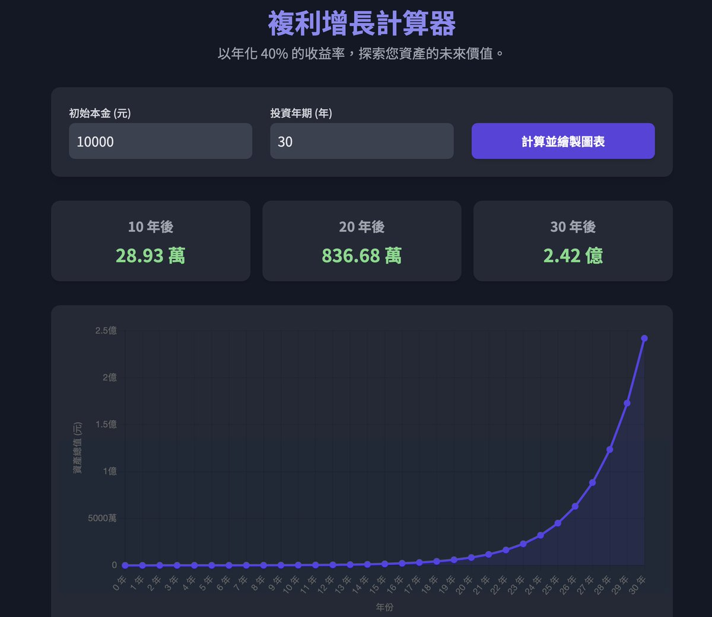

# 長期複利致富：40% 年化收益率的加密貨幣投資策略

> **來源**: [@gm365](https://x.com/gm365/status/1937756086075019722)
>
> **日期**: Wed Jun 25 06:13:47 +0000 2025
>
> **標籤**: `複利` `長期投資` `心態管理`

---

> **來源**: [@gm365](https://twitter.com/gm365)  
> **日期**: 2026-02-18  
> **標籤**: `複利投資` `年化收益` `比特幣` `資產配置` `長期投資`

---

## 複利的力量

不要暴富要長富。

問：本金投入 ¥1 萬元,年化收益 40%。

十年後,資產多少?20 年後呢?30 年呢?

我有些好奇,讓 Gemini 做了一個網頁計算器,結果當真出乎我意料。

**1 萬元投入,40% 年化收益率:**

- 10 年後:¥29 萬
- 20 年後:¥837 萬  
- 30 年後:¥2.4 億

顯然,以我們人類這普通的小腦瓜,是斷然無法理解「複利的奇迹」的。

這麼來看,這位老鐵定下的目標:2030 年,個人資產一億刀,似乎並非遙不可及(雖然我不知道他現在資產多少)。

## 幣圈的年化收益目標

在追求「一夜暴富」、「千倍金狗」的幣圈,突然講一個 40% 年化收益的策略,按理說應該沒什麼人感興趣。

但很多人可能忽略了最重要的一點:

**長期、持續的獲得 40% 的年化收益率。**

這個收益率,放在傳統金融市場,恐怕也只有西蒙斯的大獎章基金能達成。

但換個領域,在相對粗放的 Web3,是否不需要天才物理學家的頭腦,就能達成呢?(大獎章據說物理學家的數量不輸數學家)

## 策略範例

比如推文裡提到的策略:

1. 全倉比特幣
2. 抵押比特幣(最多借款 50%)
3. 借出的資金,通過三大策略投資其他幣種(短期、週期之王、天使投資)

以我個人意見來看,這個策略是否可行、是否適合你我,還有待商榷。

但毫無疑問,以更長遠的眼光,制定看上去毫不起眼、但卻極難達成的年化收益率目標,是個緩解日常焦慮、走向長富、慢富道路的好方式。

**不要暴富要長富,幣圈依然有機會。**
