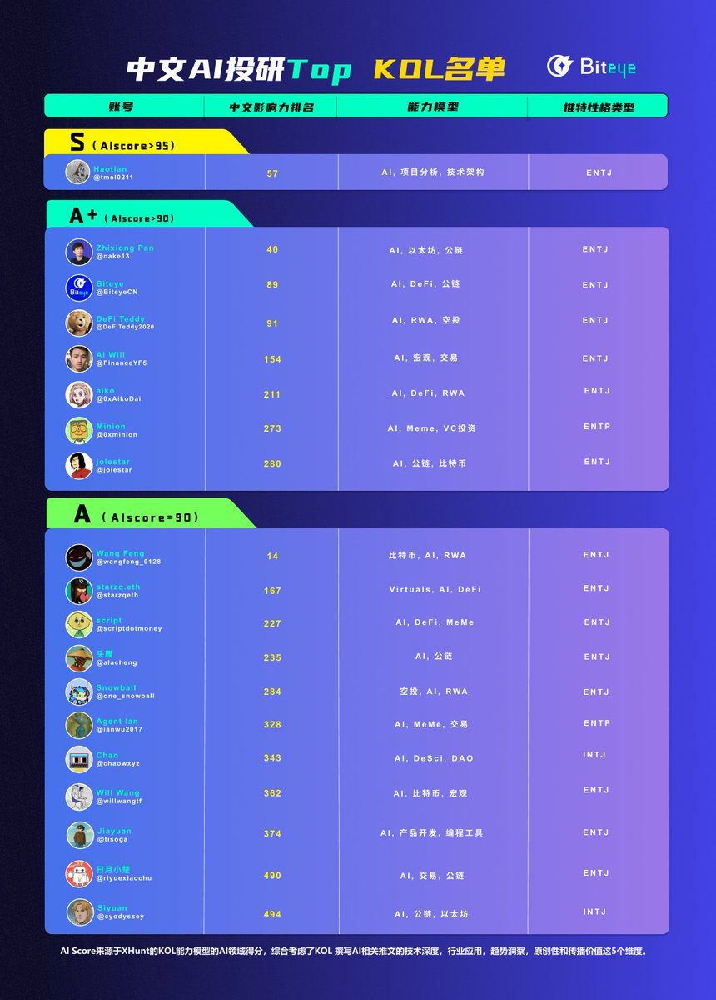

# 2025年中文加密AI投研頂級KOL排名

> **來源**: [@BiteyeCN](https://x.com/BiteyeCN/status/1937083899815072112)
>
> **日期**: Mon Jun 23 09:42:45 +0000 2025
>
> **標籤**: `AI投研` `KOL影響力` `趨勢洞察`

---

> **來源**: [@BiteyeCN (Biteye)](https://twitter.com/BiteyeCN)
> **日期**: 2025
> **標籤**: `AI投研` `KOL排名` `加密貨幣` `中文社群`

---

## 2025年中文加密AI投研頂級KOL排名

基於 @xhunt_ai KOL 能力模型的 AI 領域得分，綜合考慮了 KOL 撰寫 AI 相關推文的以下五個維度：

1. 技術深度
2. 行業應用
3. 趨勢洞察
4. 原創性
5. 傳播價值

形成這份【中文 AI 投研 Top KOL 名單】。

既有老 OG 的穩定輸出，也有新銳創作者的崛起。

**註**：這份榜單僅列出部分優秀的 KOL。
