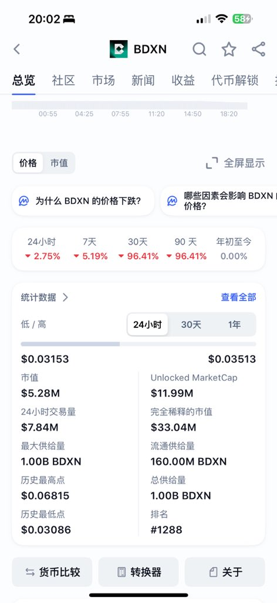
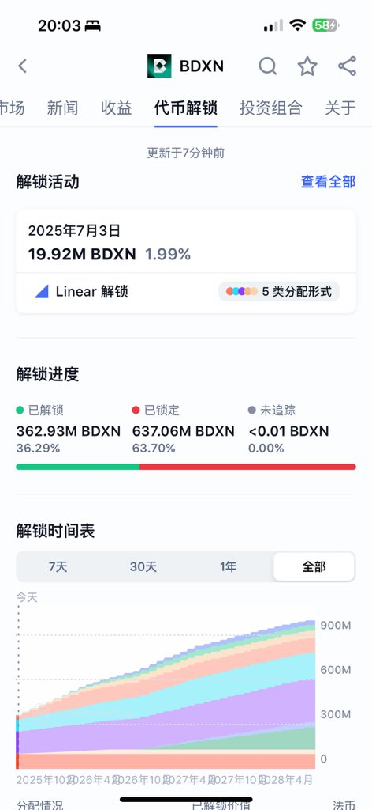

# 幣安小市值合約的套路：流通市值陷阱

> **來源**: [@richrichardoz](https://x.com/richrichardoz/status/1936396044918722642)
>
> **日期**: Sat Jun 21 12:09:28 +0000 2025
>
> **標籤**: `小市值合約` `流通市值` `道德鎖倉`

---

> **來源**: [@richrichardoz (小Z)](https://twitter.com/richrichrichardoz)
> **日期**: 2025-02-18
> **標籤**: `幣安合約` `小市值代幣` `流通市值陷阱` `市場操縱`

---

## 幣安小市值合約的流通市值陷阱

前幾天提了一嘴 $MYX 是幣安市值最小的合約殼子，可能有野莊看到了我的推文於是把 $MYX 買起來了。結果有聰明的朋友就發現了，不對啊老師，$BDXN 這個合約幣的市值比 $MYX 還小，只有 5m，為什麼沒有野莊來炒呢。

恭喜你發現了盲點，實際這個流通市值也是小市值合約幣的一個套路。顯示是 5m 流通，實際真實流通是 362.93 × 0.03303 = 12m 市值。為什麼實際真實流通比顯示的流通數據多 1 倍呢？因為這一倍多的流通是道德鎖倉的，而眾所周知，幣圈的項目方沒有道德，更何況是這種小項目方。所以野莊也會默認 $BDXN 就是 12m 市值了。

## 關鍵要點

| 項目 | 說明 |
|------|------|
| **表面流通市值** | 5m（數據顯示） |
| **實際流通市值** | 12m（362.93 × 0.03303） |
| **差異原因** | 「道德鎖倉」部分實際可以隨時流通 |
| **野莊判斷** | 默認使用實際流通市值計算 |

## 啟示

在評估幣安小市值合約時，不能只看表面的流通市值數據，需要考慮「道德鎖倉」部分實際上隨時可能進入流通，真實市值往往比顯示數據高出數倍。
