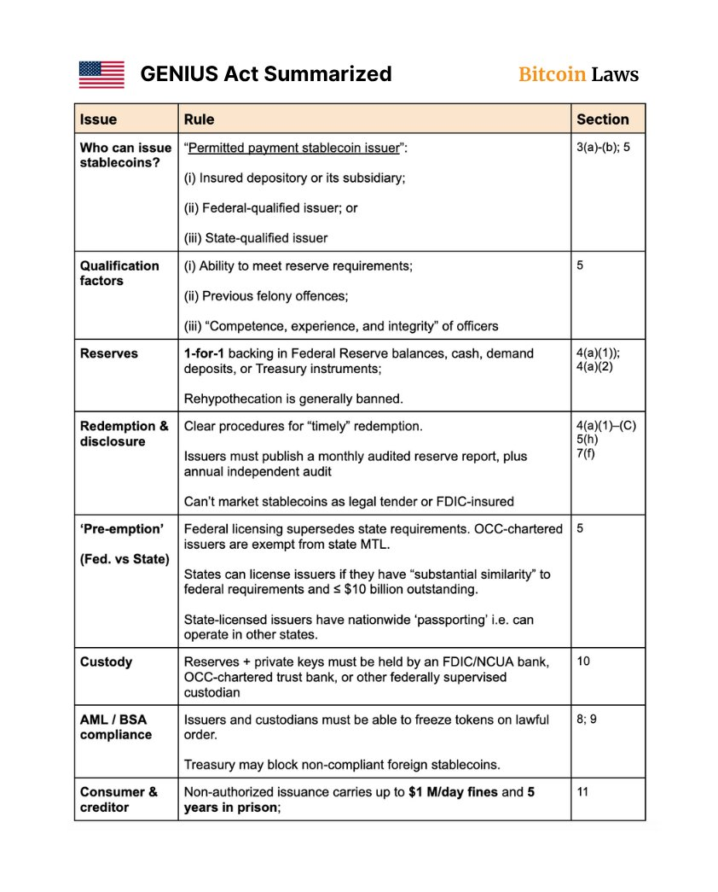

# GENIUS Act 穩定幣法案過關：美國首個穩定幣專法解析

> **來源**: [@MaxCryptoSpace](https://x.com/MaxCryptoSpace/status/1935122789184229442)
>
> **日期**: 
>
> **標籤**: `穩定幣` `監管政策` `USDC`

---

> **來源**: [@MaxCryptoSpace (MasWooX｜Max 的區塊鏈空間)](https://twitter.com/MaxCryptoSpace)
> **標籤**: `穩定幣` `GENIUS Act` `美國監管` `USDC` `USDT` `DeFi`

---

## 重大突破

Crypto 歷史上的重大一步：穩定幣法案過關！

這是美國史上第一個「穩定幣專法」。

## What happened？

GENIUS Act 在今天正式通過美國參議院，下一步是「眾議院」，接著提交 Trump 簽字。

## GENIUS Act 是什麼？

穩定幣監管法案，給予美元穩定幣更多合規條件，包括發行規定、儲備金等等。

## 誰能發穩定幣？

- 銀行
- 聯邦/州的合格機構（像是 @circle）
- 持牌的信託銀行

## 儲備金規定

法案要求 1:1 儲備，必須是現金、國債的流動性資產，必須放在特定的銀行中（符合 FDIC 保險規範的銀行）。

另外，強烈禁止 rehypothecation（重複抵押）。

## 審計儲備報告

發行人需每月自己公開儲備報告（Proof of Reserve），以及每年一次的「第三方報告」（Independent Report）。

## 非法發行會怎樣？

未授權發行者，每天可被罰 $100 萬美金＋坐牢。

## 其他規定

- 不能以「穩定幣是法定貨幣」的方式來宣傳
- 不能以「穩定幣符合 FDIC 保險」的方式宣傳

另外，很重要：發行穩定幣的發行商必須要有「凍結穩定幣」的能力。

## 影響分析

### 1. Tether 面臨壓力

以現在這個 GENIUS Act 來看，@tether 需要加快監管腳步，不然美國人能用的穩定幣就會是 $USDC 獨霸，Flip marketcap 指日可待。

### 2. 大量資金上鏈

GENIUS Act 讓美金正式「合法上鏈」，能把大量資金帶往鏈上，去使用 DEX、Lending，預計在明年可以看到至少 10x 的穩定幣增加（現在是 $250B）。

### 3. Sky Ecosystem 的正確選擇

@SkyEcosystem 做出正確選擇發行了 $USDS，否則無法合法發行穩定幣（$USDS 有凍結功能）。

### 4. 去中心化穩定幣仍有需求

去中心化穩定幣還是會有 Demand（@ethena），但有些人會考慮直接 Hold $ETH $BTC 當作去中心化資產。

### 5. 利好 DeFi 基礎設施

大大利好穩定幣延伸出的基礎設施，像是支付、DEX、借貸，大量資金進入 DeFi。

### 6. 關注 DeFi 豁免條例

關注 SEC 的 DeFi 豁免條例，看看 @aave @Uniswap 能不能被豁免。
