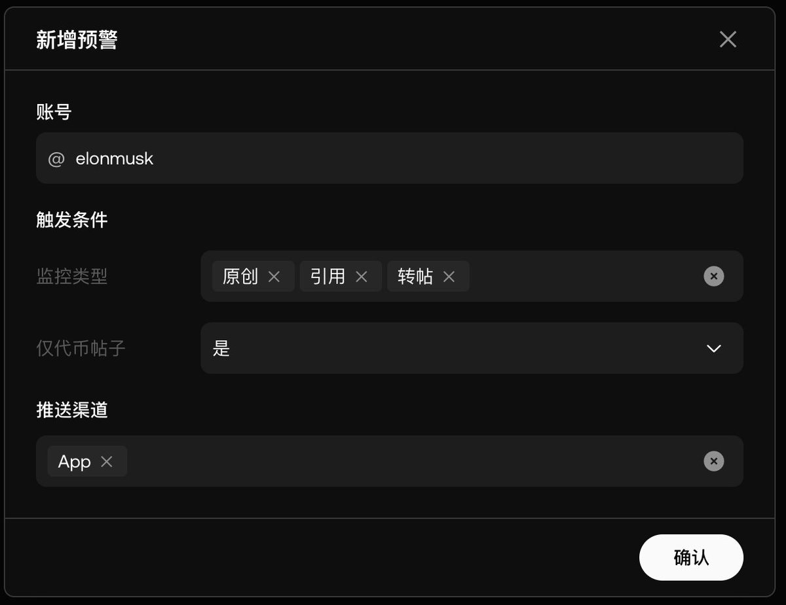

# OKX 地址雷達監控工具評測

> **來源**: [@Johnze268](https://x.com/Johnze268/status/1933777350082339232) | [原文連結](https://web3.okx.com/zh-hans/address-radar)
>
> **日期**: Sat Jun 14 06:43:42 +0000 2025
>
> **標籤**: `鏈上工具` `地址監控` `項目追蹤`

---

> **來源**: [@Johnze268 (Songsu 松鼠)](https://twitter.com/Johnze268)
> **日期**: 2026-02-18
> **標籤**: `OKX` `地址監控` `鏈上工具` `免費工具`

---

## 功能評測

OKX 地址雷達監控工具的三大優勢：

1. **完全免費** - 這是最重要的特點
2. **速度極快** - 實測基本上是即時通知
3. **多平台支援** - APP 和網頁版同步支援

## 使用場景

作為需要獲取大量項目資訊的撸毛玩家，即使已經退出鏈上 PVP 大半年，地址監控功能依然是目前見過最好用的工具。不僅可以監控項目方推特的進展，還能即時追蹤地址動態。

在鏈上工具這一塊，可以永遠相信 OKX 的產品。

## 功能說明

地址雷達主要用於查找代幣聰明錢地址，並自訂地址追蹤榜單：

### 使用步驟

**步驟 1：選擇熱門代幣**
- 地址雷達將自動查找在所選代幣中獲利的地址

**步驟 2：自訂盈利地址榜**
- 對應的盈利地址將被掃描並展示在地址雷達中
- 資料即時更新

### 功能模組

- 關注代幣
- 動態追蹤
- 持倉查看
- 錢包追蹤
- 信號提示
- 收益統計
- 通知推送
- 買入功能

## 工具連結

產品頁面：https://www.okx.com/web3/dex/radar
