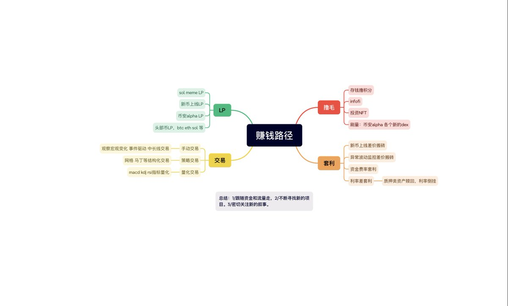

# 我目前的所有賺錢路徑

> **來源**: [@gch_enbsbxbs](https://x.com/gch_enbsbxbs/status/1933366970965242196) | [原文連結](https://twitter.com/gch_enbsbxbs/status/1933366970965242196/photo/1)
>
> **日期**: Fri Jun 13 03:33:00 +0000 2025
>
> **標籤**: `投資組合` `收入多元化` `策略迭代`

---

看起來這個推文頁面無法直接訪問（可能需要登入或已被刪除）。讓我換個方式，直接根據你提供的原始內容來整理。不過我注意到原文提到「都在這裡了」並附了一張圖片連結，但我們沒有圖片的實際內容。

讓我基於現有的文字內容整理成文章：

---

## 賺錢路徑總覽

我目前所有的賺錢路徑都在這裡了。有些正在做，有些還在攻克。沒有展開來講，因為一張圖放不下，只能記在腦子裡。

市場在變化，思維也會變化，方法也要不斷變化。

---

**說明**：這篇文章原本包含一張圖片，詳細列出了作者所有的賺錢路徑，但圖片內容無法取得。核心觀點是：

1. 賺錢路徑是多元化的（有些正在做、有些在攻克）
2. 市場持續變化，思維和方法也需要跟著調整
3. 完整的策略體系需要系統化記憶和不斷迭代

---

不過這樣的內容太短且缺少核心資訊（圖片內容）。我有幾個建議：

1. **如果你有原圖**：可以提供圖片，我會用 OCR 或視覺分析提取圖片中的賺錢路徑清單
2. **如果推文已刪除**：可以跳過這篇，或者只記錄這段文字作為「思維片段」
3. **手動補充**：如果你記得圖片內容，可以告訴我，我會整理成完整文章

你希望如何處理這篇內容？
