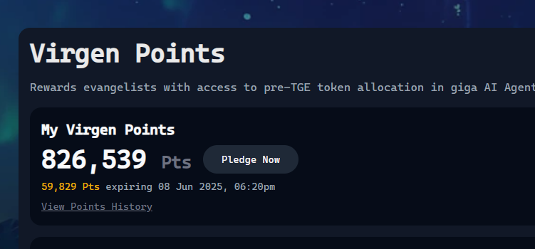

# Virtuals Agent 挖礦套利策略——月收益 50% 的養殖指南

> **來源**: [@Metabape](https://x.com/Metabape/status/1928091299418362212)
>
> **日期**: 
>
> **標籤**: `Agent 生態` `套利策略` `風險管理`

---

> **來源**: [@Metabape (Meta 猿 🦍)](https://twitter.com/Metabape)
> **日期**: 2026-02-18
> **標籤**: `Virtuals` `Agent挖礦` `套利策略` `收益農場`

---

## 策略概述

在我這種 farmer 眼裡,當前的 @virtuals_io 就是個月理財收益 50% 的神礦。

## 操作步驟

### 1. 建立套保倉位

現貨買入平台最大 agent $AIXBT,同時合約開空套保,在官網質押代幣。

### 2. 收益計算

如果你質押了 100K 的本金,再挑點池子深的 genesis 代幣,做點交易量意思意思,每天差不多是 50K 左右的 virgen point 的收益。

### 3. 項目選擇

平時也不用自己花時間做任何的項目投研,因為有一票要拿 @KaitoAI 分的高手會幫你總結好。

### 4. 操作策略

你只需要挑最熱的大項目梭哈就好。目前看反正一分的均值就是 0.03 U 的利潤,差不多就行,咱也不貪。

### 5. 日收益估算

那麼 100K 的本金,一天的收益就是 1500U。至於打新出來的代幣,都別質押,留在手裡,等差不多的時候一把砸掉,然後觸發 jail break,10 天後,繼續出來挖。

## 策略優勢

### 風險對沖

質押 $AIXBT 屬於給分最少的 agent,但是大 farmer 要的是沒有方向性風險。能夠 hedge 掉風險的擼法,肯定是最優解,只有本金是安全的前提下,才敢上倉位。

### 退出機制

假如這個盤子還能夠維持 2 個月,那麼等它曲終人散的時候,解除質押,等個 14 天,把現貨跟合約的倉位都平掉就好。過程中的那些亂七八糟的代幣,都算是利息收入。現在看,這個收益應該還不錯。

## 生態發展預期

假如 virtual 旗下新發射的這些個 agent 最後能有個上所的通道,比如先上一個 $VIRGEN,再上一個項目幣,那麼這個生態的整體項目市值預期會進一步升高,台子的存活時間會進一步拉長,我就會挖的更爽。

## 作者後記

這種分享出來,就是卷自己的事兒,也就猿哥會幹了,好好珍惜我吧,兄弟們。
