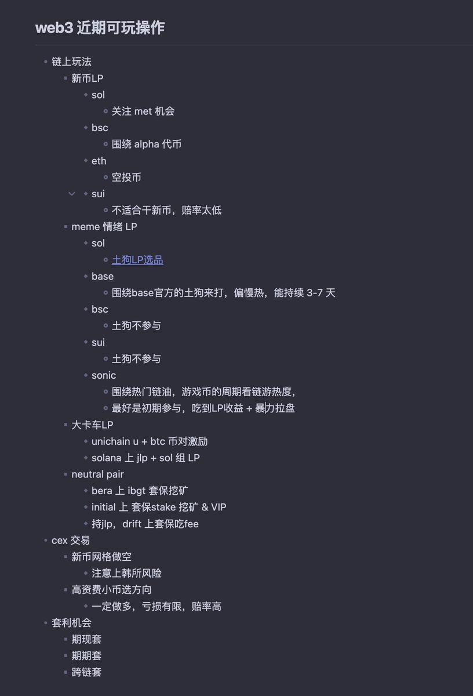

# 合約交易風險與心態管理

> **來源**: [@feikerwu](https://x.com/feikerwu/status/1917491595706007574) | [原文連結](https://twitter.com/feikerwu/status/1917491595706007574/photo/1)
>
> **日期**: Wed Apr 30 08:09:56 +0000 2025
>
> **標籤**: `合約交易` `風險管理` `交易心態`

---

> **來源**: [@feikerwu (feiker)](https://x.com/feikerwu)
> **日期**: 2026-02-18
> **標籤**: `合約交易` `風險管理` `交易心態` `扛單`

---

## 交易心態的快速轉變

上午還在開開心心寫復盤,下午就往死裡扛單了,合約害人啊

## 核心警示

這條推文揭示了合約交易中最常見的心態陷阱:

- **情緒波動**:從理性復盤到非理性扛單,心態轉變極快
- **扛單行為**:明知虧損卻不止損,反而加倍下注期待反轉
- **合約風險**:槓桿交易放大了人性弱點,容易導致重大損失
