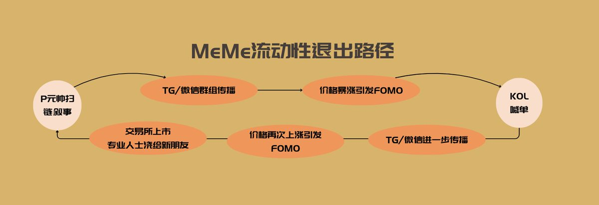
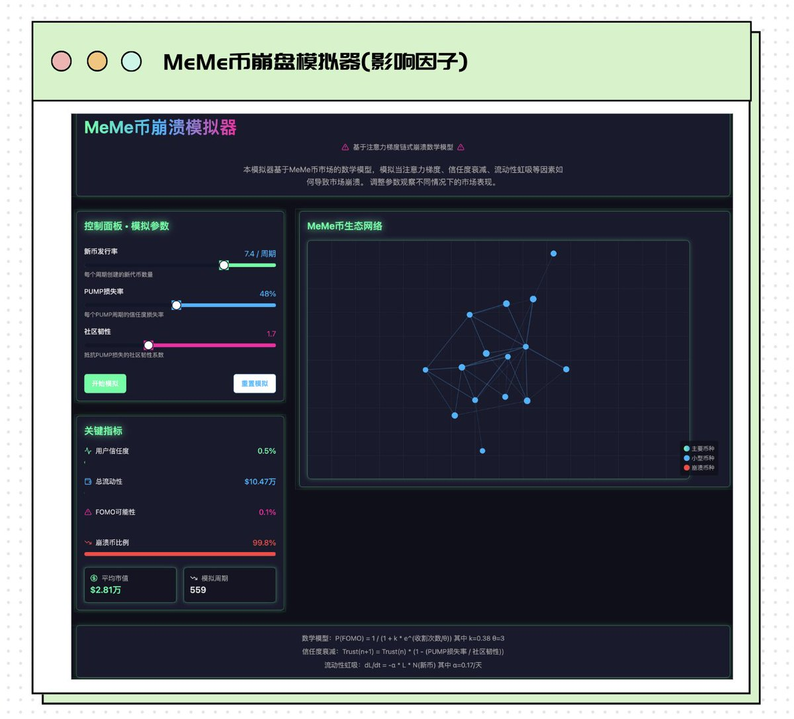
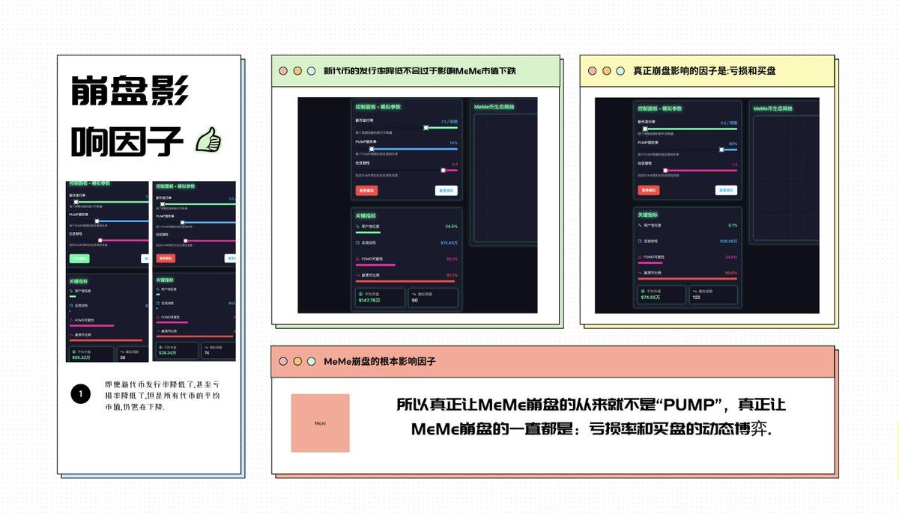

# Meme 幣崩盤物理模型：為什麼沒有新的超級 Meme 了

> **來源**: [@If_wewin](https://x.com/If_wewin/status/1916013867454353503) | [原文連結](https://meme-collapse-simulator.lovable.app/)
>
> **日期**: Sat Apr 26 06:17:58 +0000 2025
>
> **標籤**: `Meme幣週期` `市場信息熵` `收割循環`

---






> **來源**: [@If_wewin (𝓚𝓪𝔀𝓱𝓲魔尼)](https://x.com/If_wewin)
> **日期**: 2026-02-18
> **標籤**: `Meme幣` `市場分析` `物理模型` `崩盤機制` `PUMP` `叙事傳播` `流動性` `熵增理論`

---

## 引言：為什麼沒有大 MeMe 了？

我用物理運動學的邏輯做了一個 MeMe 崩盤模擬器，直觀地告訴你——為什麼在 Trump 後，我們沒有再出現像 WIF、Popcat、MooDeng、chiilguy、bome 這種 MeMe 了。

除了早就被談爛了的原因：

- SOL 紅利過期
- 宏觀市場大環境不好
- 熊市流動性差

還有原因就是像 DNF 說的那樣：Ai 幣、CTO 幣、名人幣、表情包幣、藝術家幣、馬斯克系列衍生幣、Cz/heyi 衍生幣、Alt 平台幣。我們幾乎已經把各種類型的代幣都已經玩了一個遍了…

**週期在加速，我們已經沒有什麼可玩的了…**

## 傳統金狗標準的崩塌

我們過去經常談論一個金狗的標準特徵是：

1. 宏偉的敘事
2. 輕鬆的理解
3. 大規模傳播

但這個「金狗標準」現在面臨一個問題——我們正在面臨市場信息熵增倒逼權重分配升級，傳統 MeMe 的敘事和傳播路徑已經崩塌了。

過去，我們對於 MeMe 的看法一直都是「好玩，病毒式傳播」就行，市場對 MeMe 的選擇也一直用最「簡的敘事」作為唯一 Query，用短期情緒波動作為 Key-Value。

```
注意力權重 = FOMO 情緒強度 × 社交媒體傳播速度
```

## 信息熵激增與同類敘事泛濫

MeMe 幣也跟山寨幣面臨的問題一樣，同類敘事/技術的幣真的太多了…

而 PUMP 的出現又讓我們的市場信息熵激增，如果你活躍了兩個週期，你就會發現不僅僅是山寨幣，其實 MeMe 幣的同類敘事泛濫的代幣比上個週期更多了…

也正是因為 PUMP 帶來的財富效應，會讓大家在踏空了龍一，就一窩蜂地尋找龍二、龍三，尋找下一個 10x、100x 的機會，最終結果帶來的就是——**注意力梯度的鏈式崩潰**。

## 線性敘事傳播的脆弱性

傳統 MeMe 依賴的線性敘事傳播一直都是：

```
社交媒體 → 交易所上市 → FOMO 買盤 → 價格暴漲
```

這個過程其實有點像神經網絡的梯度下降優化，通過層層放大信號實現價格「訓練」，但這個「線性敘事傳播」很脆弱，因為這個路徑本質是單向信息勢能差驅動系統。

如果用動力學模型來看的話，可類比電路中的電壓梯度：

```
ΔV = V社交媒體 − VFOMO買盤
```

每一個傳播效率取決於各環節的「導電性」，但「導電性」本身的不穩定又最終會給系統帶來斷點。

### 三層傳導斷點

1. **信息勢能衰減（社交媒體層）**：KOL 喊單沒人再信了
2. **傳導層梗阻（交易所層）**：Cz 老師了解 meme 信息差邏輯，對於 MeMe 幣，宇宙所不做最後一棒
3. **終端負載過載（FOMO 買盤層）**：韭菜抗性進化——一般經歷 3 次收割後 FOMO 概率下降 50%…

## 數學模型分析

### 社區信任度衰減模型

每次 PUMP（神幣）破滅導致社區信任度衰減：

```
Trust(n+1) = Trust(n) · (1 − PUMP損失率/社區韌性)
```

典型 MeMe 幣社區在 3 次 PUMP 週期後信任度歸零。

### 流動性虹吸效應

新項目上市抽乾舊項目流動性：

```
dL/dt = −α · L · N新幣    α = 0.17/天
```

## 真正的崩盤原因

所以不管大家選擇不選擇相信，我們現在面臨的「meme」的地獄難度就是因為——

- 韭菜進化了
- 莊家發狠了
- 交易所不買單

過去 MeMe 的大規模傳播路徑的各個「導電性」都出問題了。

**敘事預期與價格反饋脫鉤** → 無論是你我這樣的韭菜，還是莊家，又或者交易所其實都在用腳投票加速撤離…

## MeMe 崩盤模擬器

如果你覺得上面這個模型有意思，你可以去 [https://t.co/8MRgY8OGYT](https://t.co/8MRgY8OGYT) 玩一玩崩盤測試，這 AI 根據我給出的數學模型寫的代碼模擬器。

你可以去嘗試控制：

1. 新幣發幣率
2. PUMP 損失率
3. 社區韌性

這三者到底要怎麼樣的一個路徑，才能完成代幣市值的在模擬週期環境下的平均市值增長，以及三者之間怎麼樣的權衡，才會導致「平均代幣市值」不斷地塌陷。

### 模型局限性

當然模型有個缺陷就是，因為「MeMe 本身也是週期性的情緒資產」它無法考慮到更大的週期變化，另外 MeMe 本身就是動態博弈，模型無法準確判斷具象，即單個 MeMe 的「崩盤」。只做參考。

## PUMP 不是真兇

如果你在「MeMe 崩盤模型」裡面，即便我們把「新幣發行率」拉到最低，並且把損失率寫成「80%」，即有 80% 人虧損，社區韌性也給出了 4.5（很高），你會發現一個結論：

**即便「代幣發行的週期數量」下降了，但是隨著模擬週期的推移，代幣的平均市值依舊在下降，也就是我們俗話說的：MeMe 的天花板越來越低。**

### 真正的原因

**真正讓 MeMe 崩盤的從來就不是「PUMP」，真正讓 MeMe 崩盤的一直都是：虧損率和買盤的失衡。**

發行代幣的速度從來就不是決定性因素。

MeMe 本身其實是很「封閉」的市場——就像很多老玩家，他們對於 MeMe 市場本身就是小玩，他們看不上的「賭場」邏輯，更別說有沒有 cz 老師也不喜歡大玩 MeMe。

如果沒有 PUMP，很多 MeMe 是不具備流動性的，不具備流動性也就不具備「社區堅韌（買盤）」影響，最終的結局依舊是——崩盤。

## PUMP 的價值：注入負熵流

某種程度上，PUMP 機制的本質就是在封閉系統（單一 MeMe 生態）內強行注入負熵流，短期製造有序結構（價格暴漲）——隨後流動性的資產才能完成退出。

這也就是盤主 @thecryptoskanda 說的：「市場永遠會獎勵」——可以不斷以最低成本創造出兼具高波動性、高流動性的資產和市場「的團隊。

這也是為什麼盤主一直在強調「PUMP」的偉大，MeMe 市場本身是封閉性的——MeMe 一直都是很純粹的資金盤和旁氏動力學：

```
系統能量一直依賴內部循環：
新投資者資金 → 推高價格 → 吸引更多資金
```

PUMP 的出現是吸引了無數「新資金和新人」進場的，這些像我一樣的新韭菜的湧入，才完成了內部循環的流動。

### 熵增鐵律

某種程度上，PUMP 的出現或者說 PUMP 機制是試圖在封閉盒子中製造永動機，但問題就在於，在封閉系統中強行製造局部低熵態，本就違背了「全局熵不減」的鐵律，所以崩潰本來就是必然的，這也是可見的。

**但這不是 PUMP 造成的，而是物理鐵律。**

## 收割循環：週期性復甦機制

不過就跟「宇宙收縮」的邏輯一樣，正是因為有了崩盤，才會有新的「大爆炸」產生的週期循環。

這個週期循環的開始會很有意思。看起來繞口，但其實一點都不複雜，因為它就是一個實現「收割-修復-再收割」的永動機式循環。

**姑且就是說：如果更優雅地割韭菜——**

在流動性崩塌後，其實你我這樣的韭菜都處在「觀望的狀態」之中的，因為對於現有情緒的不滿，所以需要一個全新的敘事，而全新的「敘事」也就是需要所謂的「技術新偽裝和敘事變異」…

我們要相信有新的「復甦期」的出現才會開始購買…

### 韭菜記憶週期

這裡有意思的是，根據艾賓浩斯曲線：

```
設計冷卻期長度 T = ln(最大損失記憶強度) / λ
```

其中：λ = 新敘事轟炸強度（通常設置使 T ≈ 6−8 個月）

某種程度上，大家也可以理解為「韭菜」基本上只需要「6-8」個月就可以「重新長出來割」了，當然這也並不是一定的，因為這裡還跟老韭菜的「受損程度」和新韭菜的占比是有關的，但是邏輯不變…

當 AI+MeMe 的開始正式復甦，並且在未來的某一天再成為「技術是過街老鼠」的時候，我們才會再次擁抱 PUMP 的敘事動力 MeMe。

這很像人人喊單的高估值 VC 幣給敘事 MeMe 帶來的紅利，所以很多東西看起來變了，但是又沒變。

**莊家的超循環收割術本質是資金的時間套利遊戲。**

## 個人生存策略

唯一變的是，如果尋找所謂的「技術偽裝」和「敘事變異」，要學的不是「莊」是如何操盤的，因為鏈上數據太容易欺騙人了，難度在提升，對於普通人鏈上分析基本上不會的。

可是又不能不與莊共舞，畢竟在這個過程中，我們要麼成為鐮刀，要麼變成肥料。

所以這也是為什麼一直都好欣賞惠姐 @0xmagnolia 的原因，如惠姐從傳統 meme 到敘事變異 meme 再到技術偽裝的「MCP」meme，惠姐永遠在尋找新的阿爾法，對於「阿爾法」的判斷以及對，這個真的是永無止境的。

### 逃逸速度與熵增速度

莊家在進步，持續進化收割技術，我們唯有將自己變為開放系統（持續學習真實技術），才能避免成為下一茬韭菜。

在這場永不停歇的熵增戰爭中：

**「逃逸速度必須超過熵增速度」**

我們才能在黑暗森林中活下來。我們要學的是「章北海」——要做的是：「自然選擇，前進四」

### 正 EV 策略

多做一些正 EV 的事情，少刷推特，看推項目推 meme。

什麼是正 EV？花哥 @off_thetarget 最近的推也說得很明白了：

- 成為內幕
- 向上學習
- 靠近權力
- 成為權力
- 大量學習

其實這也就是 PUMP，做一個有影響力的人還不夠，其實要做一個像 PUMP 一樣的人，要做成產生流動性價值資產的人。

**即，你便是財富本身。**

我會加油，希望看到這篇文章的你也能加油。

共勉。
