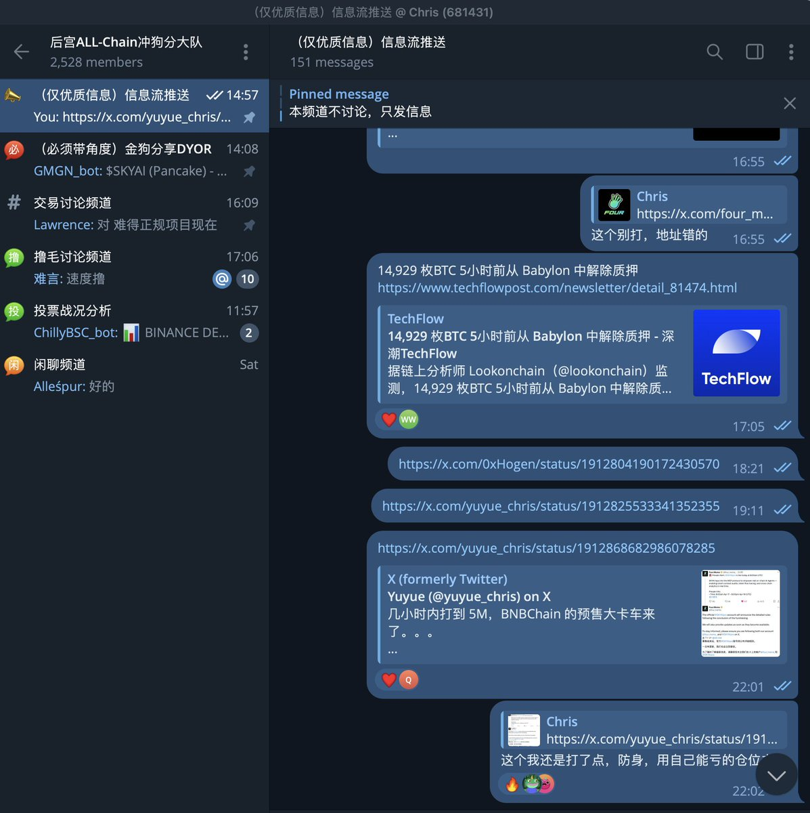

# SKYAI IDO 預售反思：機會與心態

> **來源**: [@yuyue_chris](https://x.com/yuyue_chris/status/1913883081586688331)
>
> **日期**: Sun Apr 20 09:10:59 +0000 2025
>
> **標籤**: `IDO打新` `投資心態` `風險評估`

---

> **來源**: [@yuyue_chris (Yuyue)](https://twitter.com/yuyue_chris)
> **日期**: 2024
> **標籤**: `IDO` `預售` `心態管理` `投資決策`

---

## 事件回顧

這次 four meme @SKYAIpro 的打新，復盤下一次我們怎麼能做得更好。

## 大部分人踏空的心理分析

1. 覺得打的人太多了，沒肉，都上千萬了還打什麼
2. 怕專案方 rug

真的幹進去的人都不多，有個群友發給我個在自己小群裡的匿名投票統計，10 個人裡有一半的人只幹了 1wu 以下，還是在他按頭喊了三次的情況下，沒人猛幹 $SKYAI 的預售。

## 機會判斷分析

針對第二點，只要確定專案方不可能 rug 的情況下，猛幹是確定能賺錢的：

- @four_meme_ 官方背書的第一個預售 IDO，存在 rug 的可能嗎？可能性非常低
- 打的人多是問題嗎？是，但是只要是能賺的，為什麼不衝呢

**不衝的核心原因，還是懶**

## 幣安 IDO 的心態轉變

絕大多數人現在看不上幣安 IDO 每次打新單號 20u 30u 的收益了，所以每次打新機會哪怕知道確定性強、有條件參與的還是選擇放棄。

## 風險收益評估

再回到這次 SKYAI 來說，既然確定賺錢的機率很大，不可能是本金跑路的 rug，最多最多碰上：
- 收益率較低
- 開盤專案方不聰明

在這種盈虧比和確定性比較高的情況下，至少自己平時做二級的倉位是可以拿來衝進去的，這也就是「能虧得起的倉位」。

## 心態問題剖析

沒有人會當成理財去衝，沒猛幹也是很正常的，這一點來說不用苛責自己。然而，絕大多數人連平時自己衝土狗 / 衝山寨的倉位都不敢上，說來說去也就是：**沒有重視，以及，懶**

## 專案後續判斷

回到這個幣本身，看 K 線和量來說，這個成為 BSC 上的第一個 BOME 的機會還是挺大的，或者說在目前的這個行情情況下，他已經是 BSC 上的第一個 BOME 了。

如果要想賺錢，那只能一直保證自己 **100% 在牌桌上**，碰上【第一個】這樣的機會是必須嗅覺敏感的，這也是我幹了預售 + 空投沒賣甚至還加了點倉的邏輯。
