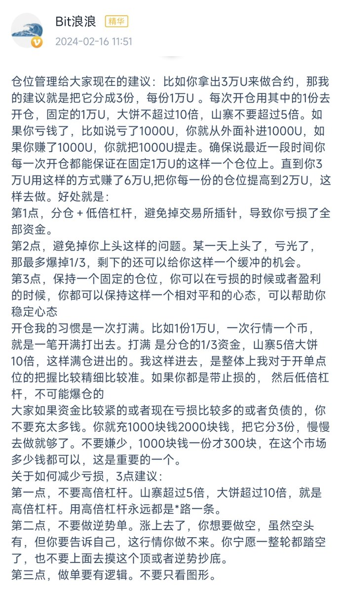

# 小資金到過億的交易聖經：舒服的倉位管理與交易方式

> **來源**: [@thankUcrypto](https://x.com/thankUcrypto/status/1911748883090456755) | [原文連結](https://twitter.com/thankUcrypto/status/1911748883090456755/photo/1)
>
> **日期**: Mon Apr 14 11:50:26 +0000 2025
>
> **標籤**: `倉位管理` `交易哲學` `資金管理`

---

## 核心交易哲學

如果你相信小資金做到過億的人有什麼交易聖經，那就是：

**執行自己舒服的倉位管理方式和交易方式，等風來。**

## 關鍵要素

### 舒服的倉位管理

找到適合自己風險承受度的倉位配置方式，不要勉強自己使用不適應的倉位規模。

### 舒服的交易方式

選擇符合自己性格和生活節奏的交易策略，不必模仿他人的交易風格。

### 等風來

在做好準備後，耐心等待市場機會的到來，而不是頻繁操作。
