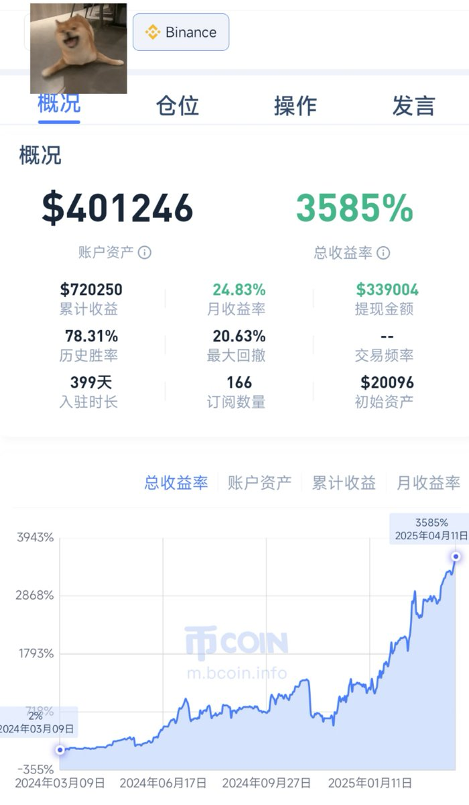
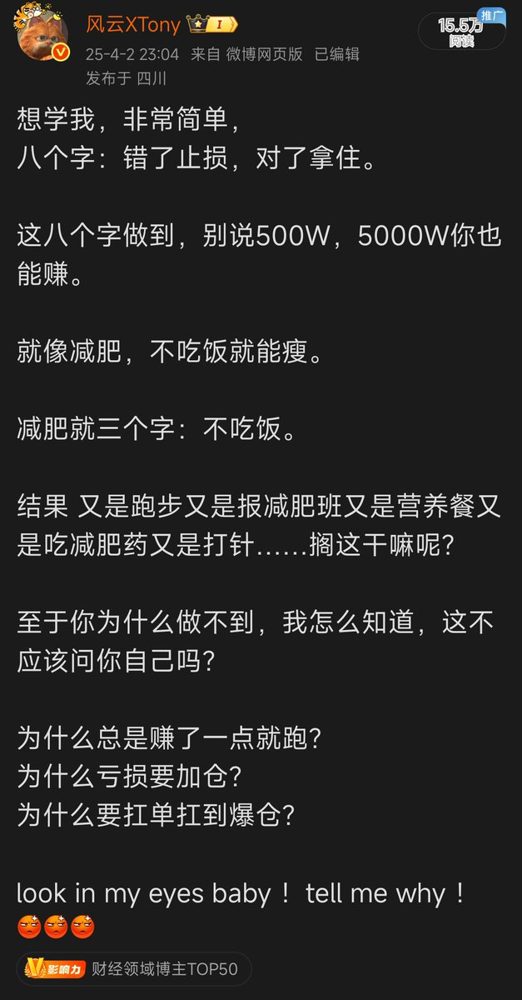
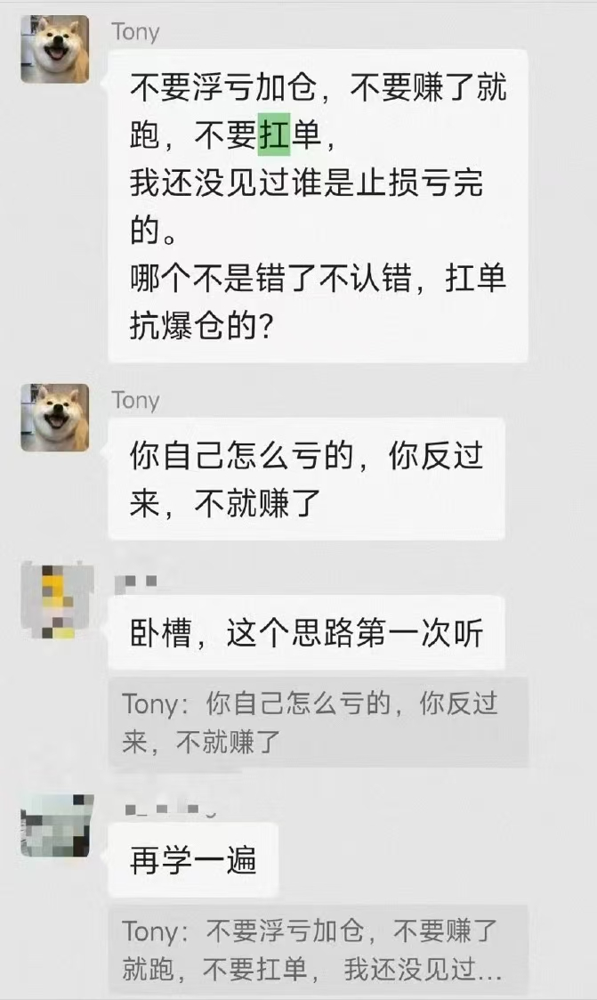
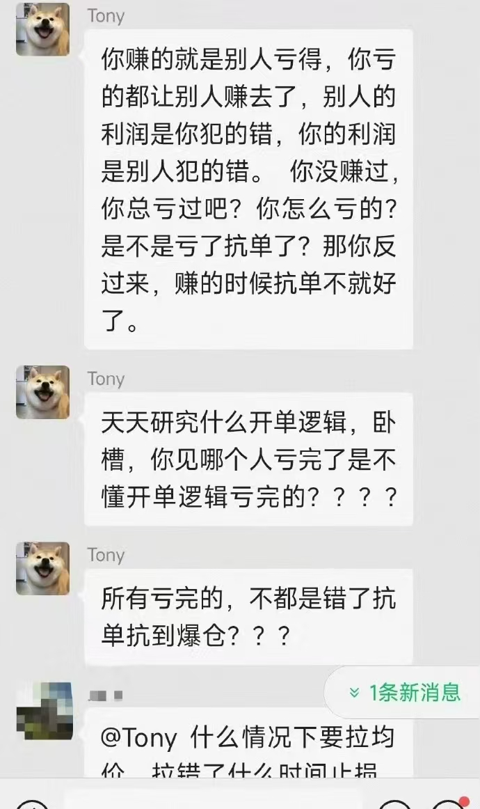

# 小資金無杠杆複利策略：2萬美元1年賺500萬人民幣

> **來源**: [@xtony1314](https://x.com/xtony1314/status/1910563265337581728) | [原文連結](https://passport.weibo.com/visitor/visitor?entry=miniblog&a=enter&url=https%3A%2F%2Fweibo.com%2F7722844380%2FPlrSh6Hgj&domain=weibo.com&ua=Bun%2F1.2.18&_rand=1771395978636&sudaref=)
>
> **日期**: Fri Apr 11 05:19:13 +0000 2025
>
> **標籤**: `複利策略` `資金管理` `心態修養`

---

> **來源**: [@xtony1314 (逍遙XTony)](https://twitter.com/xtony1314)
> **日期**: 2026-02-18
> **標籤**: `小資本交易` `複利策略` `山寨幣` `低槓桿` `倉位管理`

---

## 實盤成績

在幣安 2 萬 U 小本金的實盤，盈利正式突破 500 萬+ 人民幣（71 × 7.2 = 518），用時 1.1 年。

本金 2 萬 U，2~3 倍槓桿幾波山寨到達十倍 20 萬 U 後，基本沒再用過槓桿。

是的，基本沒用過槓桿，開倉多是主流 100～150% 倉位，山寨 50～80% 倉位，現貨玩法複利到 500 萬人民幣。

## 核心觀點：複利的力量

肯定有人說，不用槓桿，怎麼可能小資金賺到 500 萬？你騙人，胡說霸道，信口雌黃，說謊話詛咒你的貓貓生不出兒子！

**一個月 25%，一年就是 12 倍，2 個 12 倍，就是 100 倍。**

你用十倍二十倍槓桿動不動一天翻倍，你的一年 12 倍在哪裡呢？

你玩著高槓桿，因為高槓桿容錯差，壓根不可能複利下去，賺賺虧虧而已。

可能有人說，這個盈利涼子一天也就做到了，嗯，但涼子是天才，都是 50 倍多空梭哈，我沒那膽量，你可以學學看。

## 交易哲學

做交易，是跟自己的人性做鬥爭，所以也是跟自己比。本實盤的目標是未來一年做到 2500 萬盈利，兩年靠 2 萬 U 本金掙到 2500 萬人民幣，就是再賺 700% 收益，一個月 20% 收益即可。

做這個實盤，想告訴你的是：

**哪怕是小資金，哪怕不用槓桿，只要認真學做交易，一年一樣賺到 500 萬，對一個普通人來說，500 萬基本就是把一輩子的錢都掙到手了。**

我的路對普通人來更容易複製，模仿，學習，你也可以。

## 策略總結

| 項目 | 說明 |
|------|------|
| 起始資金 | 2 萬 USDT |
| 時間週期 | 1.1 年 |
| 最終盈利 | 500 萬+ 人民幣 (71 萬 U) |
| 槓桿使用 | 前期 2~3 倍，達到 20 萬 U 後基本不用 |
| 倉位策略 | 主流幣 100～150%，山寨幣 50～80% |
| 交易方式 | 現貨玩法 |
| 目標收益 | 月均 20～25% |
| 平台選擇 | 幣安（流動性最好，適合山寨） |

## 致謝

最後，感謝中本聰發明比特幣，感謝幣安平台，感謝 i 托生死相隨，感謝我自己，幣安是最好的平台，尤其是做山寨，流動性最好，更容易到達百倍成就。
