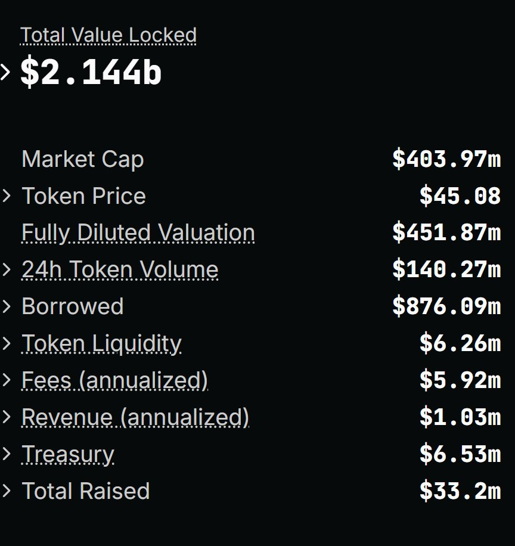
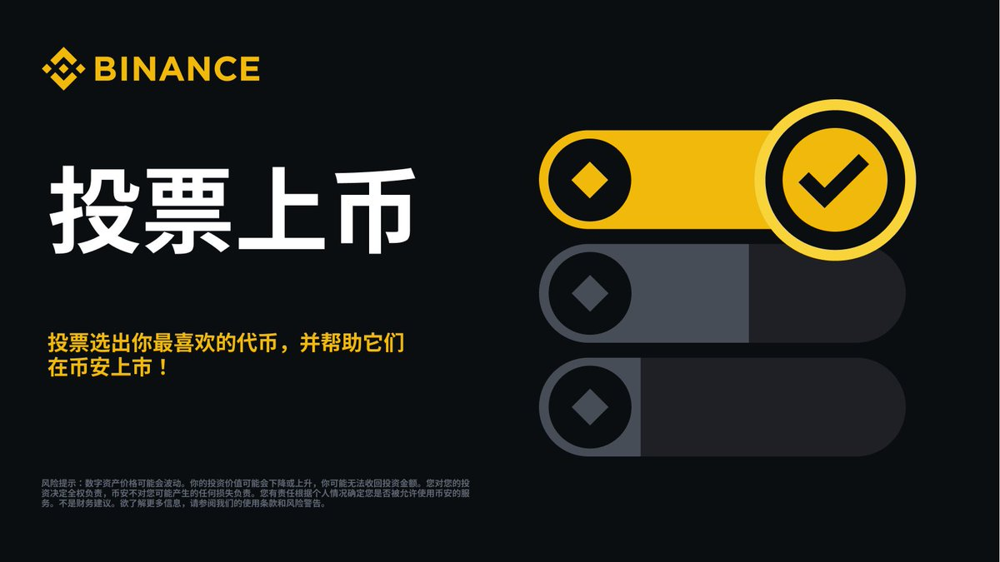

# 幣安投票上幣策略分析──從關聯度、營收、籌碼結構、市值四維度解讀

> **來源**: [@thecryptoskanda](https://x.com/thecryptoskanda/status/1908153949724795121)
>
> **日期**: Fri Apr 04 13:45:28 +0000 2025
>
> **標籤**: `幣安投票上幣` `交易所籌碼` `市值均衡策略`

---

> **來源**: [@thecryptoskanda (加密韋馱｜Skanda 🔶)](https://twitter.com/thecryptoskanda)
> **日期**: 2025-04-02
> **標籤**: `幣安` `投票上幣` `策略分析` `市值管理`

---

## 背景分析

上周內部開會，討論到幣安過會制改註冊制，會大幅補資產，到年中前可能要放開上百個，對於未 TGE 或者 TGE 狀況不佳項目方是個絕好的機會。

因此完全可以大膽一點猜測這不是 12 選 3 或者選 4，而是 **12 選 6 甚至更多**。

## 四大選擇邏輯

這裡面選擇的邏輯主要有四點：與幣安關聯度、營收、籌碼結構、市值

### 1. 與幣安關聯度

首先在過去的幾年中，Binance Labs (@yzilabs) 出手了大量的項目，這些項目中，融資數千萬，FDV 數十億者比比皆是。上月中 BSC 熱剛沒多久的時候，我就預言過 CZ 是為了摧毀當前估值和定價體系，因為這個體系不是由 Binance 主導。

因此，上幣中的優先級，肯定是給到與幣安有直接聯繫的項目方，在這 12 個中，符合條件的只有 **$Plume**。

### 2. 營收

跟 VC 相關的都應該知道我在說什麼。當前各個交易所研究團隊大多比較迷茫，因此採取最無功無過的方式，即偏向傳統的「看營收」的方式來二級上幣。

最明顯的例子就是韓國所，比如最近突然上了 momentum 早已涼透的 DeFi 鼻祖 $Comp，我們可以從它的數據倒推。其中收入和費用兩項是年化估算。

那麼按照這個標準，**Virtuals、MORPHO、SAFE 是達標的**。Ondo 的公開數據我沒有找到，不過基於 OUSG 收費 0.15% 且當前規模超過 10 億來算，應該是達標的。

### 3. 籌碼結構

一般來說都是上幣以後管 3-6 個月，因此抛壓半年內可預測且最小化的可能性更大。目前：

- **$Virtuals** - 除生態部分已經全流通
- **$MORPHO** - 大額解鎖要 11 月
- **$GRASS** - 大額解鎖要 10 月
- **$WAL** - 明年 3 月開始解鎖
- **$IP** - 明年 2 月解鎖
- **$ONDO** - 明年 1 月解鎖
- **$PLUME** - 明年 1 月解鎖

### 4. 市值

上次的投票上幣大家已經看到了，只要上了幣安，不管你是什麼敘事，你唯一的價值邏輯就是幣安殼的邏輯（這一輪還沒看到強 ponzi 驅動改變市值的），那麼市值高的會砸，市值低的會拉。最終所有項目在同一批次市值的中間點會和。

我們來看一下這批項目當前的 MC：

| 項目 | 市值（USD） |
|------|------------|
| Ondo (ONDO) | 約 $2,559,143,792 |
| Story (IP) | 約 $1,107,440,902 |
| Walrus (WAL) | 約 $667,329,184 |
| Grass (GRASS) | 約 $470,245,595 |
| Plume (PLUME) | 約 $364,939,079 |
| Virtuals Protocol (VIRTUAL) | 約 $364,138,186 |
| Safe (SAFE) | 約 $295,508,874 |
| Morpho (MORPHO) | 約 $266,836,310 |
| Aethir (ATH) | 約 $243,002,140 |
| ZetaChain (ZETA) | 約 $199,478,500 |
| UXLINK (UXLINK) | 約 $170,250,003 |
| Big Time (BIGTIME) | 約 $106,178,659 |

## 交易策略

這其中，最慘的是上了投票上不了的，大概率投票期間就是退出流動性區間了。

因此，如果刻舟求劍最好的策略：

- **堅定做空你認為肯定上不了的**
- **埋伏可能上的中市值相對小的**
- **上線狙空市值最高的**
