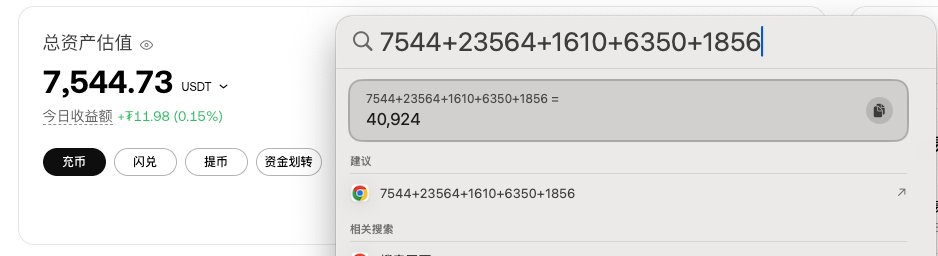

# 第五次資產復盤：交易風格轉變反思

> **來源**: [@CyptoForest](https://x.com/CyptoForest/status/1908023227559063956) | [原文連結](https://x.com/CyptoForest/status/1903997560974606692)
>
> **日期**: Fri Apr 04 05:06:01 +0000 2025
>
> **標籤**: `資產復盤` `交易心態` `風格演進`

---

> **來源**: [@CyptoForest (Forest🌳)](https://twitter.com/CyptoForest)
> **日期**: 2026-02-18
> **標籤**: `加密貨幣投資` `資產復盤` `交易策略` `投資心態` `風險管理`

---

這是我的第五次資產復盤。

先說結論，這一輪並沒有實現「資產翻倍」的目標。

因為我有資產分散習慣，大概估算了下，41000u 不到。

滿手 SOL 和 BNB，還沒來得及出手。

大盤影響固然很大，

但我覺得更重要的是，我的交易風格發生了變化。

這點我會在下面復盤中，詳細展開講。

---

## 前情提要

如果你想看我之前寫的復盤，以下是傳送門：

- 第四次復盤
- 第三次復盤
- 第二次復盤
- 第一次復盤

---

復盤使人進步，這是我的第五次資產復盤。

友情提示，內容很長，讀完需要 5-10min。

請先點讚❤️、轉發🔁、收藏🔖後觀看，避免劃走找不到。

## 交易風格轉變反思

這次復盤的核心重點在於交易風格的轉變。雖然大盤環境對投資結果有顯著影響，但更關鍵的因素是個人交易策略和風格的調整。

目前資產配置主要集中在 SOL 和 BNB 上，尚未進行獲利了結。這種持倉狀態反映了當前的市場判斷和風險管理策略。

資產分散配置是長期以來的投資習慣，這次雖然沒有達成翻倍目標，但通過復盤可以清楚看到策略調整的必要性和方向。
