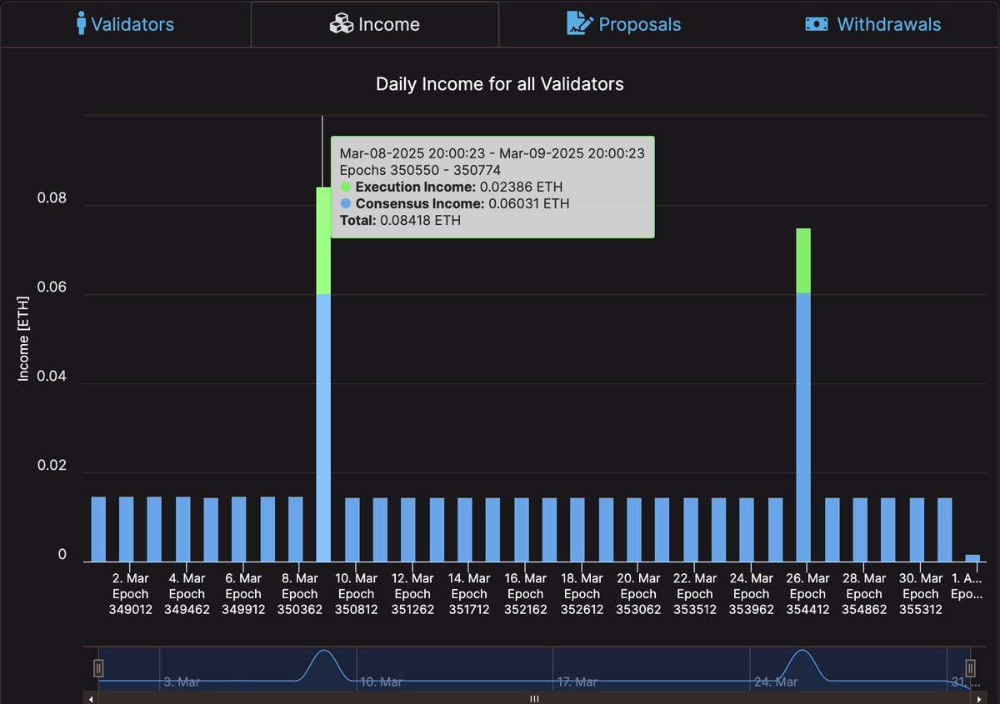
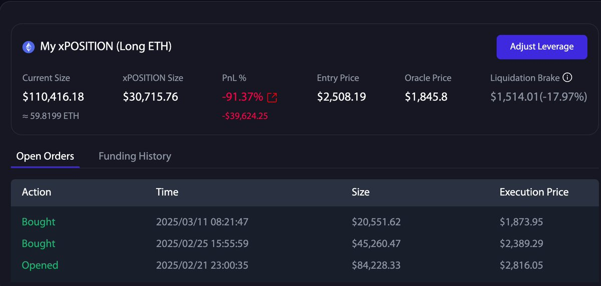

# DeFi 被動收入現況與熊市應對策略 - 2025年3月總結

> **來源**: [@darkforesttri](https://x.com/darkforesttri/status/1906734089023139876)
>
> **日期**: Mon Mar 31 15:43:26 +0000 2025
>
> **標籤**: `被動收入` `熊市策略` `風險管理`

---

> **來源**: [@darkforesttri](https://twitter.com/darkforesttri)  
> **日期**: 2025-03-31  
> **標籤**: `DeFi` `被動收入` `熊市策略` `ETH質押` `槓桿管理`

---

## 2025年3月被動收入總結

靠 DeFi 被動收入過活的第二個年頭。2025年3月被動收入總結：

| 收入來源 | 金額（美元） |
|---------|-------------|
| concentrator | $120 |
| votium | $172 |
| LSD | $482 |
| SAAS | $956 |
| L2 鏈上 LP 挖礦收益 | $0 |
| **總計** | **$1,731** |

都快揭不開鍋了。

### ETH 質押收益

其中 ETH 質押只有兩次超小爆塊，單次都沒超過 0.1 ETH，運氣也不算差了，畢竟鏈上活動趨近冰點，總收益 0.7819 ETH。

## 主動投資：f(x) Protocol 倉位管理

### f(x) Protocol 1.0

- 倉位浮虧 24%
- 大約在 2800 開倉，跌到現在虧損相當小，還挺意外

### f(x) Protocol 2.0

倉位浮虧已經達到 91%：

- 從 2800 開倉 3 倍槓桿
- 在 2400 補倉調整槓桿率
- 跌到 1800 繼續加倉 10 ETH，把再平衡線拉到 1514
- **未來計畫**：如果跌到 1600 繼續補倉
- **最悲觀估計與防守點位**：大概在 1200 左右

2.0 的倉位我一直在耐心的等待機會，機會可以錯過，但不能主動犯錯。**只要不跌破再平衡線，虧的就不是真虧**。

我還挺想能繼續跌一跌的，收回更多的以太坊，彌補上一輪熊市犯下的錯誤。

## 市場觀察與心態

這一個月的感受就是強烈的寒冬，熊市重新又回來的感覺。比特幣還好，畢竟早就突破前高了。但以太坊跌的親媽都快不認識了，其他的山寨更不用說了。

### 川普與市場不確定性

川普就任前給幣圈帶來多大希望，現在就給世界經濟帶來多大的不確定性。我並不認為世界經濟會走向衰退，但**短期的不確定性才是最打擊市場信心的**。真要衰退了，只要確定下來，接下來就是預期大放水，反而市場馬上會好起來。

所以現在的困難僅僅是暫時的，三根大陽線，千軍萬馬來相見！期待和戰友們喜極相見的那一天，**堅持住**！
