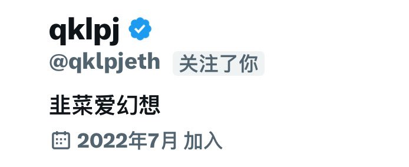

# 幣圈傳奇交易員 X 老對市場的看法

> **來源**: [@0xFxF](https://x.com/0xFxF/status/1905710494281044078) | [原文連結](https://twitter.com/MrApeV/status/1905710494281044078/photo/1)
>
> **日期**: Fri Mar 28 19:56:02 +0000 2025
>
> **標籤**: `交易哲學` `心態管理` `市場洞察`

---

> **來源**: [@0xFxF (0xF 🏴‍☠️)](https://twitter.com/0xFxF)
> **日期**: 2026-02-18
> **標籤**: `交易哲學` `市場觀察` `幣圈投資`

---

幣圈傳奇二級交易員 X 老（也就是 @qklpjeth）刪號前的最後一篇文章。以下是正文：

隨便寫了點看法，寫到後面有點沒耐心寫了，將就看看吧就。

## 我所看到的幣圈

### 前言

要學會接受一切都可能發生，允許一切發生，尤其是在幣圈。
