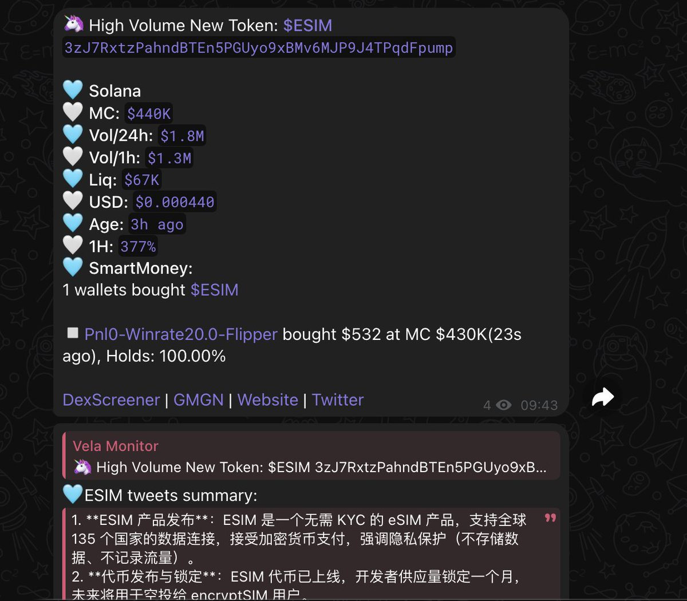
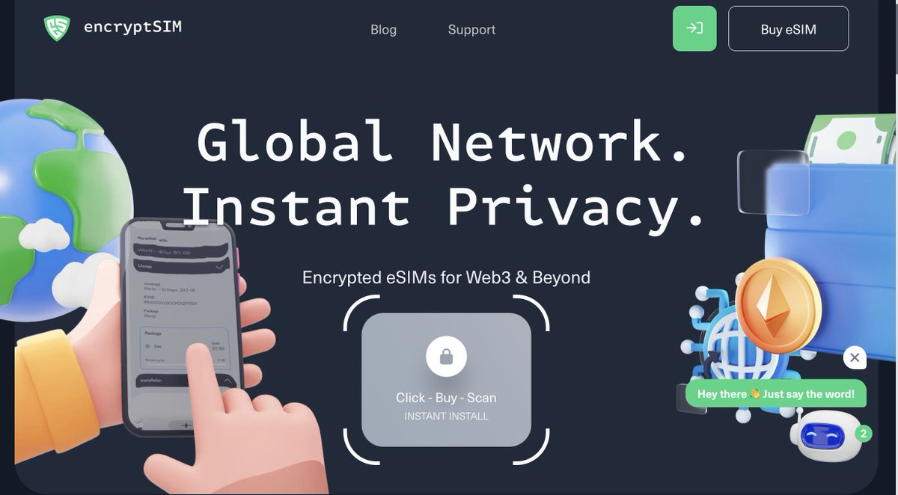
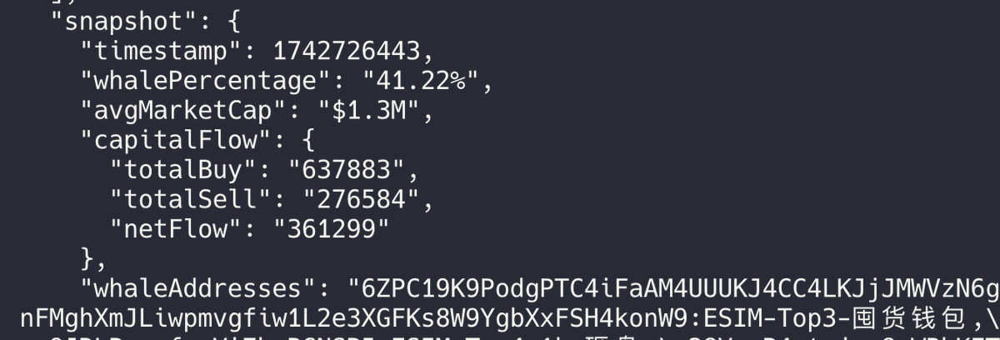
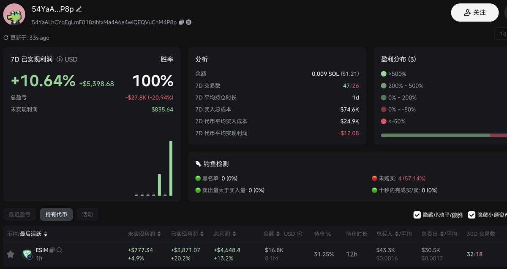

# ESIM 代幣項目分析：被市場忽視的生態項目

> **來源**: [@QuantVela](https://x.com/QuantVela/status/1903785663063003217)
>
> **日期**: Sun Mar 23 12:27:27 +0000 2025
>
> **標籤**: `代幣投資` `項目分析` `籌碼結構`

---

> **來源**: [@QuantVela (Vela)](https://x.com/QuantVela)
> **日期**: 2025
> **標籤**: `ESIM` `代幣分析` `項目研究` `Solana生態`

---

## 項目發現

忍不住分享一下我對 $esim 這個項目的發現。第一次看到是 monitor 在發佈那天 400k 報警的，當時在忙著寫 BSC 監控的代碼就沒留意。過了幾天 @Stanley_Trader 推薦時我才去調研，一打開官網驚為天人，好久沒看到做得這麼用心的項目方官網了。

## 產品定位

產品的定位也很清楚：**第一個無需 KYC 的抗審查的加密 SIM 卡**。

## 籌碼分析

於是趕快查了下籌碼結構：
- 控籌還可以
- 莊也有拉盤行為，而不是拿到底籌只管出貨
- 查的時候發現當時幣的市值和莊二段建倉的成本比較接近，於是我也跟隨進行建倉

## 市場討論

後面也看到很多推文討論說 Toly 關注了 dev，會不會發推支持，甚至 Solana 手機和 esim 合作，是有一定概率，畢竟 dev 之前在 Cosmos 和硬件深耕了很長時間。

## 綜合評價

綜合來看這個項目：
- ✓ 有實際收入（$99 的 SIM 卡）
- ✓ Token 有實用性而不是為了發幣而發幣（建立支付通道、為了遷移到自己鏈上做準備）
- ✓ Dev 聲譽良好且 keep building

我認為是一個**被市場忽視但對生態有益的項目**。
