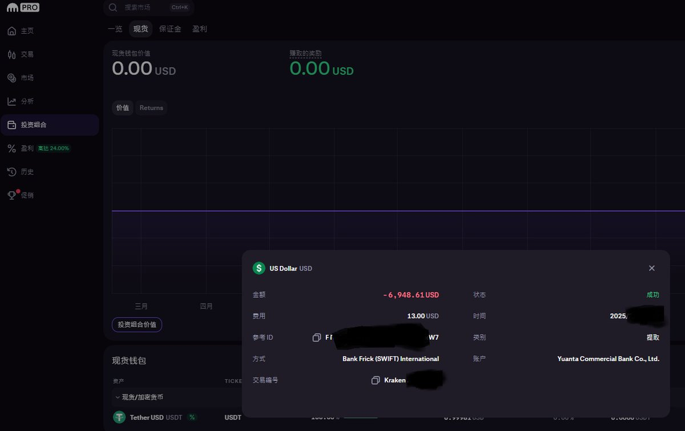

# 加密貨幣出金節稅策略：台灣海外所得申報指南

> **來源**: [@GigQp](https://x.com/GigQp/status/1891166612751020140)
>
> **日期**: Sun Feb 16 16:43:51 +0000 2025
>
> **標籤**: `加密貨幣出金` `海外所得節稅` `Kraken出金`

---

> **來源**: [@GigQp (CryptoDooog 瘋狗堯)](https://x.com/GigQp)  
> **日期**: 2026-02-18  
> **標籤**: `加密貨幣出金` `美元出金` `海外所得` `節稅` `台灣稅務`

---

## 背景說明

台灣政府部門對幣圈的法規和課稅方式到目前為止都還是相當模糊的。法規開始有限制個人幣商的交易，但課稅並還沒有明確的指引（以下不一定正確，大家都還在猜）。

## 兩種出金方式的稅務差異

### 1️⃣ 台幣出金

如果透過國內交易所（如 @MAX_exch 幣託等）完成台幣出金，報稅時會算入**境內所得**。

- 可以附上當初台幣入金的證明文件來抵扣
- 多出的部分會併入**綜合所得稅**

### 2️⃣ 美元出金（海外所得）

使用國外的交易所（以前很多幣圈人會使用 FTX，現在可使用 Kraken 等），以美元方式出金。

**海外所得稅務規定**：
- 個人海外所得 **100 萬元以下**：不計入基本所得額、免申報
- 海外所得達 **100 萬元以上**：需要申報（但申報不等於需要繳稅）
- 海外所得的扣除額為 **750 萬元**
- 稅率：**20%**

## Kraken 美元出金實測流程

本次出金作者從幣安提幣 $USDT 到 Kraken，再換成 $USD (US Dollar)。

### 換匯技巧：減少磨耗

為了減少磨耗，避免直接使用閃兌（手續費 0.9%）：
- 可以透過**現貨掛單的方式**來換美元（手續費 0.2%）
- 然後提取美金到你指定的外匯帳戶中

### 銀行收款流程（以元大銀行為例）

⚠️ **注意**：聽說每家銀行的規定不同

**時間流程**：
- 晚上提現
- 隔天（工作日）中午後，外匯部門應該就能收到你的美金電匯款項

**銀行照會**：
- 因為現在銀行對 Crypto 非常敏感
- 不管金額大小，都肯定會打電話來問你一堆問題
- 也不用想隱瞞說是其他投資所得，因為銀行會有紀錄
- 如果遇到比較不會刁難的外匯經辦，確認完是本人的匯款並非詐騙資金後，報經主管核可，即可放行

**實際耗時**：
- 作者前後花費了近 **7 日**才收到電匯的美金

### ⚠️ 風險提醒

🚨 有聽其他人的經驗（運氣不佳）：
- 經辦可能還要你提供**最初期的入金紀錄**
- 如果當初沒有保留相關入金資料，可能會有點麻煩

## 總結

歡迎各位有經驗的朋友們切磋指教。希望大家都能有出金方面的困擾——代表你在這圈子是贏家啦 🤝
