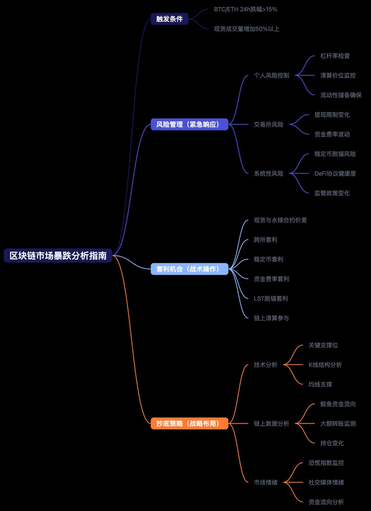

# 區塊鏈暴跌指南：檢查清單、套利與布局策略

> **來源**: [@bitfish](https://x.com/bitfish/status/1886630761199194290) | [原文連結](https://twitter.com/bitfish1/status/1886630761199194290/photo/1)
>
> **日期**: 
>
> **標籤**: `暴跌機制` `套利機會` `投資心態`

---

> **來源**: [@bitfish](https://x.com/bitfish)  
> **日期**: 2026-02-18  
> **標籤**: `區塊鏈` `暴跌應對` `套利策略` `風險管理`

---

## 概述

區塊鏈暴跌時的檢查清單與應對策略。作者使用 AI 工具撰寫深度研究報告並生成思維導圖，流程僅需幾分鐘即可完成。

## 核心內容

**《區塊鏈看瀑布指南》** 涵蓋暴跌時的三大主題：

1. **檢查清單** - 快速檢視市場狀態、持倉風險
2. **套利機會** - 暴跌時的價差、資金費率等套利策略
3. **布局策略** - 如何在恐慌中找到低風險進場機會

## 工具流程

作者使用 AI 輔助創作流程：
- 提供標題框架
- AI 深度研究功能生成報告
- 另一個 AI 繪製思維導圖
- 整套流程數分鐘完成
