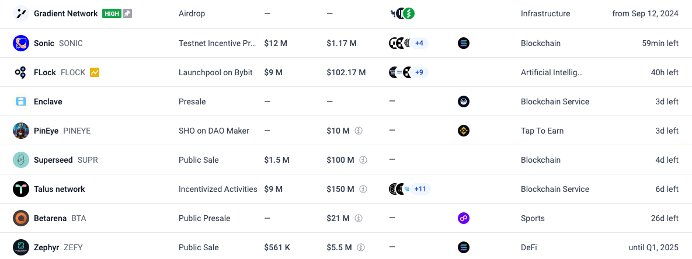

# 普通人如何掌握一級市場公售機會

> **來源**: [@TobiChicken](https://x.com/TobiChicken/status/1876546228726726775) | [原文連結](https://icodrops.com/)
>
> **日期**: 
>
> **標籤**: `IEO` `一級市場` `風險管理`

---

> **來源**: [@TobiChicken (Tobi Chicken 投幣雞)](https://twitter.com/TobiChicken)
> **日期**: 2026-02-18
> **標籤**: `一級市場` `公售` `IEO` `ICO Drops` `加密貨幣投資`

---

## 概述

除了交易所 IEO（如 OKX、Binance、Bitget、Bybit）之外，還有鏈上一級市場公售機會可以參與。這些公售機會通常勝率高，且可以投入較大倉位。

## 交易所 IEO

大型交易所會不定期釋出 IEO（Initial Exchange Offering）：
- **平台**：OKX、Binance、Bitget、Bybit
- **特點**：勝率通常很高
- **限制**：參與額度有限

## 鏈上一級市場公售

### 案例：$BIO

- $BIO 在宣布上幣安時，仍有額度開放散戶參加
- **回報**：高點有超過 20x 回報
- **優勢**：可以上大倉位

### 案例：$SUPR

- FDV（完全稀釋估值）100M 進行公售募資
- 目前已募資 4M

## 追蹤工具

**ICO Drops**（https://icodrops.com）
- 提供 ICO 和 IEO 的完整日曆
- 包含活躍中（Active）、即將推出（Upcoming）、已結束（Ended）的項目
- 可以查看項目詳情、募資進度、估值等資訊

### 建議

定期追蹤一級市場鏈上公售機會，把握高回報潛力項目。
