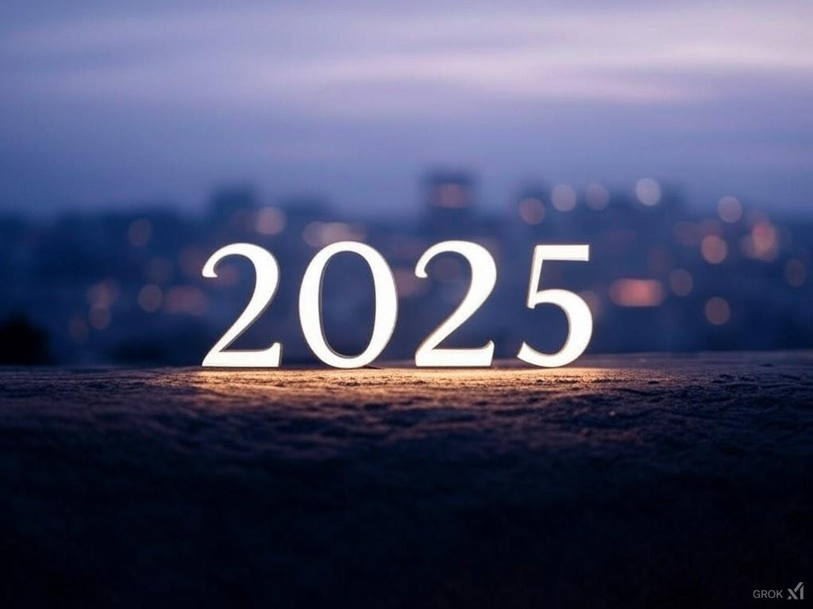

# 2025 年度投資組合規劃與資產配置策略

> **來源**: [@gm365](https://x.com/gm365/status/1875400115604828170)
>
> **日期**: Sat Jan 04 04:33:25 +0000 2025
>
> **標籤**: `投資組合配置` `週期策略` `風險管理`

---

> **來源**: [@gm365](https://x.com/gm365)  
> **日期**: 2025-01-01  
> **標籤**: `投資組合` `資產配置` `週期策略` `持倉管理`

---

## 2025 年的重要性

對很多加密圈的同學們來說，今年將會是非常重要的一年。

因為，按照「四年一個週期」的過往「歷史規律」，今年你會看到：

1. 比特幣的持續新高
2. 山寨幣的集體新高
3. MEME/AI 類阿爾法幣的爆炸性上漲

簡而言之，就是老韭菜們的個人資產組合來到四年週期的新高，賺到你之前未曾想像過的財富價值。

當然，如果是新韭菜，則很有可能在今年遭遇最嚴重的虧損金額，比過往熊市虧得更多、更快。

雖說時間的流逝是持續的，2024 年 12 月 31 號 23:59 和 2025 年 1 月 1 號 00:00 之間並無任何本質不同，但開年之際，作為反思之時，給自己定一個年度目標和計劃，依然是有價值的。

因為，太多人沉溺於如何把事情做對、做得更好，而忘了選擇做哪些對的事，往往更有價值。

鑑於此，打算認真梳理下自己的 2025 年度目標和計劃。

## 年度目標

### 個人資產總值 x 10 倍

這點參考了 DAYU 提到的一個概念，思索了一下，發現這樣的視角，其實獨具價值，甚至可以說別有洞天。

當你站在資產總值翻十倍的高度，重新審視自己的選擇、投機標的、操作手法時，相信會是一種全新的體驗。

也許你就不會再執迷於鏈上內盤 PvP 的狂熱了，因為小資金投入，再高倍數，對於資產總值而言，意義往往也不大。

相反，你會思考更重要的問題：

1. 我要持倉哪些類別的資產
2. 不同資產類別如何分配比例
3. 思考和決策是否比實際行動更有價值

### 資產類別劃分

所謂資產類別，可以大體劃分如下：

- **A**：比特幣
- **B**：頭部山寨幣（ETH、SOL、BNB 等）
- **C**：其他山寨幣
- **D**：頭部 MEME 幣（PEPE 等）
- **E**：鏈上阿爾法幣
- **F**：短期高度投機 MEME 幣

不同類別幣種，今年總體漲幅不同，比如比特幣也許再有 2 倍就頂天了，B 類可能還有 3～5 倍空間，D 類也許還有 5～10 倍，其他倍數更高，但歸零風險也更大。

合理構建投資組合，大約等同於「免費的阿爾法」。

不過，總資產十倍增長，更像是一種美好期望，3～5 倍，也許屬於可達成的目標。

## 執行計劃

計劃大致分兩方面：

1. 調整投資組合（持倉幣種及比例）
2. 時間精力投入

### 一、調整持倉幣種和比例

**1. 賣出敘事空間有限的山寨幣**

具體來說，就是賣掉空投的 ZK 和 ODOS（沒錯，空投的 ZK 我一個沒賣，持倉至今）。

持倉這類幣種，意義何在？還在奢望 $ZK 翻五倍到 $1？我不如賭 $PEPE 更快達成這個目標。

**2. 調整 ETH 倉位比例**

賣出前面提到的不再性感山寨幣後，兌換成了 ETH。那麼目前問題就是，ETH 持倉比例過大（可能超過了 9 成）。

雖然現在看，ETH 今年也許也來個 3 倍，抵達雄偉的一萬刀 Valhalla 殿堂，但 ALL IN 一個幣，並不算是一個好的策略。

打算調整/買入如下幣種：

- BTC、SOL
- PEPE
- 其他鏈上頭部 MEME 3～5 個

具體比例和幣種，有待進一步調研和決策。

### 二、時間和精力的分配

調整完投資組合後，今年的大部分時間可能不需要額外動作，只需要被動等待資產價格上漲即可。

那麼，多出來的時間精力用來做什麼呢？

**拿出 10% 的資產，用於鏈上高度投機類 MEME 幣的交易。**

優勢：

1. 整體風險小（全部虧損也不至於元氣大傷）
2. 潛在回報高（如果買中高增長 MEME，回報巨大）
3. 有事可做

不過，依然需要有章可循，而不是每天盲目衝鏈上新標的了。

比如：

1. 多研究、多思考、少操作
2. 借助 AI 輔助，構建量化交易策略

## 總結

大體而言，以上就是今年的目標與規劃。

希望能對大家有所啟發,也預祝各位在今年迎來資產價值的新高。
