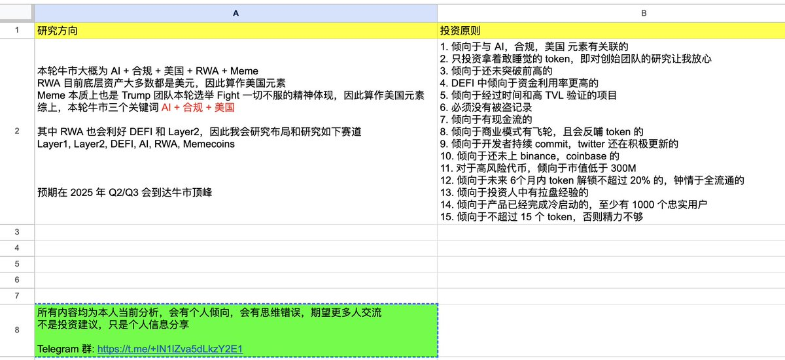
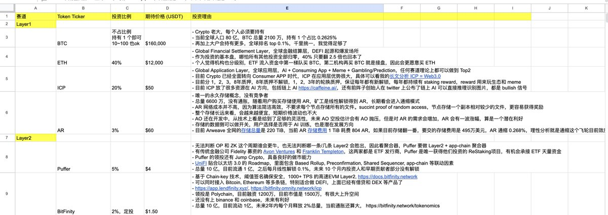
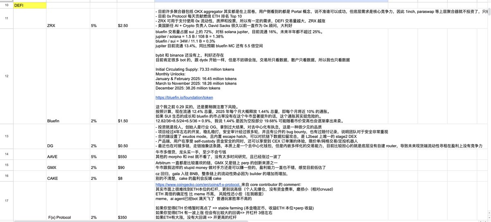
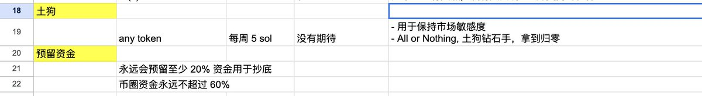

# 2025 牛市投資框架 - AI、合規、美國三大主軸

> **來源**: [@0xkookoo](https://x.com/0xkookoo/status/1873295483885719940) | [原文連結](https://t.me/+IN1lZva5dLkzY2E1)
>
> **日期**: Sun Dec 29 09:10:22 +0000 2024
>
> **標籤**: `投資策略` `牛市佈局` `選幣原則`

---

> **來源**: [@0xkookoo (0xkookoo 🦇🔊🐙)](https://x.com/0xkookoo)
> **標籤**: `投資框架` `牛市策略` `AI` `合規` `RWA` `DeFi`

---

## 前言

之前一直認為我的投資分析不成體系，所以從未有過公開的分享。但是隨著過去幾年的 點→線→面→體 的積累，我在幣圈的投資也小有盈利。再加上最近我提前佈局的一些 token 也都逐漸地被市場驗證，被更多大 V 喊單，因此今天也粗淺地分享一下我寫的一個牛市清單。

## 一. 研究方向

1. 本輪牛市大概為 **AI + 合規 + 美國 + RWA + Meme**
2. RWA 目前底層資產大多數都是美元，因此算作美國元素
3. Meme 本質上也是 Trump 團隊本輪選舉 Fight 一切不服的精神體現，因此算作美國元素

**綜上，本輪牛市三個關鍵詞：AI + 合規 + 美國**

其中 RWA 也會利好 DeFi 和 Layer2，因此我會佈局和研究如下賽道：
- Layer1
- Layer2
- DeFi
- AI
- RWA
- Memecoins

目前 AI 賽道還在深入研究中，最近發展變化太快，等形成體系後會分享我的投資清單。

**預期在 2025 年 Q2/Q3 會到達牛市頂峰**

## 二. 投資研究原則

（傾向和必須是不同級別原則）

1. 傾向於與 AI、合規、美國 元素有關聯的
2. 只投資拿著敢睡覺的 token，即對創始團隊的研究讓我放心
3. 傾向於還未突破前高的
4. DeFi 中傾向於資金利用率更高的
5. 傾向於經過時間和高 TVL 驗證的項目
6. **必須**沒有被盜記錄
7. 傾向於有現金流的
8. 傾向於商業模式有飛輪，且會反哺 token 的
9. 傾向於開發者持續 commit，Twitter 還在積極更新的
10. 傾向於還未上 Binance、Coinbase 的
11. 對於高風險代幣，傾向於市值低於 300M
12. 傾向於未來 6 個月內 token 解鎖不超過 20% 的，鍾情於全流通的
13. 傾向於投資人中有拉盤經驗的
14. 傾向於產品已經完成冷啟動的，至少有 1000 個忠實用戶
15. 傾向於不超過 15 個 token，否則精力不夠

## 風險提示

所有內容均為本人當前分析，會有個人傾向，會有思維錯誤，期望更多人交流。**不是投資建議，只是個人信息分享。**

## 相關資源

- Telegram 群組（免費）：https://t.me/+... （原推文連結）
- 投資清單 Google Excel：https://t.co/7To5iMbZyi

後續更新全部會放在 Google Excel 中。
