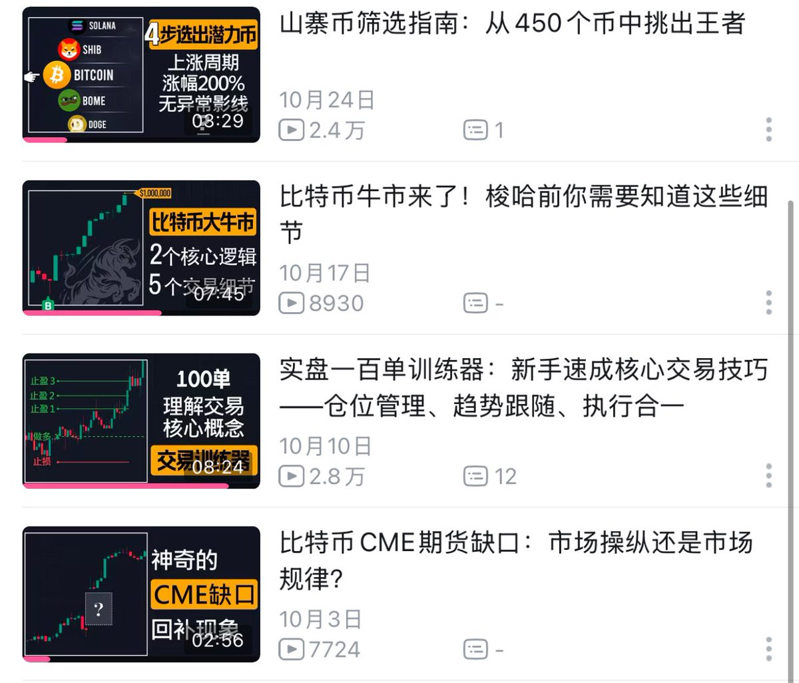

# 山寨幣弱勢判斷：30% 漲幅的時間成本分析

> **來源**: [@CycleStudies](https://x.com/CycleStudies/status/1863610969936847071) | [原文連結](https://twitter.com/CycleStudies/status/1863610969936847071/photo/1)
>
> **日期**: Mon Dec 02 15:47:34 +0000 2024
>
> **標籤**: `牛市選幣` `資金效率` `機會成本`

---

> **來源**: [@CycleStudies (百萬Eric | Day Trader)](https://twitter.com/CycleStudies)
> **標籤**: `山寨幣` `持倉管理` `機會成本` `交易策略`

---

## 弱勢幣種判斷標準

如果你持有的山寨幣當前只漲了 30%，從市場表現來看，它屬於典型的弱勢幣種。

雖然帳面上是盈利的，但從資金效率的角度來說，實際卻是在「虧時間」和「虧機會」。

## 相關學習資源

作者在 2024 年 10 月於 B 站上傳了三期關於牛市選幣和做多的教學影片。
