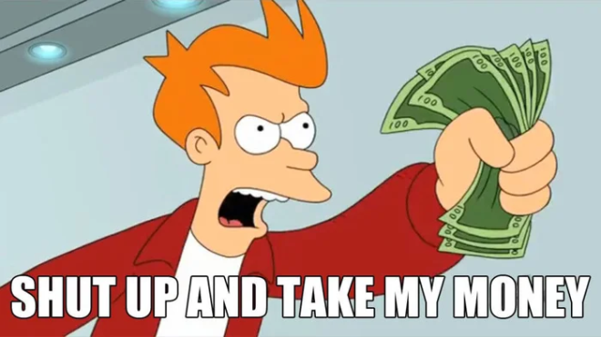

# Meme 作為加密市場殺手級應用：從普及到滲透的周期分析

> **來源**: [@Michael_Liu93](https://x.com/Michael_Liu93/status/1862765029457895882) | [原文連結](https://pump.fun/)
>
> **日期**: Sat Nov 30 07:46:06 +0000 2024
>
> **標籤**: `Meme 代幣` `市場周期` `流量經濟`

---

> **來源**: [@Michael_Liu93 (憨厚的麥總)](https://twitter.com/Michael_Liu93)
> **日期**: 2025-01-XX
> **標籤**: `Meme` `加密市場` `Mass Adoption` `Mass Penetration` `Pump.fun` `殺手級應用`

---

這是一篇從機構投資人的視角，嘗試回答三個核心問題的長文：

1. 加密行業是否已經迎來了大規模普及（Mass Adoption）？
2. Meme會不會成為打開加密市場大規模滲透（Mass Penetration）的殺手級應用？Meme賽道的底層邏輯到底是什麼？
3. 今天的Meme市場大致處於週期的哪個階段？

## 1. 加密行業是否已經迎來了大規模普及（Mass Adoption）？

聊Meme之前，先問一個有爭議性的問題：你覺得加密行業是否已經迎來了大規模普及？

對於這個問題，最常聽到的是兩個極端的觀點：

- **一方認為**：加密已經迎來了大規模普及，華爾街都入場了，該買幣的散戶都買過了，這輪週期哪裡還有什麼新人入場？
- **另一方認為**：並還沒有普及，也經常拿AI作比較，因為加密市場並沒有出現一個像是ChatGPT一樣超過2億用戶的Killer App（殺手級的應用）。

我認為兩邊說法都沒問題，但本質上討論的其實是兩件事：一個討論的是**大規模普及（Mass Adoption）**，而另一個討論的則是**大規模滲透（Mass Penetration）**。

### 用美國互聯網發展史來解釋

**1995年美國的電腦普及率在40%左右**，當時大概有8,500-9,000萬美國人用上了電腦。同期，**互聯網在美國的滲透率卻只有13%左右**，共2,500萬人。所以在1995年美國的3台電腦中有1台連上了網。

你可能站在今天很難想象那剩下兩台電腦在幹啥呢？剩下兩台電腦在當時被當計算器和打字機在用（因為電腦是從工作場景開始普及的,到了20世紀末才逐漸進入家庭場景）。

為什麼選1995年為例呢？因為**美國1995年40%的電腦滲透率恰好等同於美國今天數字貨幣的滲透率**。

**2024年美國數字貨幣持有者占美國總人口的40%，總持幣人數約9,300萬人。**

接下來，如果我們把「上鏈」對比「上網」，我們可以看到：

- Solana最大的錢包Phantom的月活錢包數量為**700萬**左右
- Ethereum最大的錢包Metamask的月活錢包數量為**3,000萬**左右（都取了最近可查數據的最高值)

假設美國人占了一半鏈上用戶，再假設每人會有3個錢包，粗略估算一下目前**美國鏈上的用戶大致在600萬人左右**，也就是最高占今天美國總人口的**3%左右**。

（這個估算肯定不完全準確，因為還有不少其他的錢包，平均每人的錢包數也可能超過3個，美國占全世界一半的鏈上玩家數這個假設也不一定準確，但因為我取的都是樂觀假設，不管怎麼算，美國的「上鏈」人數大概率不會超過1000萬人）

### 今天的加密行業處於什麼位置？

**今天的加密行業處於比1995年的互聯網行業還要尷尬的位置**：

- **40%的數字貨幣普及率已經明顯足夠普及**
- **不到3%的鏈上滲透率很明顯還太少**，還不如1995年13%的上網滲透率

這就是為什麼當大家在討論crypto是否已經mass adopted的時候，雙方觀點都沒錯，只是討論的維度不同：

- 一方說的是「電腦=數字貨幣」的**普及率**
- 另一方說的則是「互聯網=鏈上應用」的**滲透率**

值得一提的是，**美國互聯網滲透率在3%的時候是在1993年**，而**1994年開始到2000年美國互聯網的滲透率迅速的從3%增長到了43%**。所以1994年發生了什麼？**網景瀏覽器出現了**，這是互聯網時代的第一款殺手級應用，**一款殺手級的應用是真的能推動行業整體滲透率的快速增長**。

### 1995年的互聯網用戶的感受

我在桌前寫這篇文章的時候都能想象到，1995年最先上網的那批前輩也一定像今天的我們一樣討論著同樣的問題，覺得電腦都已經普及度這麼高了，好像並沒有什麼事情是「缺了電腦不行」的，上網上的實在覺得有些食之無味、棄之可惜的感覺，純純是為愛發電。**這難道不是今天加密行業的我們的感受嗎？**

### 從網絡剛出現到大規模普及發生了什麼？

**第一批聯網的用戶一定是最geek（極客）的人**，用著互聯網上第一批最沒用的應用，比如網上收音機、網上電視、網上電話簿這些在當時已經通過線下方式滿足的偽需求，他們上網純屬因為對新鮮事物的熱愛。

隨著第一批電腦用戶連上了網，漸漸的出現了**第一批「杀手級應用」**，比如郵箱、比如電商（雖然那時候的電商還是比線下麻煩太多，在當時也可以稱作偽需求，比如亞馬遜在初創賣書時就意識到了這點，他們跟線下書店競爭的方式只能是去賣那些線下書店很少會賣的小眾書籍）。

隨著互聯網用戶基數的增長，**用戶紅利帶來了新的殺手級應用出現的可能**，比如當你只有1個朋友在用微信跟你有100個朋友在用微信，你去下載微信的動力是完全不能比的（很多時候一個應用殺手不殺手是取決於用戶基數的，電話、郵箱、社交網絡就是最典型的例子）。

所以你可以看到**在互聯網用戶基數達到量變的閾值後，創新的速度開始了加速度，殺手級應用出現的頻率越來越高**，每過一兩年就是一個創新的熱潮，經歷了2000-2020年這二十年的中國第一批VC投資人們應該對這個過程的演進最感同身受（我是2016年入的行，恰好踩中了互聯網時代的尾巴）。

## 2. Meme會不會成為打開加密市場大規模滲透的殺手級應用？Meme賽道的底層邏輯到底是什麼？

如果我們再以互聯網時代作為參考，**互聯網的爆發一定是基於電腦已經足夠普及這一前提條件**。而今天對於加密行業來說，40%的滲透率，加密行業已經足夠普及，但我們就像1995年的第一批互聯網用戶，**我們一直還在找那個可以把上億用戶帶進鏈上的殺手級應用**，而**我認為我在Meme身上看到了殺手級應用的影子**。

### Meme是新的流媒體形態，是新時代的抖音

我之前在我的space裡聊過這個概念，我認為**meme就是新的流媒體形態，是新時代的抖音**。

有沒有發現你自從玩了Pump.fun以後，你刷抖音的時間都在減少？甚至都不刷了？

**兩者本身都是注意力經濟，也都是大時代背景的產物**：

- **抖音**是年輕人時間越發碎片化背景下、奔波於工作和生活下仍需要短暫且及時的多巴胺的產物，是**快娛樂**
- **Meme**則是社會階級固化背景下、年輕人急需賭一把的娛樂方式，是**「窮娛樂」**

一個滿足了色慾和懶惰，而另一個滿足了貪慾，**本質上都是滿足人性最底層「原罪」的多巴胺生意**，這也是為什麼大家都在24小時樂此不疲的刷抖音或者刷pump，因為是真的「有癮」。

### 抖音與Meme的類比

如果把抖音的各個「名詞」跟meme做個比較：

| 抖音 | Meme |
|------|------|
| 內容主 | dev/項目方（生產內容 = 生產meme盤） |
| 抖音推送算法 | meme kol（推送算法決定了你刷到什麼內容，而meme kol決定了你會關注什麼meme幣，都是分發流量的核心位） |
| 流量變現 | 做市商（通過拉盤砸盤讓自身的meme受到更多的注意力，並在過程中幫助項目方變現） |
| 廣告投放 | dexscreener、CMC、Tiktok廣告（吸引散戶眼球和流量的活） |
| 專業生產內容（PGC） | 強莊盤 |
| 用戶生產內容（UGC） | 純CTO盤 |
| 垃圾廣告視頻 | Rug盤 |

### Meme行業未來的趨勢

如果你能明白以上邏輯，那我們通過抖音的發展路徑作為meme行業的引路石，Meme行業未來大概率會有以下趨勢：

#### 1. 產業鏈分工越來越細、越來越專業

產業鏈的分工會越來越細、越來越專業，每個環節中不專業的都會漸漸被淘汰，包括dev、項目方、kol、做市商，**這是一個極度強者恆強的市場**。

#### 2. UGC漸漸淡出，PGC化成為主流

一開始還有UGC的內容（純社區盤），後來流量會越來越頭部聚集，新跑出來的內容越來越PGC化（強莊盤），UGC的內容漸漸淡出視野（但你仍然能看到隱藏成UGC，但其實是專業團隊做的PGC盤子，因為部分觀眾就喜歡UGC風格的，而這些盤子也是為了迎合這群人）。

邏輯很簡單，**在solana上，任何能起飛的盤子一定是有莊在背後推動的**：

- 高控籌拉的猛吸引大家的關注度
- 有專業營銷團隊才能把故事講好
- 然後在上漲的過程中莊會逐漸籌碼慢慢分散
- 最後隨著時間慢慢形成強社區

所以**一定是強莊在先，然後建立強社區在後**。所以我無數次的在space裡強調，**好的meme幣一定是莊和散戶互相成就的**，你們要去尋找「良莊」，看生產內容的質量、看做市商的操盤手法、看團隊運營社區的用心程度。

#### 3. KOL拼的是匹配優質「內容」的能力

**KOL最終拼的是匹配優質「內容」的能力**，誰項目調研做的好，能能找到最優質的「內容」推送給粉絲，讓粉絲賺到錢，那他的流量就會越大，進而能匹配到更優質的「內容」，形成一個正循環。仔細研究過Murad的就能明白他是怎麼玩的了。

如果你抖音的推薦算法天天給你推送垃圾視頻，你是女生，給你推茶味滿滿的美女跳舞視頻，你是男生，給你推如何選化妝品，你大概率會不斷點「不感興趣」去調整你的推薦算法。

**這也是為什麼我認為未來rug dev大概率會越來越少**（只要你不去內盤屎裡淘金），因為KOL在慢慢變的專業化，kol也不會想call垃圾盤，每call一個就是對他最寶貴資源「流量」的打擊，所以這群rug dev以後也很難被KOL做到流量推送（當然矩陣號和鐮刀KOL這些垃圾會一直存在，但他每騙一次，他的「帶貨」能力就會下降一個量級，直到再也沒有人關注他們）。

#### 4. 頭部內容主聚攏流量，頭部盤子吸血長尾盤子

**頭部的內容主會聚攏越來越多的流量，meme賽道也是，頭部的盤子會瘋狂吸血長尾盤子**。

以後meme賽道會跑出來辛巴、小楊哥、李佳琦、薇婭這些頭部的「Meme盤」，想想那些二級炒meme的小夥伴們，大家會想要去「屯」的meme是不是都是PEPE、WIF、POPCAT、SPX這些已經展現出實力，並有非常龐大社區的meme幣？（但這並不意味著不會有新的「內容主」跑出來，一定會有新的Meme殺出來）

我把底層邏輯呈現的如此赤裸裸，可能會引起一些人的不適，但沒辦法這就是事實，而且這樣的趨勢已經發生。**你要先了解遊戲規則的真相，才能去在這個遊戲裡獲勝**，你說對嗎？

## 3. 今天的Meme市場處於週期的哪個階段？

### Pump.fun的用戶量數據

我們首先來看看Pump fun目前的用戶量數據，在dune上可查：

- Pump fun目前**日活錢包數在15萬個**左右
- 前兩週solana meme最火熱的時候最高達到了**日活20萬個錢包**
- 如果我們除以之前聊過的Phantom 700萬月活總數來算個大致的滲透率，目前**pump fun日活佔Phantom用戶量的2.9%**

所以僅考慮phantom一個錢包的用戶量，**pump fun都還遠遠算不上大規模滲透（mass penetrated）**。

### 頭部Meme幣的持有人數

除了去看pump fun這種內盤玩法的參與人數，我們也可以去看看目前最大的那些meme幣的持有人數來去大致理解一下鏈上玩家的數量級有多少（很多地址是刷的，所以實際結果只會更少，我個人的判斷地址數/人數至少是2-3倍）：

| Meme幣 | 持有錢包數 |
|--------|-----------|
| WIF | 19萬個 |
| Popcat | 11萬個 |
| Bonk | 1.1萬個 |
| PEPE | 27萬個 |
| SPX | 2.5萬個（這裡有點暴露出了Murad一直在喊單的SPX到底是不是真的社區很牛逼） |

### 當前Meme的滲透率

不管是看Pump fun的用戶數據還是去看最頭部藍籌meme的持有錢包數據，你大致都會得到一個**20萬-30萬以內的數字**。

所以**Meme對於當前已經有錢包上鏈的用戶滲透率也就在3-5%之間**，光是這批已經上鏈的用戶就還有大幾百萬人沒有被meme滲透，也就是**現在Meme用戶規模的20-30倍**。

### 不同滲透率假設下的增長空間

#### 假設1：滲透已上鏈用戶

如果我們假設Meme會把原來在交易所裡交易的用戶也滲透一部分到鏈上，那我們要參考的數字則是全球的加密用戶的總量，**5-6億**：

- **1%的滲透率就能帶來20-30倍的增量用戶**
- **10%就是200-300倍**

#### 假設2：Meme成為Web3的殺手級應用

而如果我們認為Meme是Web3真正的殺手級應用，並會成為了新時代的流媒體，web3的抖音，我們可以看一下抖音2024年11月的數據：

- **7億的日活**
- 是目前全球meme玩家總量的**2000-3000倍**

## 結論

**這可是加密企業家和投資人們最好的時代啊。**
