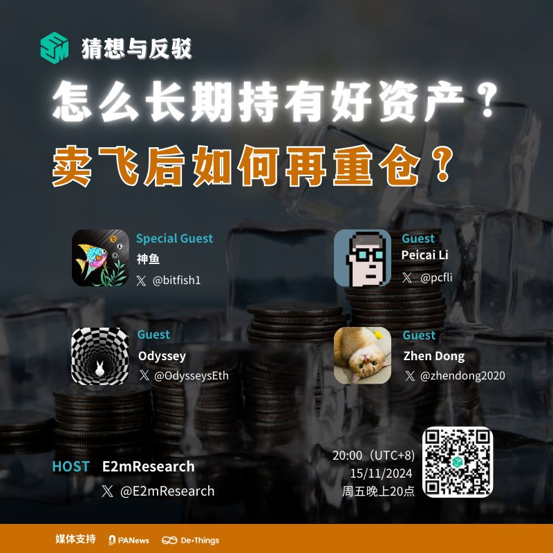

# 長期持有好資產與賣飛後重倉策略

> **來源**: [@E2mResearch](https://x.com/E2mResearch/status/1858778711119810578)
>
> **日期**: 
>
> **標籤**: `倉位管理` `心理建設` `資產認知`

---

> **來源**: [@E2mResearch (E2M Research)](https://twitter.com/E2mResearch)
> **日期**: 2024-11-15
> **標籤**: `長期持有` `倉位管理` `賣飛後重新建倉` `投資心理` `認知提升`

---

## Space 筆記摘要

最近行情漲勢不錯,如何長期持有好資產?賣飛後如何再重倉?值得再次討論,也期待嘉賓們可以從通過自己的行業經驗來交流討論。

## 討論議題時間戳

| 時間 | 議題 |
|------|------|
| 02:59 | 如何用倉位管理大法長期持有好資產? |
| 10:44 | 強調認知對於如何判斷好資產的重要性 |
| 24:55 | 長期持有好資產需要掌握基礎知識且避免短期交易 |
| 30:39 | 賣飛後如何在重倉話題的見解 |
| 35:01 | 長期持有好資產的關鍵點在於什麼? |
| 41:29 | 賣出後在重倉更多的是心理問題 |
| 45:43 | 為什麼要建立倉位管理系統? |
| 51:59 | 認識錯誤和對錯誤的歸因,哪個更重要? |
| 55:45 | 重倉之後覺得不合適的資產如何拋掉 |
| 58:04 | 發現好資產和賣飛後再重倉,哪個更難? |
| 01:09:05 | 以賺錢為目的會使賺錢的難度指數級增加嗎? |

## Space 資訊

**主題**: 怎麼長期持有好資產?賣飛後如何再重倉?

**時間**: 2024年11月15日 20:00 (UTC+8)

**特邀嘉賓**:
- 神魚 [@bitfish](https://twitter.com/bitfish)

**常駐嘉賓**:
- Odyssey [@OdysseysEth](https://twitter.com/OdysseysEth)
- Zhen Dong [@zhendong2020](https://twitter.com/zhendong2020)
- Peicai Li [@pcfli](https://twitter.com/pcfli)

**合作媒體**:
- [@PANewsLab](https://twitter.com/PANewsLab)
- [@DeThingsNews](https://twitter.com/DeThingsNews)
