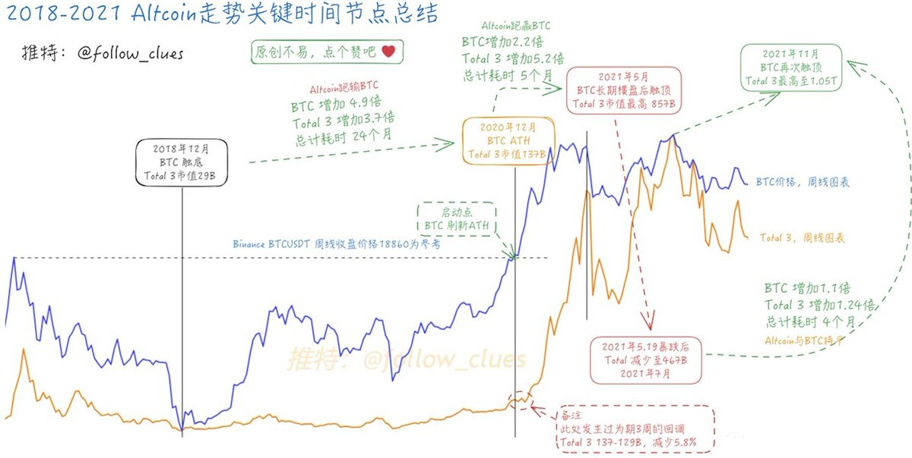

# BTC 創新高與山寨季開啟：市場週期分析

> **來源**: [@follow_clues](https://x.com/follow_clues/status/1858061542572339384) | [原文連結](https://twitter.com/follow_clues/status/1858061542572339384/photo/1)
>
> **日期**: Sun Nov 17 08:16:07 +0000 2024
>
> **標籤**: `比特幣` `山寨季` `市場週期`

---

> **來源**: [@follow_clues (Theclues)](https://twitter.com/follow_clues)
> **日期**: 2026-02-18
> **標籤**: `BTC` `山寨季` `市場週期` `技術分析`

---

## 核心觀點

找到了這個原始的圖表，關鍵規律是：

**BTC 確立新高 + 1 週，山寨季逐步開啟**

在此之前山寨幣的表現就是跑不贏 BTC。

---

## 市場週期分析

根據歷史數據觀察，當 BTC 突破並確立新高後：

- **第 1 週開始**：山寨季進入啟動階段
- **之前階段**：山寨幣普遍跑輸 BTC，資金集中在 BTC
- **週期轉換**：新高確認後約一週，資金開始輪動至山寨幣

這個時間窗口為投資者提供了山寨幣佈局的參考時機。
