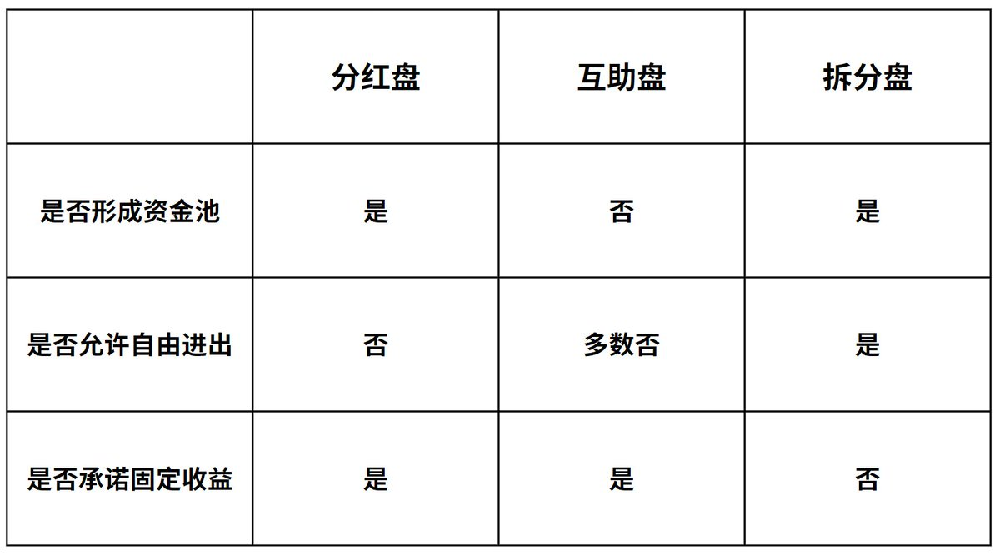
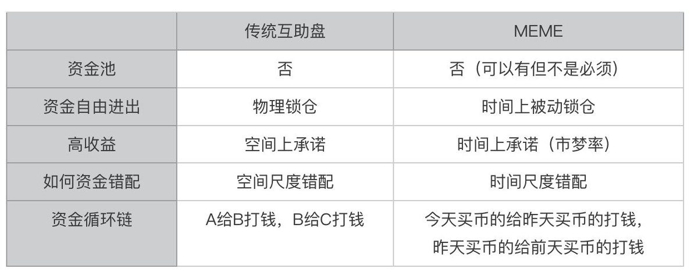
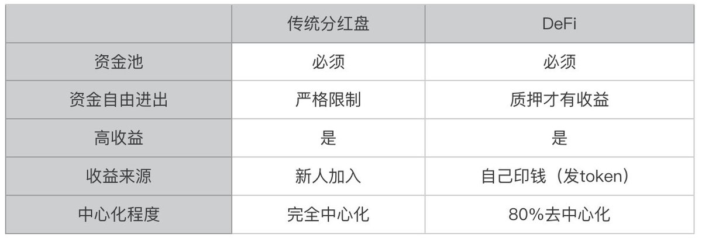
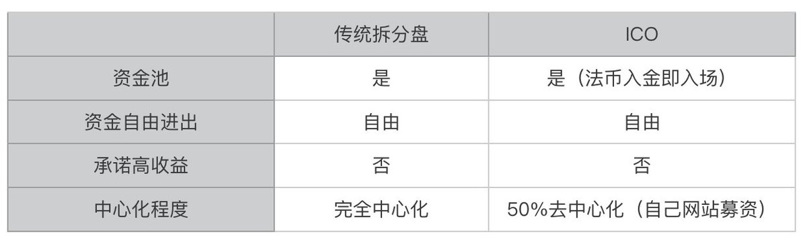

# 三盤理論看 MEME 幣崛起：旁氏民主化的演進

> **來源**: [@hiCaptainZ](https://x.com/hiCaptainZ/status/1783334519132860830)
>
> **日期**: 
>
> **標籤**: `旁氏模型` `MEME幣` `代幣經濟學`

---

> **來源**: [@hiCaptainZ (CaptainZ)](https://twitter.com/hiCaptainZ)
> **日期**: 2026-02-18
> **標籤**: `MEME幣` `三盤理論` `旁氏模型` `DeFi` `ICO`

---

## 什麼是三盤理論

加密韋陀（@thecryptoskanda）認為，Crypto 最大價值之一是首次實現龐氏民主化與可交易化。

人人都能發，還能交易盤子。拋開外部因素，Crypto 每輪牛市都由龐氏的根本創新驅動。研究龐氏，你就能根據龐氏創新所需第一性，在市場中找到大趨勢級別 alpha。

龐氏雖然眼花繚亂，但是歸根結底只有三種模型：分紅盤、互助盤、拆分盤。一切龐氏，都是這三種模型的組合。基於這個邏輯的分析方法，他將其稱為《三盤模型》。三盤可以單獨出現也可組合，每種都有自身優缺點，對應相應的起盤、操盤和崩盤邏輯。

### 三種模型定義

- **分紅盤**：一次性投入一整筆資金，隨時間線性分紅獲得收益
- **互助盤**：A 給 B 打錢，B 給 C 打，C 給 A 打從而形成流水錯配，按筆結算收益
- **拆分盤**：將一個資產標的不斷拆分成新的標的。通過新低價標的吸引增量資金。收益通過標的增值實現

### 三盤特點對比

## MEME 是互助盤

傳統互助盤的核心在於資金的流水錯配。這種模式通常涉及多個參與者按順序互相轉帳，形成一個資金循環。一般來說某個用戶，他收到下家轉來的錢要高於他給出上家的錢要多，如此賺取比他們原始投入更多的錢。項目方一般通過每筆轉帳的抽水來賺取回報。

這種旁氏模型在三個模型中是最為去中心化的一種模式，因為規則一旦制定好，後面是無需「管理方」介入的，因為抽水本質上就是抽稅。

傳統互助盤是一種空間尺度上的資金錯配，所以它不需要形成資金池，大部分也不能自由進出款項，但必然要承諾高額收益。那為什麼說 MEME 幣是互助盤呢？

### MEME 幣的核心屬性

我們一般認為 MEME 幣有兩個最重要的屬性：

- **公平發射**：人人皆可參與（人人皆可互助）
- **全流通**：不需要項目方預留

所謂的「文化屬性」和「總量特別大」並不是必需的。

### 時間尺度的資金錯配

MEME 幣其實是一種時間尺度上的資金錯配。我們假設在某個牛市語境下，某個 MEME 幣一直強勢上漲，那麼其實是，今天高價買幣的打錢給昨天買幣的，昨天買幣的打錢給前天最低價買幣的。而因為時間本身的唯一性，又形成了「被動鎖倉」（人不可能永遠跨入同一條河流）。

## DeFi 是分紅盤

DeFi 是上一輪牛市的核心敘事（2020年），在技術上就是把金融規則寫入智能合約（區塊鏈技術和某一領域結合的一種方式），從代幣經濟學來說，是以流動性挖礦的方式來分發協議代幣：把錢存進協議獲得 token。

比如金融領域最為重要的兩個方面是交易和借貸，那就有了 Uniswap 和 Compound。在 Uniswap 裡面，用戶把代幣 A 和代幣 B 組成交易對 LP 存入資金池來獲得收益。在 Compound 裡面，用戶需要把可以借貸的代幣存入資金池來獲得收益。收益大部分是協議代幣，少量是真金白銀（穩定幣）。

### DeFi 的分紅盤特徵

DeFi 是典型的分紅盤，因為分紅盤的基本邏輯就是「一次性投入一整筆資金，隨時間線性分紅獲得收益」，是不是和上面的做法一模一樣？

## ICO 是拆分盤

ICO 是上上輪牛市的核心敘事（2017年），其大概玩法是，任意領域的一個想法寫成白皮書，然後進行融資發代幣，以致於大部分人們都誤以為，區塊鏈唯一的應用場景就是「發幣」（區塊鏈技術和某一領域結合的另一種方式）。所以在那個週期，出現了很多奇奇怪怪的代幣，比如什麼「做環保發個幣」，「做電腦發個幣」，「做慈善發個幣」，等等。

### ICO 的拆分盤特徵

我們知道，拆分盤是將一個資產標的不斷拆分成新的標的。通過新低價標的吸引增量資金。收益通過標的增值實現，這不正是 ICO 的表現嗎？如果我們把當時加密貨幣這個賽道看做一個資金盤的話，各種 ICO 的出現正是把加密貨幣這個資產標的，不斷通過「新的故事」來拆分成新的投資標的（新的 ICO 代幣），以此來吸引增量資金。

## 幣圈即盤圈

如果我們忽略具體的技術演化，僅從代幣經濟學角度來說，似乎過去的十年，確實代表了旁氏模式的演化，甚至我們也可以把比特幣挖礦也可以看做是一種分紅盤（質押礦機產生 BTC 收益）。

### 演化順序

那是不是演化的順序是：分紅盤（BTC 挖礦）→ 拆分盤（ICO）→ 分紅盤（DeFi）→ 互助盤（MEME）？同時項目也變得越來越去中心化。

### MEME 的雙重屬性

另外一方面，如果把 MEME 當做一個賽道來看的話，越來越多的 MEME 幣出現，其實也是拆分盤的體現，那麼可以認為 MEME 就是（互助盤 + 拆分盤）的合體。

### 本輪牛市的特徵

互助盤，也許是本輪牛市「互不接盤」的真實答案（Restaking 是分紅盤，DePin 是分紅盤，Layer2 是拆分盤，顯然散戶這輪牛市只想玩互助盤）。

---

本文由 @hiCaptainZ 原創
