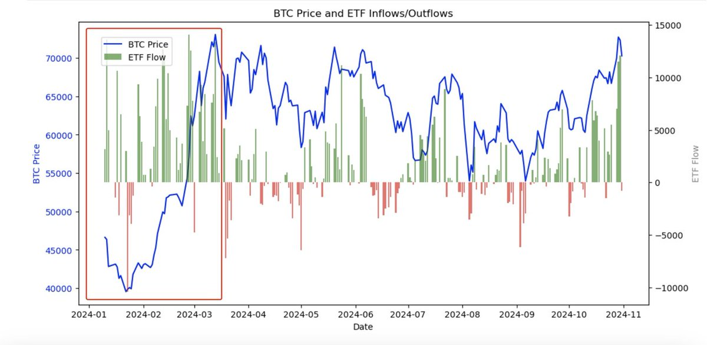

# BTC 價格與 ETF 流入流出關係分析

> **來源**: [@0xOar](https://x.com/0xOar/status/1853716690942742810)
>
> **日期**: 
>
> **標籤**: `BTC ETF` `市場週期` `價格驅動`

---

## BTC 價格與 ETF 流入流出關係分析

BTC ETF 通過之後為 BTC 增加了一種合法購買途徑，市場上很多觀點認為是 ETF 的通過帶來了這輪牛市。從數據可以明顯看出，ETF 在今年 1 月通過後，快速將 BTC 價格從 38,000 美元拉升到了 73,000 美元。

但是對於 4 月後的市場，ETF 持續的流入卻並未讓 BTC 的價格再次創下新高。那麼 4 月之後 ETF 的流入對於 BTC 價格影響究竟是怎樣的？

> **來源**: [@0xOar (Jackson.ll)](https://twitter.com/0xOar)  
> **作者**: 作者所在公司研究員

---

★ Insight ─────────────────────────────────────
- 這篇文章提出了一個有趣的市場觀察：ETF 流入與 BTC 價格的關係在 2024 年 4 月後出現了結構性變化
- 1 月通過後的快速拉升（38k→73k）vs. 4 月後持續流入但價格停滯，顯示可能存在其他影響因素
- 這種觀察對於理解 BTC 牛市驅動力和 ETF 實際影響力非常重要
─────────────────────────────────────────────────
