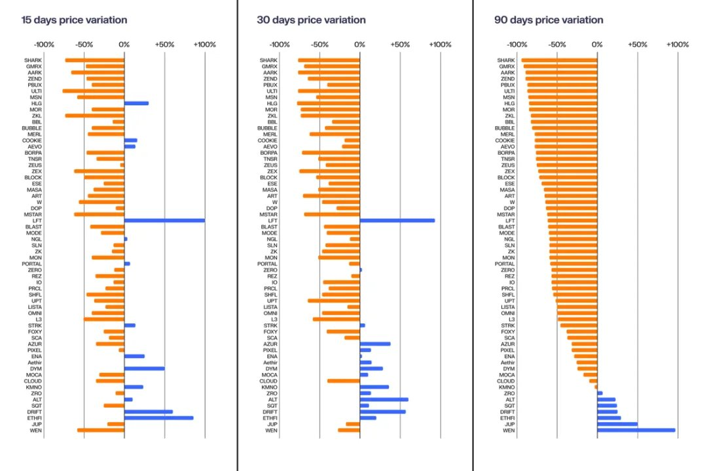
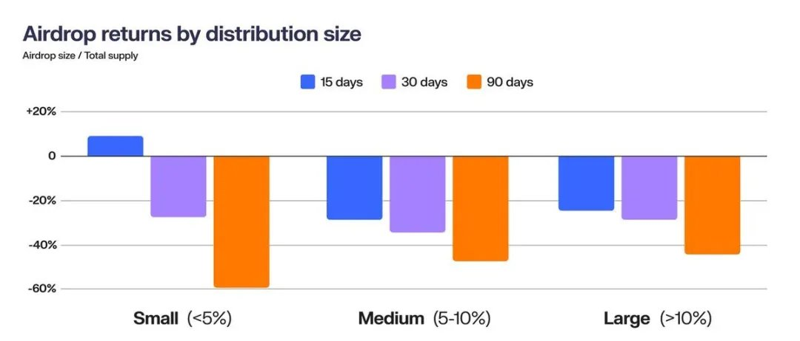

# 空投代幣價格走勢分析：供應量分配的影響

> **來源**: [@scuptone](https://x.com/scuptone/status/1851003054717546567)
>
> **日期**: Mon Oct 28 20:48:12 +0000 2024
>
> **標籤**: `空投代幣` `價格表現` `供應量分配`

---

> **來源**: [@scuptone (猫老师scupt)](https://x.com/scuptone)
> **日期**: 2026-02-18
> **標籤**: `空投` `代幣經濟學` `價格分析` `供應量分配`

---

## 空投代幣價格走勢分析

空投幣在 15、30 和 90 天內的價格走勢表現，受到代幣總供應量分配比例的顯著影響。

### 空投分類標準

根據空投佔總供應量的比例，可將空投分為三個類別：

| 類別 | 空投比例 | 說明 |
|------|---------|------|
| 小額空投 | < 5% | 空投量佔總供應量不到 5% |
| 中等空投 | 5% ~ 10% | 空投量佔總供應量 5% 至 10% |
| 大額空投 | > 10% | 空投量佔總供應量超過 10% |

### 分析時間框架

檢視三個關鍵時間段的空投代幣表現：

- **15 天**：短期表現
- **30 天**：中期表現  
- **90 天**：長期表現

透過這三個時間段的數據，可以觀察不同空投比例對代幣價格走勢的影響規律。
