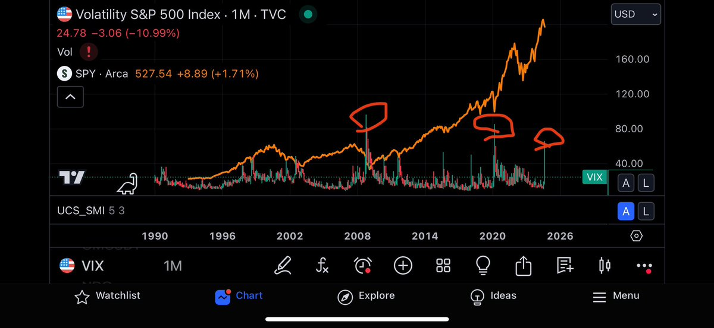

# VIX 超過 60 的歷史機遇：不要做空極端行情

> **來源**: [@Michael_Liu93](https://x.com/Michael_Liu93/status/1821559487972745713) | [原文連結](https://twitter.com/Michael_Liu93/status/1821559487972745713/photo/1)
>
> **日期**: 
>
> **標籤**: `風險管理` `市場心態` `底部機會`

---

> **來源**: [@Michael_Liu93 (憨厚的麥總)](https://twitter.com/Michael_Liu93)
> **日期**: 2026-02-18
> **標籤**: `VIX` `恐慌指數` `市場底部` `風險管理`

---

## 核心觀點

不管你現在多麼不看好後市，千萬不要做空。

## 歷史數據

美股過去快 40 年一共三次 VIX 超過 60 的事件：

| 時間 | VIX 峰值 | 市場狀況 |
|------|----------|----------|
| 2008 年 | >60 | 接近絕對底部 |
| 2020 年 | >60 | 接近絕對底部 |
| 前幾天 | >60 | 當前事件 |

08 年和 20 年那兩次都是接近絕對底部，後面發生什麼大家也都知道了。

## 風險提醒

最近太多 KOL 跳出來說看空後市了，他不對你的錢負責，但你自己要對自己的錢負責。
