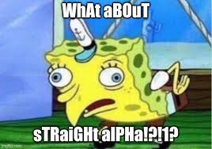

# 一級交易經驗大全：新手必知的陷阱與教訓

> **來源**: [@Michael_Liu93](https://x.com/Michael_Liu93/status/1837365817010442351)
>
> **日期**: Sat Sep 21 05:38:42 +0000 2024
>
> **標籤**: `新手入門` `經驗主義` `交易心態`

---

> **來源**: [@Michael_Liu93 (憨厚的麥總)](https://twitter.com/Michael_Liu93)  
> **日期**: 2024  
> **標籤**: `一級市場` `新手教學` `交易經驗` `風險管理`

---

## 系列說明

開篇持續連載超長的「一級經驗大全」。之前把一級的工具和新手入門講清楚了，但一級有太多經驗主義的細節是小白只有交了學費才會知道的，希望這篇帖可以讓小白少走彎路，至少在交了學費之後能回過頭來看我這篇帖子，理解清楚為什麼交了學費。

每一部分我會以「現象 + 底層邏輯」為框架，希望能幫到你。
