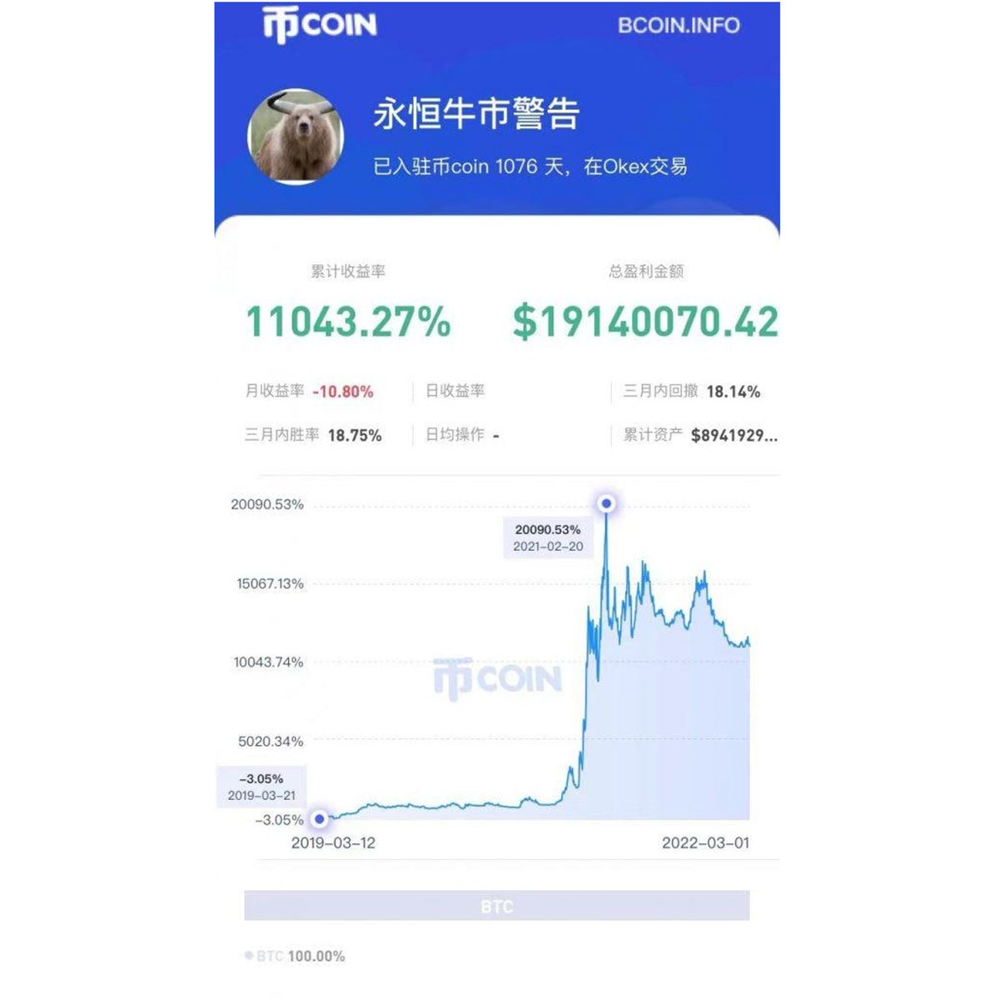

# 傳奇交易員故事：小鎮青年一年從百萬到兩億的策略分享

> **來源**: [@FC_0X0](https://x.com/FC_0X0/status/1833133303492431961)
>
> **日期**: Mon Sep 09 13:20:12 +0000 2024
>
> **標籤**: `交易策略` `小資金成長` `交易心態`

---

> **來源**: [@FC_0X0 (FC)](https://x.com/FC_0X0)  
> **日期**: 2026-02-18  
> **標籤**: `傳奇交易員` `小資金策略` `100萬到2億` `交易策略`

---

## 概述

100萬到2個億的理解和策略，而且僅用了一年，小鎮青年究竟做對了什麼？

如果你是小資金、沒資源，一定要把【肥宅比特幣】的故事和策略看完，也許你就是下一個傳奇交易員。

---

## 關於本系列

傳奇交易員系列由 @FC_0X0 和 @sky_gpt 共創。

---

**注意**：此為系列文章的開篇預告推文，完整內容需查看原推文串。
