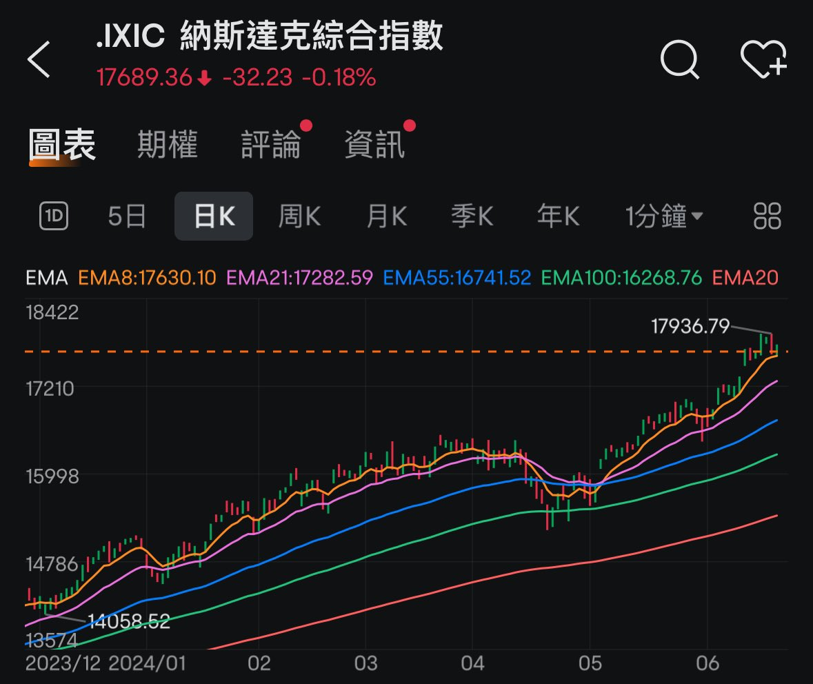
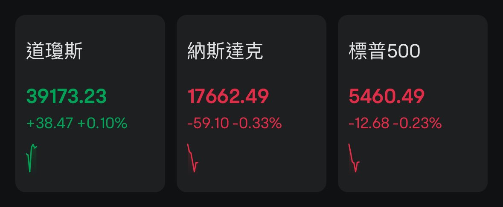

# BTC 跌破 100 天 EMA — 風險提示與減倉策略

> **來源**: [@0xSiuwawa](https://x.com/0xSiuwawa/status/1805061559934443811)
>
> **日期**: Mon Jun 24 02:13:06 +0000 2024
>
> **標籤**: `技術分析` `風險管理` `資產配置`

---

> **來源**: [@0xSiuwawa (Siuwawa)](https://x.com/0xSiuwawa)
> **日期**: 2024-05-06
> **標籤**: `BTC` `技術分析` `100-day-EMA` `風險管理` `減倉策略`

---

## 風險提示：BTC 跌破 100 天 EMA

100 天 EMA 是我的減倉指標之一。從上年 10 月加密貨幣升浪開始，就只有 1 月 23 日和 4 月尾的回調跌破過。1 月是當天就立刻站回，4 月 30 日那次是用了 3 天。

兩次的背景都是科技股回調。1 月那次 BTC 比 Nasdaq 遲跌了一點，相信是 BTC ETF 通過沖喜有關。4 月的話，科技股是被血洗，當時 NVDA 是從 950 跌到 780 左右。我很記得，因為我在股價跌到 830 左右止盈了，離高位賺少了很多。

## 本次回調背景分析

這次 BTC 再度跌破 100 EMA，背景也是美股回調。但因為我了解 BTC 轉弱的原因，所以不是太擔心。

我判斷美股的回調不會持續太久或太深。宏觀上沒有理由大跌，除非通脹突然反轉，但我們離下次通脹數據還有時間。

上星期五主要是半導體版塊回調得多，其實傳統股像道指甚至是升的，顯示資金輪動。科技股過去一個月漲得快，緩一口氣是很正常的。

## BTC 與 Alt 幣表現

加密貨幣是沒有基本面的科技股，走勢不能跟 Mag 7 比，只能算二流的科技股。BTC 從高位的回調才 10% 左右，是很多非半導體科技個股的回調幅度。不必過於緊張。

當然 Alt 的情況慘多了。但龍頭 ETH 顯示出了相對的強勢，和 BTC 跌幅差不多，ETH/BTC 維持在 0.054。我認為這顯示 ETH 已經跌到底，接下來如果還有回調，會跟隨 BTC 跌幅或比他跌得少。如果現在入市，入 ETH 在短期內的潛在升幅比較高。

## 減倉策略

我之前曾經多次說過，即使再看好，跌破關鍵點位都要減倉。跌破 100EMA 就是我的關鍵點位。

**如果三天內比特幣未能站回 100EMA，我會減倉**：
- 先賣持有的 10% Sol
- 再賣 10% BTC

邏輯是，如果這真的是轉勢，Solana 這種 Alt 跌幅可以很誇張。

## 為什麼不賣 ETH？

因為上面我已說過，我認為他在這個價位顯示出相對 BTC 一樣甚至更強的走勢。

## 減倉後持倉規劃

賣出後的話持倉仍然有 80% 在 BTC 和 ETH 上。原因是基於宏觀因素，我仍然相信這是牛市，所以不要下車太快。

- 即使減倉後，幣市反彈，我沒有了 Sol，但還有這 80% 持倉可以受惠
- 但如果真的是轉勢，BTC 和 ETH 應該是跌幅最少的幣，到時再跑也可以盡量留得住本輪牛市利潤

暫時是這樣，過幾天再來看。

---

## 附圖說明

1. BTC 與 100 天 EMA 走勢圖
2. 科技股回調對比圖
3. ETH/BTC 比價走勢
4. 道指與科技股資金輪動
