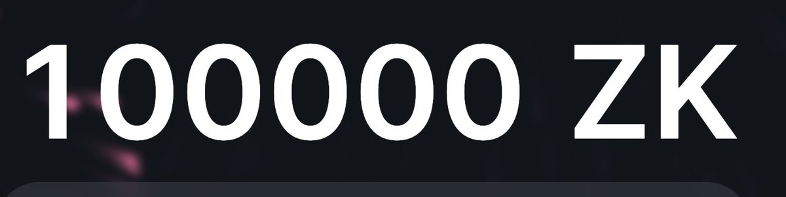

# 高勝率撸毛錢包策略：空投獵人的資產配置

> **來源**: [@tyw1984](https://x.com/tyw1984/status/1803749361924661685)
>
> **日期**: 
>
> **標籤**: `空投農場` `高勝率錢包` `資產配置`

---

> **來源**: [@tyw1984 (nanatang)](https://twitter.com/tyw1984)
> **日期**: 2024-02-18
> **標籤**: `空投獵人` `錢包策略` `資產配置` `撸毛`

---

## 高勝率撸毛錢包案例

以前收藏了一個超高勝率撸毛地址，光是 RBN + DYDX 就撸到了至少 20 萬美元，歷史上 16 次值錢空投他得有 15 次。

今天閒來無事發現，這個地址：
- zkSync 撸到頂格
- LayerZero 是 top 0.42% 用戶

可以觀察這個地址現在在撸什麼項目，作為參考。
