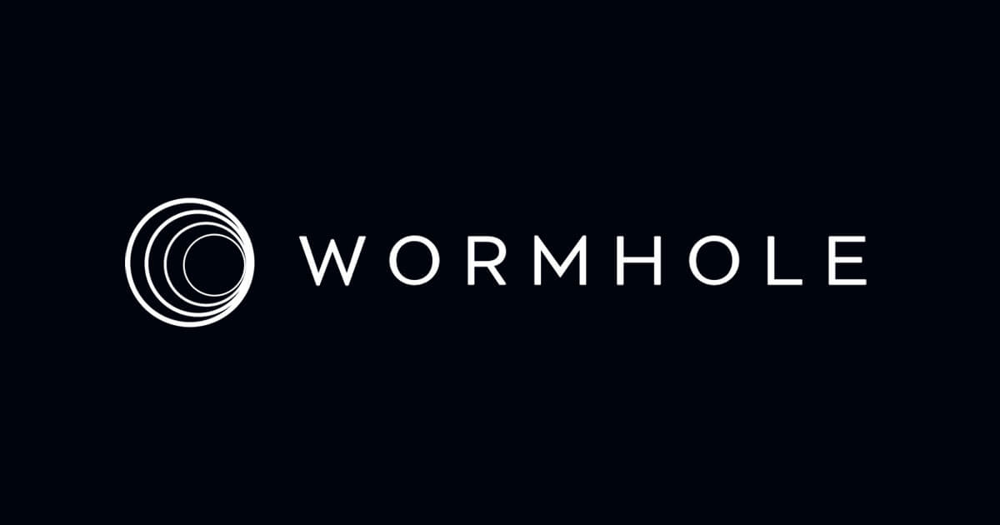

# Wormhole 跨 15 條公鏈零撸教程 - Portal Bridge 完整指南

> **來源**: [@0xKevin00](https://x.com/0xKevin00/status/1750864017617494132) | [原文連結](https://portalbridge.com/)
>
> **日期**: Fri Jan 26 12:51:25 +0000 2024
>
> **標籤**: `跨鏈橋` `空投撸毛` `Wormhole`

---

> **來源**: [@0xKevin00](https://twitter.com/0xKevin00)
> **標籤**: `wormhole` `跨鏈` `空投` `portal-bridge` `defi`

---

## 專案背景

WORMHOLE 是比肩 LayerZero 的強大跨鏈專案，已籌集 2.25 億美元，今年可能會空投以與 LayerZero 競爭。本教程將帶你完成 15 次跨鏈橋接交易，覆蓋 9 個來源鏈和 12 個目的地鏈，大部分是低 gas 費交易。

---

## 前置準備

在開始之前，請準備以下錢包和工具：

- **Keplr 錢包**（用於 Osmosis、Injective）
- **Phantom 錢包**（用於 Solana）
- **Aptos 錢包**（用於 Aptos）
- **Jupiter Exchange**
- **Merkly**（用於補充各鏈 gas 費）

---

## 跨鏈操作步驟

### 1. Portal Bridge - Optimism → BSC

- 前往 [Portal Bridge](https://portalbridge.com)
- 將 ETH 從 Optimism 跨到 BSC
- **注意**：此交易可能需要一些時間才能完成

### 2. Jumper Exchange - BSC → Avalanche（無代幣）

- 前往 [Jumper Exchange](https://jumper.exchange)
- 將 WETH 從 BSC 橋接到 Avalanche 上的 USDC

### 3. deBridge - Avalanche → Arbitrum（無代幣）

- 前往 [deBridge](https://debridge.finance)
- 在 Arbitrum 上將 USDC 從 Avalanche 跨到 ETH

### 4. Mayan Finance - Arbitrum → Solana

- 前往 [Mayan Finance](https://mayan.finance)
- 將 Arbitrum 上的 ETH 兌換成 Solana 上的 SOL

### 5. Klaytn 跨鏈操作

- 前往 [Klaytn 水龍頭](https://baobab.wallet.klaytn.foundation/faucet)，補充 0.05 KLAY（需要它在目的地鏈上獲得）
- 前往 [Portal Bridge](https://portalbridge.com)
- 將極少量的 ETH 從 Arbitrum 橋接到 Klaytn
- 從 Klaytn 到 Optimism 的跨鏈 $KLAY
- 在 Optimism 上兌換

### 6. Injective 跨鏈操作

- **前置需求**：需要一個帶有 Injective 地址的 Keplr 錢包，以及一些用於支付 gas 的 $INJ。如果沒有，請略過這一步
- 前往 [Portal Bridge](https://portalbridge.com)
- 將極少量的 ETH 從 Arbitrum 橋接到 Injective
- 使用 Jupiter Exchange 在 Solana 上購買 USDCet
- 前往 [Jupiter Exchange](https://jup.ag)，購買少量 USDCet（如 0.1 美元）

### 7. Aptos 跨鏈操作

- **前置需求**：需要一個帶有 APT 的 Aptos 錢包來支付費用。如果沒有，可以使用 [LayerZero Bridge](https://theaptosbridge.com) 橋接並獲取 APT 以支付費用
- 前往 [Portal Bridge](https://portalbridge.com)
- 將少量 USDCet 從 Solana 轉入 Aptos

### 8. Moonbeam 跨鏈操作

- 使用 Merkly 為 Moonbeam 加 gas
- 前往 [Portal Bridge](https://portalbridge.com)
- 使用 Portal Bridge 將您的 USDCet 從 Solana 橋接到 Moonbeam
- 交易完成後，在 Moonbeam 上兌換您的 TX
- 將 USDCet 從 Moonbeam 橋接回 Solana
- 在 Solana 上兌換

### 9. Osmosis 跨鏈操作

- 前往 [Portal Bridge](https://portalbridge.com)
- 將極少量的 USDC 從 Arbitrum 橋接到 Osmosis
- **注意**：我們不會橋接回來。如果出現錯誤，可以嘗試從 BSC 橋接 USDC 到 Osmosis

### 10. Kujira 跨鏈操作

- 前往 [Portal Bridge](https://portalbridge.com)
- 將少量 ETH 從 Base 橋接到 Kujira
- **注意**：如果 Base 上沒有 ETH，可以先用 deBridge 橋接到 Base，然後再用 Kujira 橋接到 Kujira

### 11. Fantom 跨鏈操作

- 使用 Merkly 為 Fantom 補充 gas
- 將 USDC 從 Optimism 過渡到 Fantom
- 在 Fantom 上兌換 USDC

### 12. BSC 跨鏈操作

- 使用 Merkly 在 BSC 上補充 gas
- 將 USDC 從 Fantom 橋接到 BSC
- 在 BSC 上兌換 USDC

### 13. Celo 跨鏈操作

- 使用 Merkly 向 Celo 補充 gas
- 在 Celo 上從 BSC 過渡到 USDC
- 在 Celo 上兌換 USDC

### 14. Base 跨鏈操作

- 將 USDC 從 Celo 跨到 Base
- 在 Base 上 claim USDC

---

## 總結

完成以上 15 個跨鏈橋接操作後，你將覆蓋 Wormhole 支援的主要公鏈，為潛在的空投做好準備。大部分操作的 gas 費用較低，但需要注意各鏈的前置需求（如 Injective、Aptos 等需要預先準備代幣）。
