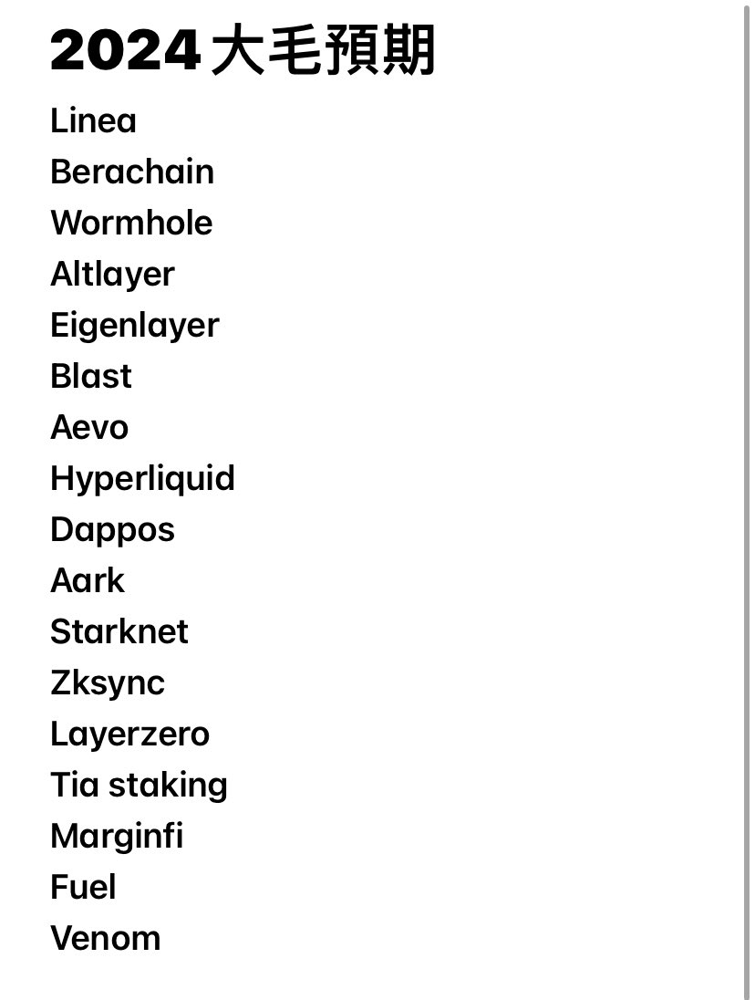

# 2024 年空投耕作項目藍圖

> **來源**: [@hank06171](https://x.com/hank06171/status/1749400811233513588)
>
> **日期**: Mon Jan 22 11:57:10 +0000 2024
>
> **標籤**: `空投農耕` `Layer2 生態` `跨鏈橋接`

---

> **來源**: [@hank06171 (幣玩hank-lighter版-已囤幣完成😍)](https://twitter.com/hank06171)
> **日期**: 2024
> **標籤**: `airdrop` `空投耕作` `Layer2` `質押` `跨鏈`

---

## 2024 年重點空投項目清單

2024 大毛預期筆記，今年就肝這些：

### Layer2 與測試網項目
- **Linea** - Layer2 測試網
- **Starknet** - Layer2 生態
- **Zksync** - Layer2 刷量
- **Layerzero** - 跨鏈協議
- **Fuel** - Layer2 基礎設施

### DeFi 協議與交易平台
- **Berachain** - 新公鏈生態
- **Aevo** - 衍生品交易平台
- **Hyperliquid** - 去中心化衍生品交易所
- **Dappos** - DeFi 協議
- **Aark** - DeFi 協議
- **Marginfi** - Solana 借貸協議

### 基礎設施與質押
- **Wormhole** - 跨鏈橋協議
- **Altlayer** - Rollup 即服務
- **Eigenlayer** - 再質押協議
- **Blast** - Layer2 生態
- **Tia staking** - Celestia 質押
- **Venom** - 新公鏈

## 策略類型

包含了以下幾種空投耕作策略：
- 測試網參與
- 鏈上刷量
- 協議存款
- Layer2 互動
- 代幣質押
- 跨鏈操作

## 預期收益

作者目標：從這些項目中賺取數十萬美元的空投收益。策略是持續耕作這些項目，不放過任何機會。
