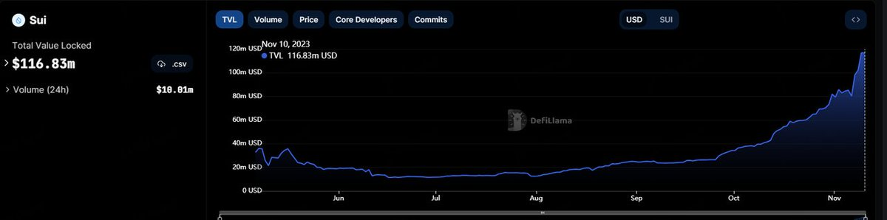
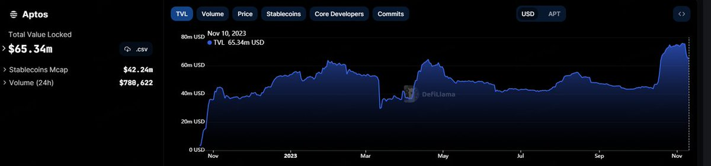
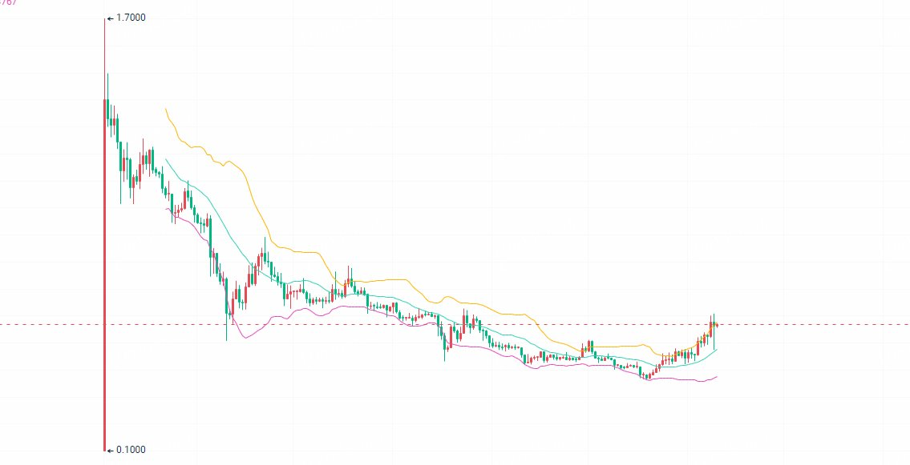
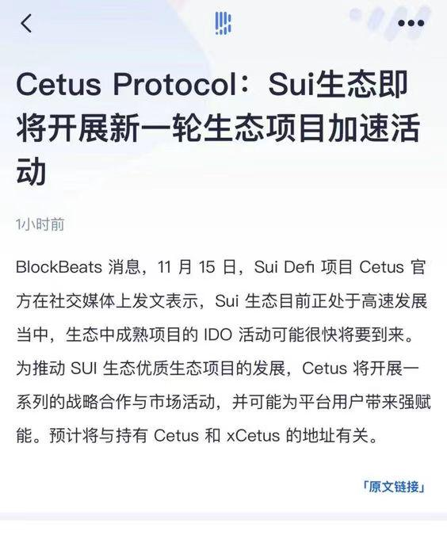

# SUI 低估分析：鎖倉量與市值對比研究

> **來源**: [@jianshubiji](https://x.com/jianshubiji/status/1745721249484186096)
>
> **日期**: Fri Jan 12 08:15:54 +0000 2024
>
> **標籤**: `項目估值` `技術分析` `生態對比`

---

> **來源**: [@jianshubiji (鉴叔)](https://twitter.com/jianshubiji)
> **日期**: 2024-11-01 (推測)
> **標籤**: `SUI` `Aptos` `Move` `鏈上分析` `TVL分析` `估值對比`

---

SUI 短短兩個月翻了一倍,先聲明,這波沒吃到🫥

但是 11 月初的時候,其實有一個團隊成員有推薦我買,可惜我沒聽勸。今天在回看他當時發我的買入理由,覺得其中的邏輯還是值得參考的,也分享給大家。

## 團隊成員的買入分析(2個月前)

### TVL 與市值對比分析

SUI 的鎖倉量達到了 1 億美金,流通市值只有 4 億美金。

對比同為 Move 系 L1 公鏈的 Aptos,Aptos 的鎖倉量只有 6500 萬美金,而市值有 17 億美金。

這樣對比看起來,要麼是 SUI 被低估了,要麼是 APT 被高估了。

### 造成差異的原因分析

兩個情況導致,一個是 APT 本身的強控盤,另一個是 SUI 線性解鎖帶來的持續拋壓和非常低的質押量有關。

我這裡更偏向於 SUI 被低估了,因為從技術分析的角度看:

- SUI 已經確認了短期底部,走出了下跌趨勢
- 價格的持續下跌與鎖倉量的持續上升形成了另類背離
- 經歷長時間的洗盤,底部交易量放大,籌碼換手充分

所以我認為 SUI 同樣進入了強控盤階段。

### 生態發展優勢

並且 SUI 在生態上遠強於 Aptos,不只有幾個 DeFi 項目,而且鏈遊項目最近也是火熱。

### 市場宣傳信號

在最近的新聞推送中,SUI 相關的播報和軟文突然多了起來,項目活動、鎖倉量突破等等,有花錢買流量的跡象。

### 相對性價比分析

從大盤走勢來看,BTC 走勢十分強勢,並且有著 1 月份的 ETF 通過的預期炒作,但是此時買入 BTC 的性價比明顯不如買入 SUI 的性價比高。

由此,我做出了買入 SUI 的決策。
