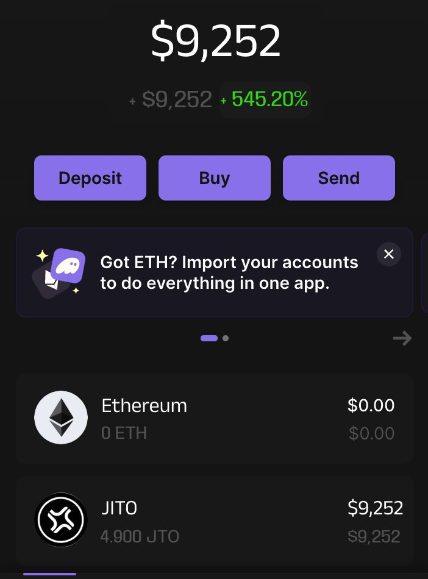

# JTO 空投機會及 Solana 項目空投指南

> **來源**: [@BladeDefi](https://x.com/BladeDefi/status/1732865405897838925) | [原文連結](https://twitter.com/BladeDefi/status/1732865405897838925/photo/1)
>
> **日期**: 
>
> **標籤**: `空投` `Solana 生態` `投資機會`

---

> **來源**: [@BladeDefi (BLADE)](https://twitter.com/BladeDefi)
> **日期**: (日期未提供)
> **標籤**: `JTO` `Solana` `airdrop` `空投` `SOL`

---

錯過了 $9,000 的 $JTO 空投？別擔心！

我已經收集了 8 個 $SOL 項目，每個都有潛在的空投機會。

你的機會來了 🧵👇

---

**注意**：原文為推文形式，作者提到將在後續推文中分享 8 個 Solana 生態項目的空投機會，但具體項目列表未包含在此推文中。
