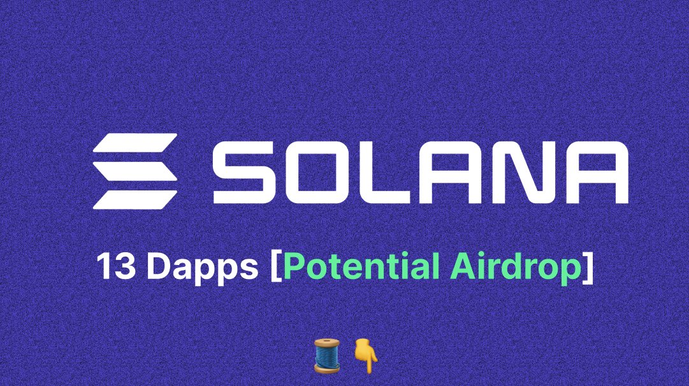

# JTO 空投季來臨：Solana 無代幣項目機會

> **來源**: [@its_airdrop](https://x.com/its_airdrop/status/1733814758300868836) | [原文連結](https://twitter.com/its_airdrop/status/1733814758300868836/photo/1)
>
> **日期**: Sun Dec 10 11:43:45 +0000 2023
>
> **標籤**: `空投farming` `Solana生態` `代幣經濟`

---

> **來源**: [@its_airdrop (Airdrop Official)](https://twitter.com/its_airdrop)  
> **日期**: 2024-01-XX  
> **標籤**: `Solana` `空投` `JTO` `PYTH` `JUP` `無代幣項目`

---

## 空投收益實例

有人透過 $JTO 空投賺取超過 $30,000 美元。

最近 $PYTH 和 $JUP 空投也已經啟動。

Solana 空投季節才剛剛開始。

## 13 個 Solana 無代幣項目

作者分享了 13 個 Solana 生態系統中尚未發行代幣的項目清單，這些項目可能在未來提供空投機會。

（原推文包含完整項目列表的連結）
