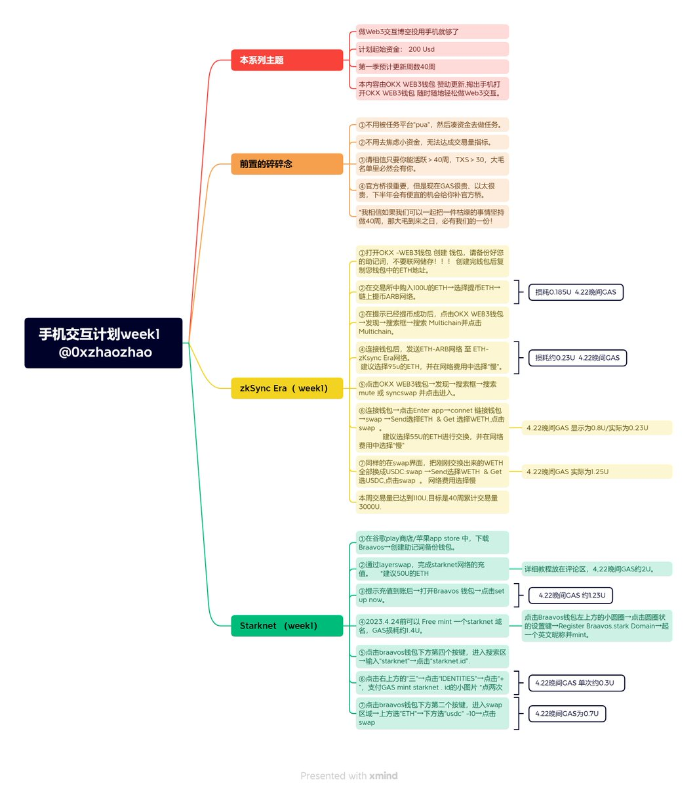

# Web3 交互空投農耕指南：用手機就夠了

> **來源**: [@0xzhaozhao](https://x.com/0xzhaozhao/status/1649769824170696704) | [原文連結](https://twitter.com/0xzhaozhao/status/1649769824170696704/photo/1)
>
> **日期**: Sat Apr 22 13:39:11 +0000 2023
>
> **標籤**: `空投農耕` `Web3 交互` `手機錢包`

---

> **來源**: [@0xzhaozhao (0xzhaozhao | MemeMax⚡️)](https://twitter.com/0xzhaozhao)
> **日期**: 2024-02-18
> **標籤**: `Web3` `空投` `手機錢包` `交互` `OKX`

---

## 核心概念

做 Web3 交互博空投用手機就夠了。如果我們可以一起把一件枯燥的事情堅持做 40 週，那大毛到來之日，必有我們的一份！

## 工具推薦

本內容由 @OKXWeb3_CN 贊助更新。掏出手機打開 OKX WEB3 錢包，隨時隨地輕鬆做 Web3 交互。

## 執行建議

- 第一週內容已發布
- 建議分 2-3 天完成
- 持續參與 40 週計畫

---

**註**: 原推文提供了一個長期空投農耕計畫的開端，強調使用手機錢包（特別是 OKX Web3 錢包）即可完成 Web3 交互任務，並建議將任務分散在多天執行，以持續 40 週的方式參與空投機會。
