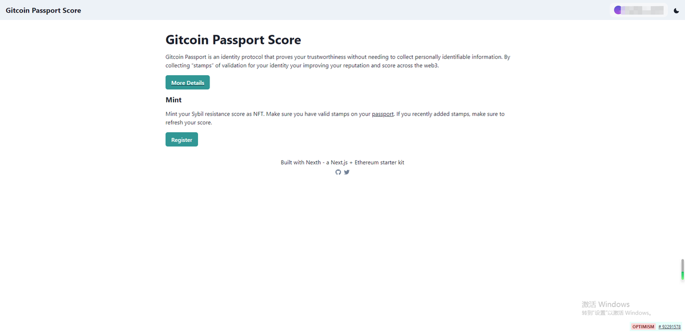
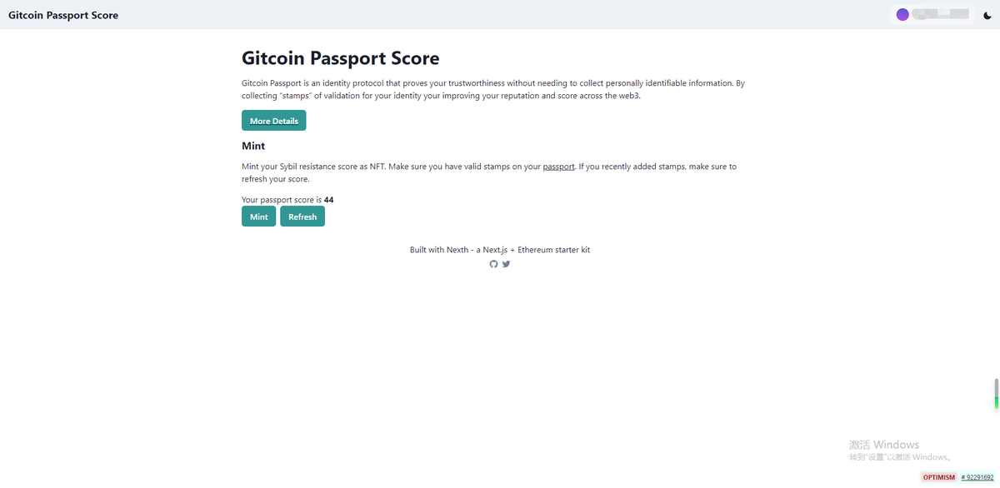
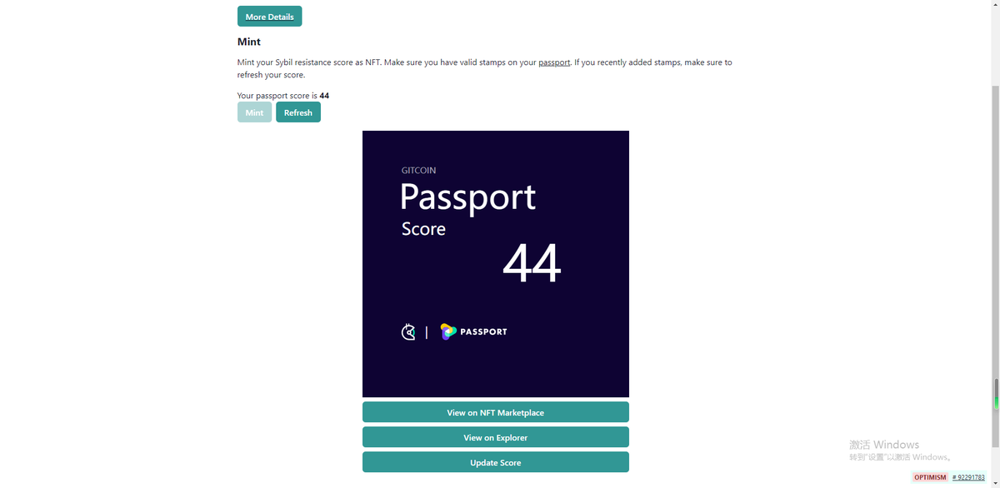

# Gitcoin 護照 NFT 鑄造指南

> **來源**: [@asu549](https://x.com/asu549/status/1648724117301116934) | [原文連結](https://twitter.com/safety/unsafe_link_warning?unsafe_link=https://passport-score-nft.vercel.app/)
>
> **日期**: Wed Apr 19 16:23:56 +0000 2023
>
> **標籤**: `NFT鑄造` `Gitcoin護照` `Web3身份`

---

> **來源**: [@asu549 (加密菩提🎒)](https://twitter.com/asu549)
> **日期**: 2026-02-18
> **標籤**: `Gitcoin` `NFT` `空投` `護照`

---

## 簡介

Gitcoin 護照現在可以進行 NFT 鑄造（mint）。系統會根據你的分數來鑄造 NFT，未來的賦能會有多方面，建議進行 mint。

## 操作連結

護照 NFT 鑄造頁面：https://t.co/d5ftB18YFq

