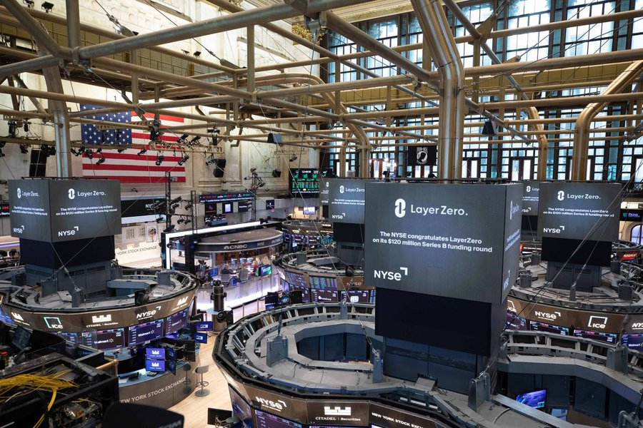

# LayerZero 上市謠言與空投套路分析

> **來源**: [@0xweiqigaoshou](https://x.com/0xweiqigaoshou/status/1646078660045340672) | [原文連結](https://twitter.com/Said46807236/status/1646078660045340672/photo/1)
>
> **日期**: Wed Apr 12 09:11:49 +0000 2023
>
> **標籤**: `空投農耕` `市場周期` `風險管理`

---

> **來源**: [@0xweiqigaoshou (我是圍棋高手)](https://x.com/0xweiqigaoshou)
> **日期**: 2024-06-16
> **標籤**: `LayerZero` `空投` `交互策略` `市場謠言`

---

## LayerZero 上市謠言分析

今天又有不少說 LayerZero (@LayerZero_Labs) 要上市的消息。有意思的是除了紐交所的恭喜圖片外，還有不少群友的 P 圖（為什麼要 P 呢？）你細品，當然是為了更少的人卷！

他發不發你當然不會知道。但是你不撸就一定沒有，還記得當初的 ARB 發幣前，也是說要上市異曲同工啊。

## 相關資源

全方面解析 L0 三部曲二：低成本交互（0.6u）
https://t.co/qJq6L56Pts
