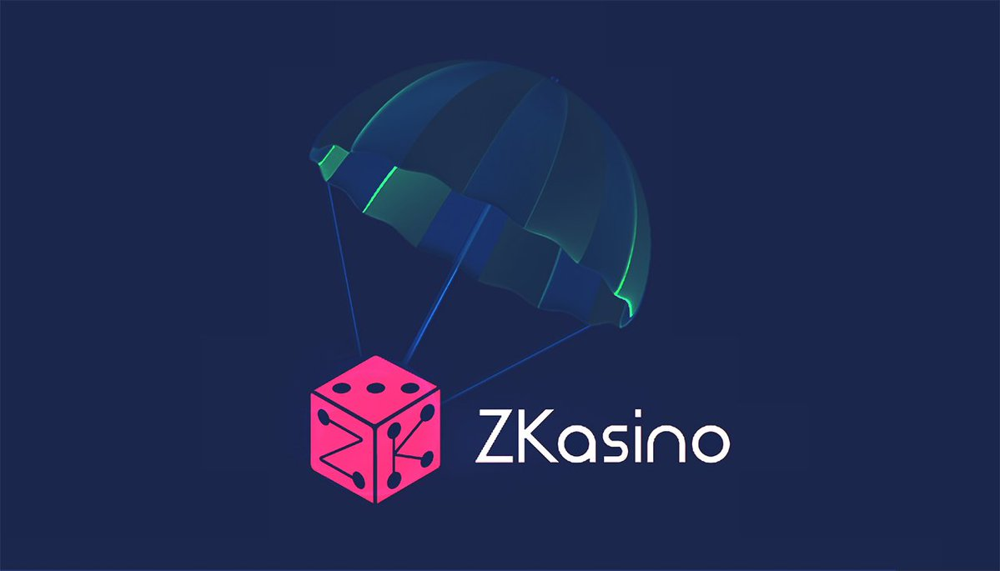

# zkSync Era 空投挖礦策略：早期項目交互指南

> **來源**: [@yutiancoin](https://x.com/yutiancoin/status/1645826942938279938) | [原文連結](https://twitter.com/yutiancoin/status/1645826942938279938/photo/1)
>
> **日期**: 
>
> **標籤**: `空投挖礦` `zkSync Era` `DeFi 交互`

---

> **來源**: [@yutiancoin (雨天)](https://twitter.com/yutiancoin)
> **日期**: 2023-04-12（推測）
> **標籤**: `zkSync Era` `空投挖礦` `早期交互` `DeFi`

---

## 專案背景

zkSync Era 網絡上線後，短短 2 週多的時間就獲得了近 1 億美元的 TVL。

Arbitrum 空投造富效應有目共睹，大家為了獲得 zkSync Era 的空投，也在刷 Era 上的各種專案，包括交易、加 LP、mint NFT 等操作。

## 推薦交互專案

除了常見的 Mute、SyncSwap、MintSquare 等專案，推薦大家交互一下 @ZKasino_io，博取空投機會。
