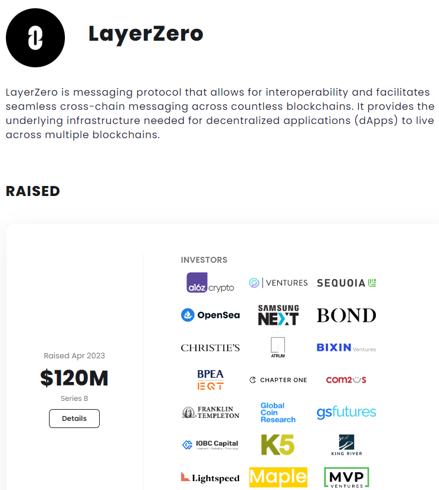

# LayerZero 質押策略：低成本多周期治理參與

> **來源**: [@shangdu2005](https://x.com/shangdu2005/status/1643899170397511681) | [原文連結](https://twitter.com/shangdu2005/status/1643899170397511681/photo/1)
>
> **日期**: 
>
> **標籤**: `LayerZero` `質押策略` `veSTG治理`

---

> **來源**: [@shangdu2005 (领哥LingGe🙏)](https://twitter.com/shangdu2005)
> **日期**: 2025-02-18
> **標籤**: `LayerZero` `STG` `質押策略` `治理代幣` `空投策略`

---

## 融資動態

最近 @LayerZero_Labs 又拿了 1.2 億美元融資！

## 交互策略：低成本優質用戶

策略核心是做低成本「一肉多吃」的優質用戶。

### 具體操作方法

1. **代幣積累時機**：每當大盤下跌時，準備一些 STG 代幣（LayerZero 親兒子代幣）

2. **質押獲取治理權**：
   - 在主網質押 STG 獲取 veSTG 治理代幣
   - veSTG 專門用於投票治理

3. **成本優化策略**：
   - 主網整體 GAS 成本較高
   - 建議：少量代幣 + 多周期質押
   - 也可以使用下面的低成本方法（原文未詳述）
