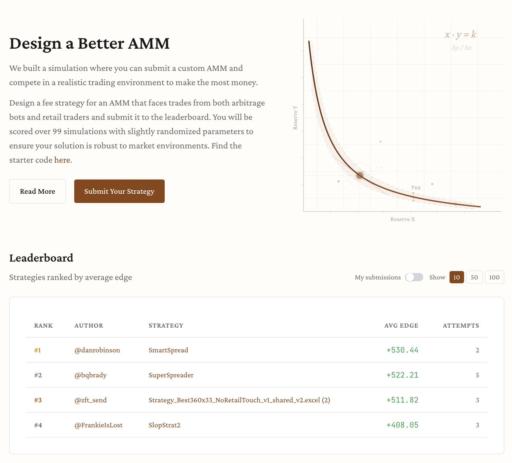

# 動態費用 AMM 設計挑戰

> **來源**: [@danrobinson](https://x.com/danrobinson/status/2019848425458807024)
>
> **日期**: Fri Feb 06 18:59:26 +0000 2026
>
> **標籤**: `AMM` `DeFi` `流動性提供` `挑戰賽`

---

## 動態費用 AMM 設計挑戰：證明你的 AMM 設計能力

### 簡介

@danrobinson 與 @bqbrady 共同發起了一項挑戰，邀請各位使用者參與，創建自己的動態費用 AMM (Automated Market Maker)，並提交作品以參與排名。

### 挑戰目標

這項挑戰的主要目標如下：

*   **驗證 AMM 設計能力：** 提供一個平台，讓設計者可以測試和展示他們在 AMM 設計方面的技能。
*   **DeFi 策略展示：**  讓參與者能夠展現其獨特的 DeFi (Decentralized Finance) 策略，並觀察其在實際環境中的表現。

### 參與方式

參與者需要設計並創建自己的動態費用 AMM，然後提交到挑戰的排行榜上。 具體參與連結為：https://t.co/ivgIShnWTz

### 重點總覽

| 項目                 | 說明                                                     |
|----------------------|----------------------------------------------------------|
| 挑戰發起人           | @danrobinson, @bqbrady                                       |
| 挑戰內容             | 設計並提交動態費用 AMM，參與排行榜排名                         |
| 挑戰目的             | 驗證 AMM 設計能力，展示 DeFi 策略                             |
| 參與連結             | [https://t.co/ivgIShnWTz](https://t.co/ivgIShnWTz) |

