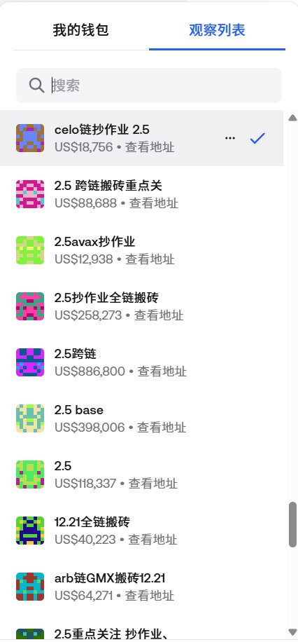
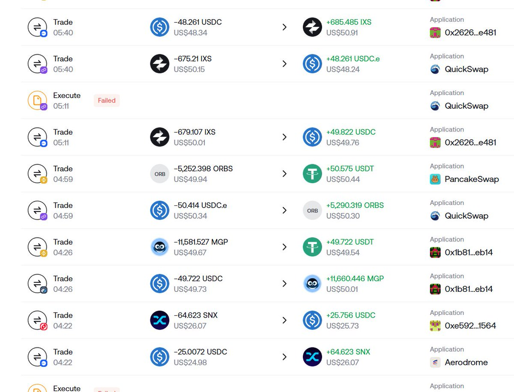
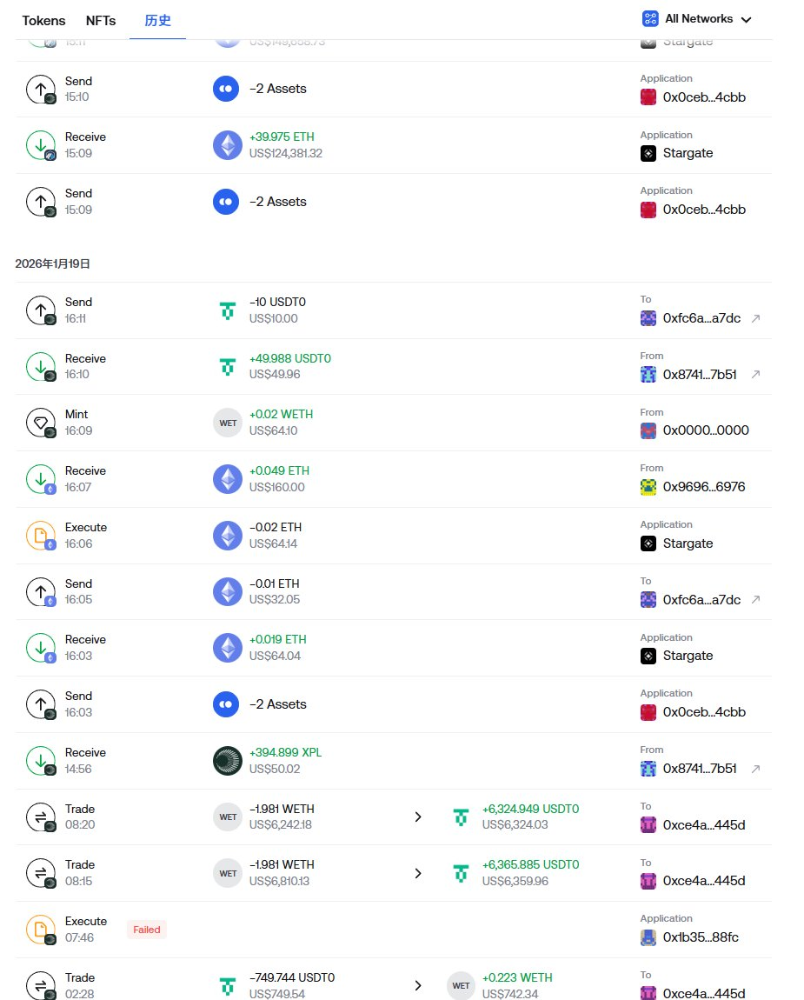

# DeFi市場LP流動性困境

> **來源**: [@zhamomo666](https://x.com/zhamomo666/status/2019164643382767734)
>
> **日期**: Wed Feb 04 21:42:19 +0000 2026
>
> **標籤**: `DeFi` `LP` `流動性提供` `市場下跌` `搬磚`

---

## DeFi 市場 LP 流動性困境觀察

### 總覽

近期市場連續下跌，許多 LP 跌穿範圍，導致搬磚交易額萎縮。觀察顯示，每月約有 10% 的 LP 退出市場，同時也有新的 LP 加入，顯示 DeFi 市場的流動性正面臨挑戰。

### 市場現況

作者 @zhamomo666 觀察到，近期市場的連續下跌對 DeFi 市場的 LP (Liquidity Provider) 造成了顯著影響，具體表現在：

*   **LP 跌穿範圍：** 許多 LP 的價格已經跌破他們所設定的範圍，導致收益下降甚至虧損。
*   **搬磚交易額萎縮：** 搬磚交易額大幅減少，從過去動輒數百上千美元的交易量，萎縮至數百甚至數十美元。

### LP 流動性變化

透過觀察搬磚地址，作者發現 DeFi 市場的 LP 流動性呈現一種動態變化：

*   **每月退出比例：** 大約有 10% 的 LP 無法承受市場壓力選擇退出。
*   **每月新增比例：** 同時也有約 10% 的新 LP 加入市場。

這種高比例的進出，反映了市場參與者對於 DeFi 市場的不確定性以及對流動性挖礦收益的期望和失望。

### 數據總結

雖然缺乏具體的圖表數據，但根據作者的觀察，可以將關鍵數據整理如下：

| 指標         | 數值   |
| ------------ | ------ |
| 每月 LP 退出比例 | 約 10% |
| 每月 LP 新增比例 | 約 10% |
| 交易額變化     | 大幅萎縮 |

### 總結

DeFi 市場目前正經歷流動性困境，LP 的高流動率和交易額的萎縮，都反映了市場的波動性和不確定性。這也提醒參與者需要更謹慎地評估風險，並制定更完善的投資策略。

