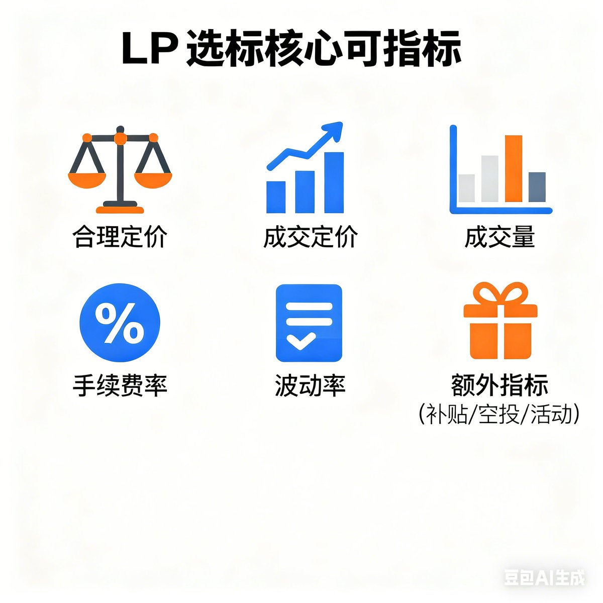

# LP選標指南：如何平衡收益與風險？

> **來源**: [@fivepointwater5](https://x.com/fivepointwater5/status/2009592431583653919)
> **日期**: Fri Jan 09 11:45:46 +0000 2026
> **標籤**: `LP` `流動性提供` `DeFi` `風險管理` `收益`

---

## LP 選標指南：平衡收益與風險

### 總覽：選標核心指標與注意事項

| 指標       | 重點                                                                                                |
| ---------- | --------------------------------------------------------------------------------------------------- |
| 合理定價   | 自行評估項目價值，或採取保守策略，如對沖風險。                                                                               |
| 成交量     | LP收益來自交易手續費，觀察幣種的成交量，選擇活躍時段參與。                                                                         |
| 手續費率   | 高手續費率可能帶來高收益，但也伴隨高風險。關注平台的手續費設置，並考慮路由聚合的影響。                                                               |
| 波動率     | 根據幣種波動程度調整區間，波動大則放寬，反之則縮窄。波動大的幣種可能帶來較大的成交量。                                                                 |
| 額外指標   | 留意項目方或平台的額外補貼、空投預期或活動。                                                                                |
| 年化收益率 | 不要直接相信平台顯示的年化收益率，應自行計算，並考慮成交量、手續費率、波動率和額外激勵等多重因素。大資金進入會降低年化收益率。                                |

### 核心指標詳解

#### 1. 合理定價

一個好的 LP 標的，或者將一個標的玩成自己獨有的好標的，合理的定價至關重要。定價因素繁多，包括項目背景、社群文化、資金流入等等。由於作者本人無法很好地對所有山寨幣種進行合理定價，因此他通常會對所有山寨幣種採用價值為 0 的定價。因此，每次組 LP 前，作者都會開空一定數量的倉位（約 1/2 的空單價值）來對沖風險，即使有時反而會虧損更多。此外，如果短時間內價格漲幅過大，作者大多會選擇價格回落後再組 LP。

#### 2. 成交量

LP 的本質是賺取交易者的手續費，因此活躍的成交量非常重要。一般而言，作者會回顧一個幣種一周的成交量，拆分到每天，再拆分到每小時，並在成交量活躍的時候組 LP。許多幣種在凌晨時段交易量較低，因此很多 LP 玩家會在凌晨撤池子離場。

#### 3. 手續費率

類似於 Uniswap 這種可以自行設定手續費率的平台，手續費率的高低會直接影響收益。如果一個幣種交易較為活躍，但手續費率不是特別高，收益可能並不好。鏈上有許多 LP 玩家會選擇組 Alpha 新幣的 LP，並調高手續費率。在高費率加上高成交量的情況下，收益可能很高，但同時風險也不小，因為需要對幣價有一個比較準確的定價。

#### 4. 波動率

如果一個幣種的波動很大，作者會把區間放寬，反之則縮窄。對於波動太大的幣種，除非特殊情況，作者個人是不喜歡組 LP 的，他更喜歡穩定一點的幣種，然後拉窄區間博取超額收益。如果價格超出區間，他也能及時止損。然而，大多數幣種都是在波動大時才會產生大的成交量，這是一個很糾結的點。

#### 5. 額外指標

有些項目方、有些平台會有額外的補貼，有些也可能有空投預期，或者是有活動。可以留意一下這些額外指標，儘管大部分時候可能沒有。

### 年化收益率：自行計算更準確

不要直接相信平台顯示的年化收益率，應該自己計算，用前幾分鐘的數據計算才是最準確的，因為每個平台的演算法不一樣，所以年化不準的。成交量、手續費率、波動率以及額外的激勵等多重因素共同構成年化收益率。大資金的進入肯定會讓年化驟降，所以一定要珍惜身邊有人給你分享好的 LP 標的，這是一種「利人損己」的行為。

### 總結

LP 其實需要考慮的因素很多，不是三言兩語能夠說清。最重要的是合理評估收益和風險。

