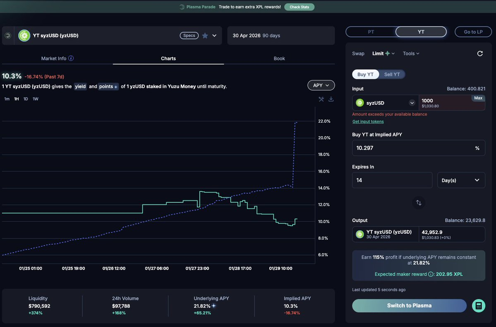
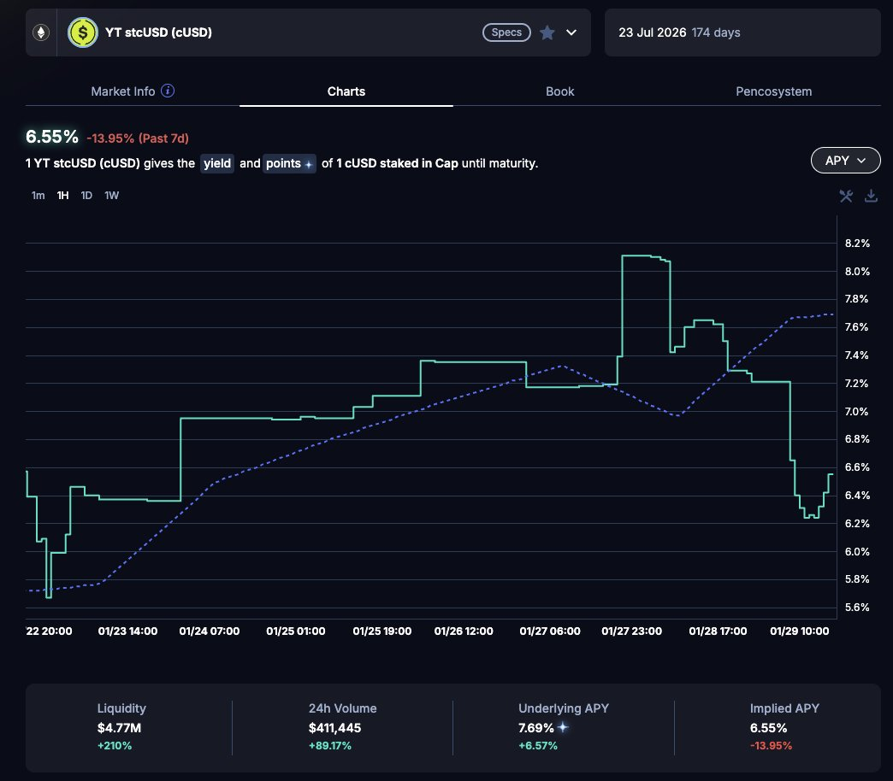
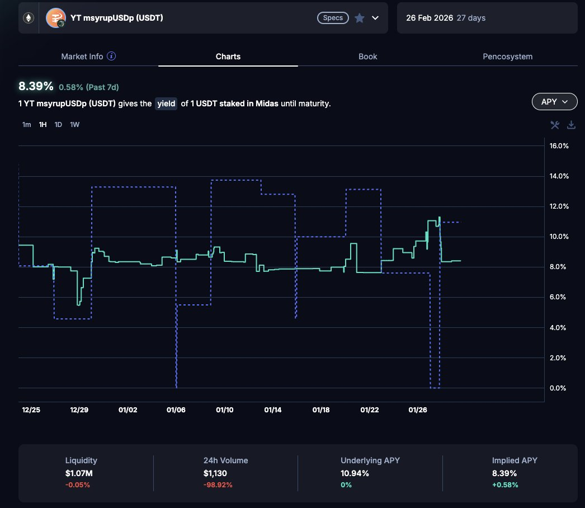

# Pendle 到期 YT 進場機會

> **來源**: [@BTCLIN](https://x.com/BTCLIN/status/2016801483988332609)
> **日期**: 
> **標籤**: `Pendle` `YT` `DeFi` `收益耕作`

---

## Pendle 到期 YT 進場機會：投資指南

**總覽**

本文整理自 @BTCLIN (Mr. Lin 霖先生 ｜Pendle Maxi) 的觀點，指出 Pendle 今天有大規模池子到期，是進場 YT 的好時機。文章推薦了 syzUSD、stcUSD 和 MidasRWA 在 Syrupfi 的池子，並分析了其中的收益機會。

**重點整理**

| 標的          | 說明                                                                 | 收益機會                                                                                                                                |
| ------------- | -------------------------------------------------------------------- | --------------------------------------------------------------------------------------------------------------------------------------- |
| syzUSD        | YuzuFinance 底層收益噴發                                                  | 可考慮掛單，順便獲得 $XPL Plasma 提供的獎勵。                                                                                                  |
| stcUSD        | Capmoney_ 底層收益基本維持在 7% 左右                                            | 6.5% 的 YT 視為送錢機會。                                                                                                           |
| MidasRWA @ Syrupfi | 可考慮波段 YT 操作                                                            | 潛在波段收益。                                                                                                                   |

### YT 進場時機

由於 @pendle_fi 今天有大規模池子到期，目前是進場 YT 的良好時機。以下是一些建議標的：

### 推薦標的

1.  **syzUSD @YuzuFinance:**

    *   YuzuFinance 的 syzUSD 底層收益表現良好，呈現噴發趨勢。
    *   建議：可以考慮掛單買入 YT，同時還能獲得 $XPL Plasma 的獎勵。
2.  **stcUSD @capmoney_:**

    *   Capmoney_ 的 stcUSD 底層收益基本維持在 7% 左右。
    *   建議：如果 YT 的收益率在 6.5% 左右，可以視為一個有利的進場機會。
3.  **MidasRWA @syrupfi:**

    *   MidasRWA 在 Syrupfi 的池子提供 YT 交易機會。
    *   建議：可以考慮進行波段操作，以獲取潛在收益。

**聲明**

本文僅為信息分享，不構成任何投資建議。投資者在進行任何投資決策前，應自行研究並評估風險。

