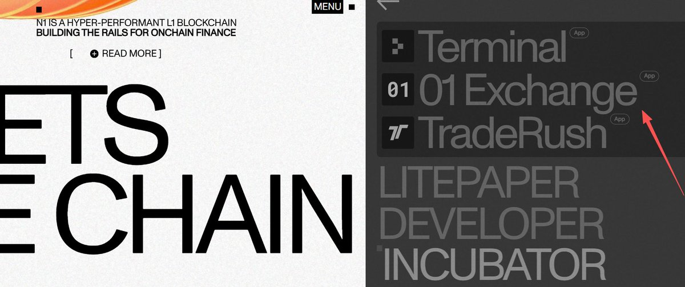
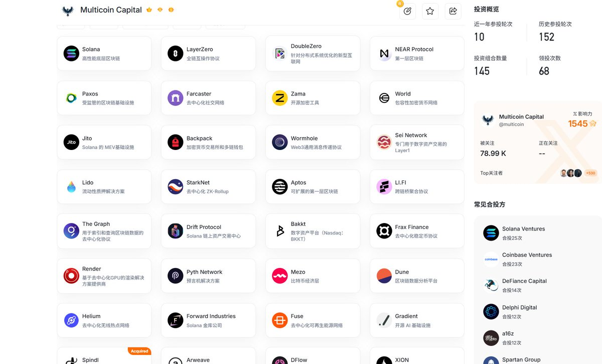
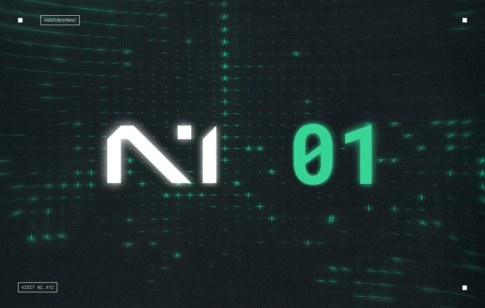

# 01 Exchange 與 N1 公鏈潛在空投機會分析

> **來源**: [@web3a99](https://x.com/web3a99/status/2012805853628584275)
> **日期**: Sun Jan 18 08:34:46 +0000 2026
> **標籤**: `01Exchange` `N1 Chain` `Perpdex` `空投` `DeFi`

---

## 01 Exchange 與 N1 公鏈潛在空投機會分析

### 項目簡介與投資價值

本文作者 @web3a99 (笑苍生.btc) 分享了他對 01 Exchange 的投資分析與潛在空投機會的看法。作者強調自己主動挖掘了 01 Exchange 這個項目，並深度參與了從內部測試到公開測試的過程。

他認為，在眾多 Perpetual DEX 中，01 Exchange 雖融資金額看似不高，但透過分析其戰略合作夥伴，例如 N1 公鏈，可看出其長遠發展潛力。N1 公鏈背後有頂級投資機構支持，且未公開融資價格，顯示其具備後續融資的實力。

### N1 公鏈的戰略意義

N1 公鏈專注於高性能交易，專為鏈上所有市場類型的超高性能交易而構建。其孵化的項目數量不多，聚焦核心發展，避免了許多 Perpetual DEX 僅為收取手續費而缺乏長遠規劃的問題。

根據 N1 官方介紹，N1 並非另一個通用 L1/L2，而是一個專門的 L1，旨在實現鏈上所有市場類型的高性能交易。N1 生態系統中的每個應用程式都是內部孵化或構建的，以確保統一的願景和架構，避免碎片化。

01 Exchange 是首個上線的應用，提供機構級永續期貨交易，具有結構化策略、深度流動性和多鏈存款功能。01 在其專用的計算環境中運行，隔離的資源意味著穩定的吞吐量和執行可靠性，即使在網路高峰負載期間也能保持。

### 01 Exchange 的發展歷程與優勢

01 Exchange 自 2024 年初開始開發，歷經兩年的代碼階段，旨在打造最佳的交易體驗。作者認為，這種專注於產品開發的態度與許多僅為發幣而生的項目截然不同，類似於他在 Solana 鏈上發現 JTO 和 JUP 時的感覺。

### 潛在空投機會分析

作者從 01 Exchange 的投資人處獲悉，該項目計劃在 2026 年進行空投。官方雖未明確說明空投積分，但這種做法可能意味著項目方更看重真實用戶的緩慢增長，而非工作室刷量。

作者同時提到，N1 公鏈未來可能也會給 01 Exchange 的用戶進行空投，實現「一魚多吃」的效果。即使沒有 N1 公鏈的空投，早期參與者依然具備較高的盈虧比。

### 投資策略與建議

作者建議，在參與任何項目之前，應全方位了解其交叉估值，深入了解項目方的產品、發幣時間和未來規劃。做空投項目與投資類似，需要進行充分的預期規劃，並保持極度理智的盈虧比判斷。

作者強調，獲得「大結果」的前提是絕對的早期參與和真正的了解，而散戶往往缺乏這種敏銳感。

### 總覽與重點

| 重點項目    | 內容                                                                                                                                                                                                                                                      |
| ----------- | ----------------------------------------------------------------------------------------------------------------------------------------------------------------------------------------------------------------------------------------------------------- |
| 01 Exchange | Perpetual DEX，與 N1 公鏈戰略合作，具備長期發展潛力。                                                                                                                                                                                                    |
| N1 公鏈     | 高性能交易 L1，專為鏈上所有市場類型的超高性能交易而構建。                                                                                                                                                                                                  |
| 空投計劃    | 01 Exchange 計劃在 2026 年進行空投，N1 公鏈未來可能也會給 01 Exchange 的用戶進行空投。                                                                                                                                                                     |
| 投資建議    | 全方位了解項目，深入了解產品與規劃，理性評估盈虧比，儘早參與。                                                                                                                                                                                                  |
| 關鍵詞     | Perpetual DEX, N1 公鏈, 空投, 早期參與, 盈虧比, 戰略合作夥伴                                                                                                                                                                                                      |

**免責聲明：** 本文僅為作者個人觀點分享，不構成任何投資建議。投資前請務必自行研究並謹慎評估風險。

