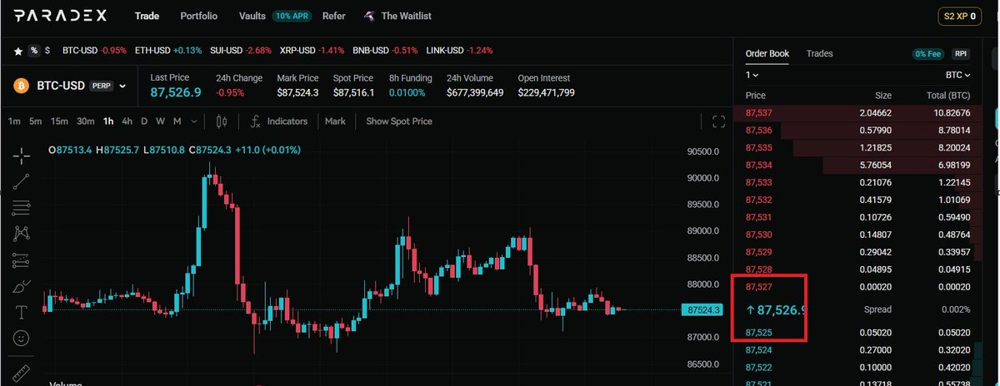

# Paradex 刷量策略與積分分配

> **來源**: [@LumaoDoggie](https://x.com/LumaoDoggie/status/2012470548878758274) | [原文連結](https://x.com/LumaoDoggie/status/2006742759621931026)
>
> **日期**: Sat Jan 17 10:22:23 +0000 2026
>
> **標籤**: `Paradex` `刷量` `DeFi` `積分` `女巫攻擊`

---

## Paradex 刷量策略與積分分配指南

**總覽**

本文整理自 @LumaoDoggie (撸毛小狗) 在 Paradex 上刷量策略的分享，重點包含：

*   Paradex 即將分配此前沒收的女巫積分，預計未來兩周積分將大幅增長。
*   1 月 19 日開放交易後可進行「挖提賣」操作。
*   分享控制磨損、對沖持倉等具體操作建議。
*   推薦使用邀請連結參與額外活動，有機會瓜分 TGE 後 1% 的代幣。

**一、積分分配與挖提賣策略**

Paradex 即將把先前因女巫行為而沒收的積分重新分配給用戶。官方預計未來兩周的積分增長可達 50%，無論是持倉還是刷交易量皆適用。

1 月 19 日開放交易後，建議開啟「挖提賣」模式。即便不打算出售，也務必將 XP 轉移至小號，以避免 TGE 前再次被官方判定為女巫帳號。上次被判定為女巫帳號的經驗顯示，已經轉移的 XP 不會被沒收。

**二、刷量技巧與磨損控制**

*   **刷量時間選擇：** 下午較為穩定，上午夾子較多，價格波動劇烈。
*   **價差觀察：** 行情穩定時，觀察 Bid/Ask 價格。目標是將買賣一個 BTC 的差價控制在 4U 以內，即可獲利。
*   **磨損控制：** 將磨損控制在萬分之 0.3 以下，基本都能獲利。

**三、對沖持倉策略（手殘黨適用）**

如果手速不夠快，不擅長刷分，可以參考作者之前的帖子，進行 BTC/ETH 對沖持倉。

*   **參考連結：** [https://t.co/Y8HqLD3q85](https://t.co/Y8HqLD3q85)

**四、邀請連結與額外活動**

如果打算在 Paradex 上刷量，建議使用作者提供的邀請連結，可參與以下活動：

*   **15% 積分加成：** 15% 積分加成將全數自動返還（等同於自己邀請自己）。
*   **瓜分 1% 代幣活動：** TGE 後，有機會瓜分 1% 的代幣（透過自己邀請自己沒有此活動）。

